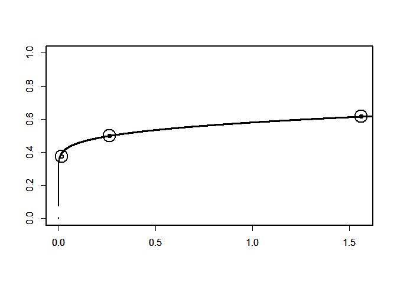

<!-- README.md is generated from README.Rmd. Please edit that file -->

<!-- badges: start -->

<!-- badges: end -->

## Installation

Available from [CRAN](https://CRAN.R-project.org) with the following R
script, which installs the released version of `BayesianFROC` .

``` r
install.packages("BayesianFROC") #     Pleaes execute it from the R console or the R studio console.
```

## Before reading this, execute the following R script:

``` 
      BayesianFROC::fit_GUI()
```

Then reader will understand what this package is.

### For details

  - See [vignettes](https://cran.r-project.org/package=BayesianFROC)

  - See our open access pre-print on the arXiv: yet
    
    To upload, I need someone who endorse my paper. If someone can help
    endorse my pre print, please send e-mail to me. I need help to
    upload my paper 2019.Jun.09.

  - **Behaviour** **Metrica** in which the author submit the paper.

### Goal of this package `BayesianFROC`

**Comparison** of *modality*. In some context, *modality* is imaging
methods: *MRI*, *CT*, *PET*,…etc, and the another context, if images are
taken for treatment (case) group and untreatment or another treatment
(control) group, then *modality* means *treatment*.

  - ***Fitting***: data is the following two type
      - Single Reader and Single Modality case.
      - Multiple Reader and Multiple modality case (MRMC)
  - ***Comparison*** of the *modalities* by *AUC* (the area under the
    AFROC curve).

## Example

  - Build Data
  - Fit
  - Validation of goodness of fit

This is a basic example which shows how to fit a model to the data
`dataList` representing the following FROC data;

| Confidence Level       | Number of Hits | Number of False alarms |
| :--------------------- | :------------: | :--------------------: |
| 3 = definitely present |       97       |           1            |
| 2 = equivocal          |       32       |           14           |
| 1 = questionable       |       31       |           74           |

where *hit* means True Positive: **TP** and *false* *alarm* means False
Positive: **FP**.

``` r

#0) To avoid the following error in Readme file,
#I have to attach the Rcpp. 
#I do not know why such error occur withou Rcpp. 
#This error occurs only when I run the following R scripts from readme.

#Error
#in do.call(rbind,sampler_params) :second argument must be a list Calles:<Anonymous>...get_divergent_iterations ->sampler_param_vector =. do.call Execution halted

 library(Rcpp)  # This code can remove the above unknown error, if someone know why the error occur, please tell me.


#1) Build  data for singler reader and single modality  case.


  dataList <- list(c=c(3,2,1),     # c is ignored, can omit.
              h=c(97,32,31),
              f=c(1,14,74),
              NL=259,
              NI=57,
              C=3)


#  where,
#        c denotes confidence level, each components indicates that 
#                3 = Definitely lesion,
#                2 = subtle,  
#                1 = very subtle
#        h denotes number of hits 
#          (True Positives: TP) for each confidence level,
#        f denotes number of false alarms
#          (False Positives: FP) for each confidence level,
#        NL denotes number of lesions (signal),
#        NI denotes number of images,


  
  
  
  
  
  
  
  
  
  
  
  
  
#2) Fit the FROC model.


 
                  fit <- BayesianFROC::fit_Bayesian_FROC(
            # data to which we fit a model                 
                    dataList,
                                        
            # The number of MCMC chains                         
                    cha = 4
                                                         )
#> Study Design: srsc case
#> False Positive Fraction is calculated
#>  per image.
#> 
#> * Number of Lesions: 259
#> 
#> * Number of Images : 57
#> 
#> 
#> .                     Confidence.Level   False.Positives   True.Positives
#> -------------------  -----------------  ----------------  ---------------
#> Obviouly present                     3                 1               97
#> Relatively obvious                   2                14               32
#> Subtle                               1                74               31
#> 
#> 
#> * Higher number of confidence level indicates reader's higher confidence. In your case, the number 3 is the most high confidence level, i.e., we may say that confidence level 3  means that "definitely lesion is present "
#> 
#> SAMPLING FOR MODEL 'Model_srsc_per_image_target' NOW (CHAIN 1).
#> Chain 1: 
#> Chain 1: Gradient evaluation took 0 seconds
#> Chain 1: 1000 transitions using 10 leapfrog steps per transition would take 0 seconds.
#> Chain 1: Adjust your expectations accordingly!
#> Chain 1: 
#> Chain 1: 
#> Chain 1: Iteration:    1 / 10000 [  0%]  (Warmup)
#> Chain 1: Iteration: 1000 / 10000 [ 10%]  (Warmup)
#> Chain 1: Iteration: 2000 / 10000 [ 20%]  (Warmup)
#> Chain 1: Iteration: 2001 / 10000 [ 20%]  (Sampling)
#> Chain 1: Iteration: 3000 / 10000 [ 30%]  (Sampling)
#> Chain 1: Iteration: 4000 / 10000 [ 40%]  (Sampling)
#> Chain 1: Iteration: 5000 / 10000 [ 50%]  (Sampling)
#> Chain 1: Iteration: 6000 / 10000 [ 60%]  (Sampling)
#> Chain 1: Iteration: 7000 / 10000 [ 70%]  (Sampling)
#> Chain 1: Iteration: 8000 / 10000 [ 80%]  (Sampling)
#> Chain 1: Iteration: 9000 / 10000 [ 90%]  (Sampling)
#> Chain 1: Iteration: 10000 / 10000 [100%]  (Sampling)
#> Chain 1: 
#> Chain 1:  Elapsed Time: 0.367 seconds (Warm-up)
#> Chain 1:                1.859 seconds (Sampling)
#> Chain 1:                2.226 seconds (Total)
#> Chain 1: 
#> 
#> SAMPLING FOR MODEL 'Model_srsc_per_image_target' NOW (CHAIN 2).
#> Chain 2: 
#> Chain 2: Gradient evaluation took 0 seconds
#> Chain 2: 1000 transitions using 10 leapfrog steps per transition would take 0 seconds.
#> Chain 2: Adjust your expectations accordingly!
#> Chain 2: 
#> Chain 2: 
#> Chain 2: Iteration:    1 / 10000 [  0%]  (Warmup)
#> Chain 2: Iteration: 1000 / 10000 [ 10%]  (Warmup)
#> Chain 2: Iteration: 2000 / 10000 [ 20%]  (Warmup)
#> Chain 2: Iteration: 2001 / 10000 [ 20%]  (Sampling)
#> Chain 2: Iteration: 3000 / 10000 [ 30%]  (Sampling)
#> Chain 2: Iteration: 4000 / 10000 [ 40%]  (Sampling)
#> Chain 2: Iteration: 5000 / 10000 [ 50%]  (Sampling)
#> Chain 2: Iteration: 6000 / 10000 [ 60%]  (Sampling)
#> Chain 2: Iteration: 7000 / 10000 [ 70%]  (Sampling)
#> Chain 2: Iteration: 8000 / 10000 [ 80%]  (Sampling)
#> Chain 2: Iteration: 9000 / 10000 [ 90%]  (Sampling)
#> Chain 2: Iteration: 10000 / 10000 [100%]  (Sampling)
#> Chain 2: 
#> Chain 2:  Elapsed Time: 0.293 seconds (Warm-up)
#> Chain 2:                1.063 seconds (Sampling)
#> Chain 2:                1.356 seconds (Total)
#> Chain 2: 
#> 
#> SAMPLING FOR MODEL 'Model_srsc_per_image_target' NOW (CHAIN 3).
#> Chain 3: 
#> Chain 3: Gradient evaluation took 0 seconds
#> Chain 3: 1000 transitions using 10 leapfrog steps per transition would take 0 seconds.
#> Chain 3: Adjust your expectations accordingly!
#> Chain 3: 
#> Chain 3: 
#> Chain 3: Iteration:    1 / 10000 [  0%]  (Warmup)
#> Chain 3: Iteration: 1000 / 10000 [ 10%]  (Warmup)
#> Chain 3: Iteration: 2000 / 10000 [ 20%]  (Warmup)
#> Chain 3: Iteration: 2001 / 10000 [ 20%]  (Sampling)
#> Chain 3: Iteration: 3000 / 10000 [ 30%]  (Sampling)
#> Chain 3: Iteration: 4000 / 10000 [ 40%]  (Sampling)
#> Chain 3: Iteration: 5000 / 10000 [ 50%]  (Sampling)
#> Chain 3: Iteration: 6000 / 10000 [ 60%]  (Sampling)
#> Chain 3: Iteration: 7000 / 10000 [ 70%]  (Sampling)
#> Chain 3: Iteration: 8000 / 10000 [ 80%]  (Sampling)
#> Chain 3: Iteration: 9000 / 10000 [ 90%]  (Sampling)
#> Chain 3: Iteration: 10000 / 10000 [100%]  (Sampling)
#> Chain 3: 
#> Chain 3:  Elapsed Time: 0.287 seconds (Warm-up)
#> Chain 3:                0.939 seconds (Sampling)
#> Chain 3:                1.226 seconds (Total)
#> Chain 3: 
#> 
#> SAMPLING FOR MODEL 'Model_srsc_per_image_target' NOW (CHAIN 4).
#> Chain 4: 
#> Chain 4: Gradient evaluation took 0 seconds
#> Chain 4: 1000 transitions using 10 leapfrog steps per transition would take 0 seconds.
#> Chain 4: Adjust your expectations accordingly!
#> Chain 4: 
#> Chain 4: 
#> Chain 4: Iteration:    1 / 10000 [  0%]  (Warmup)
#> Chain 4: Iteration: 1000 / 10000 [ 10%]  (Warmup)
#> Chain 4: Iteration: 2000 / 10000 [ 20%]  (Warmup)
#> Chain 4: Iteration: 2001 / 10000 [ 20%]  (Sampling)
#> Chain 4: Iteration: 3000 / 10000 [ 30%]  (Sampling)
#> Chain 4: Iteration: 4000 / 10000 [ 40%]  (Sampling)
#> Chain 4: Iteration: 5000 / 10000 [ 50%]  (Sampling)
#> Chain 4: Iteration: 6000 / 10000 [ 60%]  (Sampling)
#> Chain 4: Iteration: 7000 / 10000 [ 70%]  (Sampling)
#> Chain 4: Iteration: 8000 / 10000 [ 80%]  (Sampling)
#> Chain 4: Iteration: 9000 / 10000 [ 90%]  (Sampling)
#> Chain 4: Iteration: 10000 / 10000 [100%]  (Sampling)
#> Chain 4: 
#> Chain 4:  Elapsed Time: 0.296 seconds (Warm-up)
#> Chain 4:                1.469 seconds (Sampling)
#> Chain 4:                1.765 seconds (Total)
#> Chain 4: 
#> 
#> Divergences:
#> 0 of 32000 iterations ended with a divergence.
#> 
#> Tree depth:
#> 0 of 32000 iterations saturated the maximum tree depth of 15.
#> 
#> Energy:
#> E-BFMI indicated no pathological behavior.
#> 
#> * One of the Stan developer "betanalpha" makes the check_rhat() and it says that
#> Rhat looks reasonable for all parameters.
#> * Very Good Convergence !!  
#> 
#> 
#>      R hat  < 1.01 
#> 
#>  
#> * Your model converged, that is: 
#> * Each R hat is less than or equal to 1.01 for all parameters
#> 
#> * We do not stop, since model converged.
#> Inference for Stan model: Model_srsc_per_image_target.
#> 4 chains, each with iter=10000; warmup=2000; thin=1; 
#> post-warmup draws per chain=8000, total post-warmup draws=32000.
#> 
#>         mean se_mean   sd   2.5%    25%    50%    75%  97.5% n_eff Rhat
#> w      -0.82    0.00 0.12  -1.05  -0.90  -0.82  -0.74  -0.58 19815    1
#> dz[1]   1.56    0.00 0.15   1.27   1.46   1.56   1.66   1.88 17963    1
#> dz[2]   1.63    0.00 0.31   1.11   1.41   1.61   1.82   2.31 15796    1
#> m       0.66    0.00 0.50  -0.35   0.33   0.67   1.00   1.65 20231    1
#> v       5.38    0.01 0.93   3.78   4.72   5.29   5.95   7.41 14933    1
#> p[1]    0.12    0.00 0.02   0.08   0.10   0.12   0.13   0.15 20320    1
#> p[2]    0.12    0.00 0.02   0.09   0.11   0.12   0.13   0.16 29994    1
#> p[3]    0.38    0.00 0.03   0.32   0.36   0.38   0.40   0.43 28935    1
#> l[1]    1.58    0.00 0.17   1.27   1.47   1.58   1.69   1.93 19744    1
#> l[2]    0.27    0.00 0.06   0.15   0.22   0.26   0.31   0.41 24450    1
#> l[3]    0.01    0.00 0.01   0.00   0.00   0.01   0.02   0.04 15304    1
#> dl[1]   1.32    0.00 0.15   1.04   1.21   1.31   1.41   1.63 17012    1
#> dl[2]   0.25    0.00 0.06   0.15   0.21   0.25   0.29   0.38 26328    1
#> dl[3]   0.01    0.00 0.01   0.00   0.00   0.01   0.02   0.04 15304    1
#> z[1]   -0.82    0.00 0.12  -1.05  -0.90  -0.82  -0.74  -0.58 19815    1
#> z[2]    0.74    0.00 0.16   0.43   0.63   0.74   0.85   1.07 24956    1
#> z[3]    2.37    0.00 0.37   1.73   2.12   2.35   2.60   3.16 15727    1
#> a       0.13    0.00 0.10  -0.06   0.06   0.13   0.19   0.33 21476    1
#> b       0.19    0.00 0.03   0.13   0.17   0.19   0.21   0.26 14785    1
#> A       0.55    0.00 0.04   0.48   0.52   0.55   0.58   0.63 21438    1
#> lp__  -14.57    0.01 1.59 -18.53 -15.39 -14.23 -13.40 -12.46 13184    1
#> 
#> Samples were drawn using NUTS(diag_e) at Wed Jul 03 21:52:01 2019.
#> For each parameter, n_eff is a crude measure of effective sample size,
#> and Rhat is the potential scale reduction factor on split chains (at 
#> convergence, Rhat=1).
#> 
#> * WAIC was caluculated,
#>  since log likelihoodis is a precise value, i.e., the traget += statement are used in the stan file.
#> 
#>  
#>  ----------------------
#>   WAIC =  32.664
#>  ----------------------
#>  * WAIC; Widely Applicable Information Criterion (Watanabe-Akaike Information Criterion)
#> 
#>  
#>  
#>  
#> 
#>   +*+  +*+  +*+                                  -*-  -*-  -*-
#>   ***  ***  ***    Estimates of an FROC model    ***  ***  -*-
#>   +*+  +*+  +*+                                  -*-  -*-  -*-
#> 
#> * In a single reader and a single modality case, the Bayesian model has three kind of parameter, that is, thresholds and mean and standard deviation of the signal distribution of the latent Gaussian random variable. From these parameter, the so-called Area under the curve (AUC) and hit rate for each confidence levels and false alarm rate for each confidence levels are calculated. In the following, the posterior means and 95% credible intervals are shown. I consider the most important parameter is the AUC. So, First, we will see the AUC.
#> 
#>  
#>  
#>  
#> 
#>   +*+  +*+  +*+                                  -*-  -*-  -*-
#>   ***  ***  ***              AUC                 ***  ***  -*-
#>   +*+  +*+  +*+                                  -*-  -*-  -*-
#> * Area under the curve, where "the curve" means the AFROC curve:
#> 
#> 
#> Parameter    posterior.mean   lowerCI   upperCI
#> ----------  ---------------  --------  --------
#> AUC                 0.54999   0.47693   0.62564
#> 
#>  
#>  
#>  
#> 
#>   +*+  +*+  +*+                                  -*-  -*-  -*-
#>   ***  ***  ***       Binormal Assumption        ***  ***  -*-
#>   +*+  +*+  +*+                                  -*-  -*-  -*-
#> 
#> * Thresholds of Gaussian Assumption(Binormal Assumption):
#> 
#> 
#> Parameter    posterior.mean    lowerCI    upperCI
#> ----------  ---------------  ---------  ---------
#> z[1]               -0.81826   -1.05500   -0.58268
#> z[2]                0.74397    0.43061    1.06720
#> z[3]                2.37470    1.72520    3.16000
#> 
#> 
#> 
#> * Differences of Thresholds of Gaussian Assumption:
#> 
#> 
#> Parameter    posterior.mean   lowerCI   upperCI
#> ----------  ---------------  --------  --------
#> dz[1]                1.5622    1.2746    1.8783
#> dz[2]                1.6307    1.1082    2.3111
#> 
#> 
#> 
#> * Mean and Standard Deviation (S.D.) of the signal distribution in the Gaussian (binormal) Assumption:
#> 
#> 
#> Parameter    posterior.mean    lowerCI   upperCI
#> ----------  ---------------  ---------  --------
#> mean                0.66305   -0.34909    1.6478
#> S.D.                5.37550    3.78490    7.4095
#> 
#> * Note that the Mean and Standard Deviation (S.D.) of the noise distribution in the Gaussian (binormal) Assumption is 0 and 1, respectively.
#> 
#>  
#>  
#>  
#> 
#>   +*+  +*+  +*+                                  -*-  -*-  -*-
#>   ***  ***  ***            Hit rate              ***  ***  -*-
#>   +*+  +*+  +*+                                  -*-  -*-  -*-
#> 
#> 
#> 
#> * p[c] means the hit rate of the binomial distribution with confidence level c.
#> 
#> 
#> Parameter    Posterior.Mean    lowerCI   upperCI
#> ----------  ---------------  ---------  --------
#> p[1]                0.11640   0.084496   0.15381
#> p[2]                0.11962   0.086673   0.15850
#> p[3]                0.37549   0.317890   0.43428
#> 
#> * Let h(c) denote the number of hits with confidence level c,
#> then the above p[c] means that
#> 
#>             
#>                  h(c) ~ Binomial(p[c],NL) 
#> 
#> 
#> for each c = 1,2,...,3, where NL denotes the number of lesions and now it is 259.
#> 
#>  
#>  
#>  
#> 
#>   +*+  +*+  +*+                                  -*-  -*-  -*-
#>   ***  ***  ***        false alarm rate          ***  ***  ***
#>   +*+  +*+  +*+                                  -*-  -*-  -*-
#> 
#> 
#> 
#> * l[c] means the false alarm rate of the Poisson distribution with confidence level c.
#> 
#> 
#> Parameter    Posterior.Mean      lowerCI    upperCI
#> ----------  ---------------  -----------  ---------
#> l[1]               1.582500   1.27280000   1.926100
#> l[2]               0.265250   0.15424000   0.405530
#> l[3]               0.012694   0.00078916   0.043168
#> 
#> * Let f(c) denote the number of false alarms with confidence level c,
#> then the above table means that
#> 
#>             f(3) +  f(2) + ...+ f(c) ~ Poisson( l[c]*NI ) 
#> 
#> 
#> or equivalently,
#> 
#>              f(c) ~ Poisson(  ( l[c]-l[c+1] )*NI  ) 
#> 
#> 
#> 
#> for each c = 1,2,...,3, where NI denotes the number of images and now it is 57.
#> 
#> 
#>    AUC      lowerCI    upperCI 
#> ---------  ---------  ---------
#>  0.54999    0.47693    0.62564
#> 
#> * size of the return value:
#> 9.546464Mb

                  
                  
                  
                  
                  
                  

#  validation of fit via alculation of p -value of the chi square goodness of fit, which is 
#  calculated by integrating with  predictive posterior measure.
                  
                  
            BayesianFROC::p_value_of_the_Bayesian_sense_for_chi_square_goodness_of_fit(
              
              fit,
              
#        In an output, a table is shown only head part.
              head.only = TRUE
              )
#> 
#> 
#> name         chisq.vector.for.observed.data   chisq.vector.for.replicated.data  replication.vs.observed 
#> ----------  -------------------------------  ---------------------------------  ------------------------
#> the 1-th                               5.32                               13.9  TRUE                    
#> the 2-th                              10.40                               17.6  TRUE                    
#> the 3-th                               5.85                               14.2  TRUE                    
#> the 4-th                               4.56                               13.3  TRUE                    
#> the 5-th                               3.21                               11.8  TRUE                    
#> the 6-th                               1.58                               12.7  TRUE                    
#> the 7-th                               7.66                               11.2  TRUE                    
#> the 8-th                               2.99                               12.8  TRUE                    
#> the 9-th                               3.52                               11.1  TRUE                    
#> the 10-th                              2.13                               13.2  TRUE
#> 
#> * We show the head part of data, i.e., first 10 rows  are shown.
#> 
#> * To show all rows of data, use p_value_of_the_Bayesian_sense_for_chi_square_goodness_of_fit(StanS4class = Your fitted model object, head.only = FALSE)
#> 
#> *  Note that the posterior predictive p value is a rate of TRUE in the right column in the above table.
#> 
#> *  The presence of more TRUE indicates that our goodness of fitting is better.
#> 
#> *  Smaller p value indicates goodness of fit is not better.
#>  The p value of the posterior predictive measure for the chi square discrepancy. 
#>                                                                        0.9144375
```

#### The FROC curve

Using the R script `BayesianFROC::DrawCurves(fit)`, we can draw the FROC
curve (or AFROC curve) as follows;


## Modality Comparison

By fitting hierarchical Bayesian model, we get the characteristics to
compare modality.

Using the data object named `BayesianFROC::dataList.Chakra.Web`
representing multiple modality data, we will fit the model to data by
the following R script. For letting the running time be short, we take
small MCMC iteration, that is, `ite =222` which is too small to obtain
reliable estimates. I think it should be `ite =33333` for actual data
analysis or compatible result with *Jafroc*.

``` r


#0) To avoid the following error I have to attach the Rcpp. I do not know why such error occur withou Rcpp.
#Error in do.call(rbind,sampler_params) :second argument must be a list Calles:<Anonymous>...get_divergent_iterations ->sampler_param_vector =. do.call Execution halted

library(Rcpp)  # This code can remove the above unknown error, if someone know why the error occur, please tell me.


fitt <- BayesianFROC::fit_Bayesian_FROC(
  
  # data of multiple reader and multiple case (modalities)
 dataList =   BayesianFROC::dataList.Chakra.Web,
  
  # iteration of MCMC
  ite = 111 # Should be ite = 33333
 )
```

Now, we obtain the fitted model object named `fit` which is an S4 object
of class `stanfitExtended` inherited from `stanfit` of the ***rstan***
package..

# Transform of S4 Class to apply other packages

To apply the functions of other package such as **rstan** or **ggmcmc**,
…, etc in which there are functions for object of class `stanfit`, e.g.,
`rstan::stan_trace()`,
`rstan::stan_dens()`,`rstan::check_hmc_diagnostics()`,…etc, we have to
change the class of the fitted model object by the following manner:

``` r
 fit.stan <- methods::as(fit, "stanfit")
```

Then the above object `fit.stan` is an object of the class `stanfit` and
thus we can apply the function of rstan package as
`rstan::stan_dens(fit.stan)`.

### Prepare pipe operator (redandunt)

``` r
# First, get pipe operator
`%>%` <- utils::getFromNamespace("%>%", "magrittr")
```

### Change the class to `stanfit`

``` r
# Change the class from stanfitExtended to stanfit
fit.stan <- methods::as(fit,"stanfit")
```

### trace plot for object of class `stanfit`

``` r
# Plot about MCMC samples of paremeter name "A", reperesenting AUC
ggmcmc::ggs(fit.stan) %>% ggmcmc::ggs_traceplot(family  = "A")
```



### posterior density of paramter `A` stored in an object of class `stanfit`

The following plot indicates that *maximal* *posterior* *estimator*
(MAP) is very unstable in each chain in this iteration. By drawinng more
samples, it become stable?

``` r
ggmcmc::ggs(fit.stan) %>% ggmcmc::ggs_density(family    = "A")
```


### Auto correlation for an object of class `stanfit`

``` r
ggmcmc::ggs(fit.stan) %>% ggmcmc::ggs_autocorrelation(family    = "A")
```


How `ggmcmc` painted using these colours was amazing\!

The author thinks the Reademe file is redandunt? or my explanation is
redandunt? :’-D
