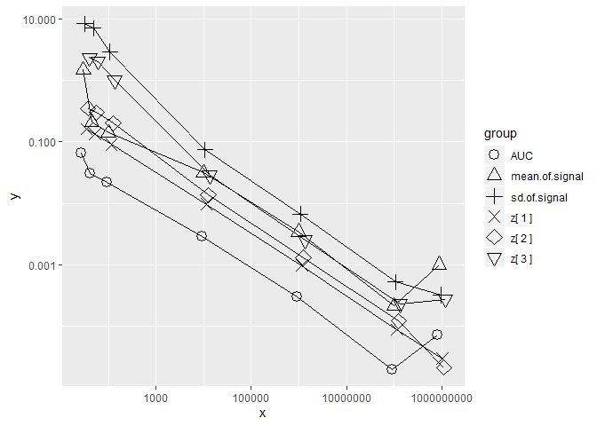
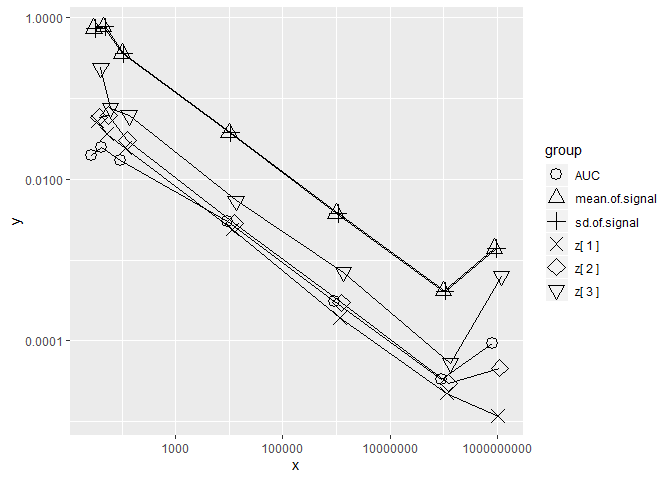

<style type="text/css">

h1.title {
  font-size: 35px;
  font-weight: bold;
  font-family: Arial-Black;
   color: #800000           ;
}
h1{
  font-size: 35px;
  font-weight: bold;
  font-family: Arial-Black;
  
  color: #800000            ;

}

h2 {
  font-size: 30px;
  font-weight: bold;
  font-family: Arial-Black;
    
  color: #800000            ;

}

h3 {
  font-size: 26px;
  font-weight: bold;
  font-family: Arial-Black;
    
  color: #800000            ;

}

h4 {
  font-size: 24px;
  font-weight: bold;
  font-family: Arial-Black;
    
  color: #800000            ;

}


h5 {
  font-size: 22px;
  font-weight: bold;
  font-family: Arial-Black;
    
  color: #800000            ;

}


h6 {
  font-size: 19px;
  font-weight: bold;
  font-family: Arial-Black;
    
  color: #800000            ;

}


img {
    border:0;
}


body {
  font-size: 18px;
  <!-- font-weight: normal ; -->
    font-weight:bolder;
  
  font-family: Calibri;
  
    
  color: #800000            ;

  background-color:#EEEEEE; 
  
<!--   margin:0; -->
<!--    padding:0; -->
  
}


p {
    color: #440000      ;
}

</style>

<!-- README.md is generated from README.Rmd. Please edit that file -->

<!-- badges: start -->

<!-- badges: end -->

## Installation

Available from [CRAN](https://CRAN.R-project.org) with the following R
script, which installs the released version of `BayesianFROC` .

``` r

              install.packages("BayesianFROC")
              
              
#     Pleaes execute it from the R console or the R studio console.
```

## What this package?

Execute the following R script for a **shiny based GUI**:

``` r

                           library(BayesianFROC)
                           BayesianFROC::fit_GUI_Shiny()
```

Then reader will understand what this package is.

### For details

  - See [vignettes](https://cran.r-project.org/package=BayesianFROC)

  - See our open access pre-print on the arXiv: yet
    
    To upload, I need someone who endorse my paper. If someone can help
    endorse my pre print, please send e-mail to me. I need help to
    upload my paper 2019.Jun.09.

### Goal of this package `BayesianFROC`

**Comparison** of *modality*. In some context, *modality* is imaging
methods: *MRI*, *CT*, *PET*,…etc, and the another context, if images are
taken for treatment (case) group and untreatment (or another treatment)
(control) group, then *modality* means *efficacy of treatment*.

  - ***Fitting***: data is the following two type
      - Single Reader and Single Modality case.
      - Multiple Reader and Multiple modality case (MRMC)
  - ***Comparison*** of the *modalities* by *AUC* (the area under the
    AFROC curve).

## Example

  - Build Data
  - Fit
  - Validation of goodness of fit

This is an example dataset;

| Confidence Level       | Number of Hits | Number of False alarms |
| :--------------------- | :------------: | :--------------------: |
| 3 = definitely present |       97       |           1            |
| 2 = equivocal          |       32       |           14           |
| 1 = questionable       |       31       |           74           |

where *hit* means True Positive: **TP** and *false* *alarm* means False
Positive: **FP**.

``` r

#0) To avoid the following error in Readme file,
#I have to attach the Rcpp. 
#I do not know why such error occur withou Rcpp. 
#This error occurs only when I run the following R scripts from readme.

#Error
#in do.call(rbind,sampler_params) :second argument must be a list Calles:<Anonymous>...get_divergent_iterations ->sampler_param_vector =. do.call Execution halted

 library(Rcpp)  # This code can remove the above unknown error, if someone know why the error occur, please tell me.


#1) Build  data for singler reader and single modality  case.


  dataList <- list(c=c(3,2,1),     # c is ignored, can omit.
              h=c(97,32,31),
              f=c(1,14,74),
              NL=259,
              NI=57,
              C=3)


#  where,
#        c denotes confidence level, each components indicates that 
#                3 = Definitely lesion,
#                2 = subtle,  
#                1 = very subtle
#        h denotes number of hits 
#          (True Positives: TP) for each confidence level,
#        f denotes number of false alarms
#          (False Positives: FP) for each confidence level,
#        NL denotes number of lesions (signal),
#        NI denotes number of images,


  
  
  
  
  
  
  
  
  
  
  
  
  
#2) Fit the FROC model.


 
   fit <- BayesianFROC::fit_Bayesian_FROC(
     
            # data to which we fit a model                 
                dataList = dataList,
                                        
            # The number of MCMC chains                         
                     cha = 4,
            
            # The number of MCMC samples for each chains                         
                    ite  = 11111,
                    
            # The number of warming up of MCMC simulation for each chains           
                     war = 1111,
            
            # Show verbose summary and MCMC process
                 summary = TRUE
                                                         )

                  
                  
                  
                  
                  
                  

#  validation of fit via alculation of p -value of the chi square goodness of fit, which is 
#  calculated by integrating with  predictive posterior measure.
                  
                  
            BayesianFROC::ppp(
              fit
              )
                   
                   # The auhor thinks it is not correctly programmed, so it needs validaton of programing

                                     
                  
```

# Jafroc data

If you already have Jafroc data, then use the code;

``` r
     dataList <- convertFromJafroc(
                                  No.of.Modalities =5,
                                  No.of.readers    =4,
                                  No.of.confidence.levels = 5
                                    )
```

where you should specify the number of modalities, readers, confidence
levels.

#### The FROC curve

Using the fitted model object `fit` of class `stanfitExtended`, we can
draw the FROC curve (or AFROC curve) as
follows;

<!--  -->

``` r
# new.imaging.device = FALSE  is used to include the output image 
# in this README file, so I recommand new.imaging.device = TRUE
BayesianFROC::DrawCurves(fit,
                         new.imaging.device = FALSE)
```

#### If you want to draw the curve in white background, then use the followings

``` r
# new.imaging.device = FALSE  is used to include the output image 
# in this README file, so I recommand new.imaging.device = TRUE

BayesianFROC::DrawCurves(fit,
                         Colour = FALSE,
                         new.imaging.device = FALSE)
```

Where the circles means False Positive Fractions (FPFs) and True
Positive Fractions (TPFs). The curve is FROC curve. FROC curve thorough
exactly the expected points of FPFs and TPFs. Thus we can intuitively
see the goodness of fit by comparing the circles and curves. Ha,…
someone reads this boring vignettes? My right arm ache bothering me for
20 months. Ha,… I want to die.

# Latent Distributions

Hit rates are determined the areas of signal Gaussian between
thresholds,

and false alarm rate are defined by the areas of differential
logarithmic cumulative Gaussian between thresholds.

## False rate

``` r
# new.imaging.device = FALSE  is used to include the output image 
# in this README file, so I recommand new.imaging.device = TRUE

BayesianFROC::draw_bi_normal_version_UP(
    fit,new.imaging.device = F,
    dark_theme = T,
    hit.rate = F,
    false.alarm.rate = T,
    both.hit.and.false.rate = F)
```

## Hit rate

``` r
# new.imaging.device = FALSE  is used to include the output image 
# in this README file, so I recommand new.imaging.device = TRUE

BayesianFROC::draw_bi_normal_version_UP(
    fit,new.imaging.device = F,
    dark_theme = T,
    hit.rate = T,
    false.alarm.rate = F,
    both.hit.and.false.rate = F)
```

One will see that the bi normal assumption is wrong in the FROC context,
and instead of bi normal assumption, we use two latent distributions,
one is Gaussian for signal and another is the differential logarithmic
Gaussian introduced first by the author of this package. For details,
see vignettes of this package.

## Modality Comparison

By fitting hierarchical Bayesian model, we get the characteristics to
compare modality.

Using the data object named `BayesianFROC::dataList.Chakra.Web`
representing multiple modality data, we will fit the model to data by
the following R script. For letting the running time be short, we take
small MCMC iteration, that is, `ite =222` which is too small to obtain
reliable estimates. I think it should be `ite =33333` for actual data
analysis or compatible result with *Jafroc*.

The author try to remove `eval=FALSE`, but it cause stopping of knitr,
so I can not include the following code. The following code sometimes
crash R session, so,… it is heavy for README file??

``` r


#0) To avoid the following error I have to attach the Rcpp. I do not know why such error occur withou Rcpp.
#Error in do.call(rbind,sampler_params) :second argument must be a list Calles:<Anonymous>...get_divergent_iterations ->sampler_param_vector =. do.call Execution halted

library(Rcpp)  # This code can remove the above unknown error, if someone know why the error occur, please tell me.


library(BayesianFROC)


dataList <- dataList.Chakra.Web

fitt <- BayesianFROC::fit_Bayesian_FROC(
  
  # data of multiple reader and multiple case (modalities)
 dataList =   dataList,
  
  # iteration of MCMC
  ite = 1111 # Should be ite = 33333
 )
```

Now, we obtain the fitted model object named `fit` which is an S4 object
of class `stanfitExtended` inherited from `stanfit` of the ***rstan***
package..

# Transform of S4 Class to apply other packages

To apply the functions of other package such as **rstan** or **ggmcmc**,
…, etc in which there are functions for object of class `stanfit`, e.g.,
`rstan::stan_trace()`,
`rstan::stan_dens()`,`rstan::check_hmc_diagnostics()`,…etc, we have to
change the class of the fitted model object by the following manner:

``` r
 fit.stan <- methods::as(fit, "stanfit")
```

Then the above object `fit.stan` is an object of the class `stanfit` and
thus we can apply the function of rstan package as
`rstan::stan_dens(fit.stan)`.

### Prepare pipe operator (redundant)

``` r
# First, get pipe operator
`%>%` <- utils::getFromNamespace("%>%", "magrittr")
```

### Change the class to `stanfit`

``` r
# Change the class from stanfitExtended to stanfit
fit.stan <- methods::as(fit,"stanfit")
```

#### trace plot for object of class `stanfit`

``` r

# Change the class from stanfitExtended to stanfit
#fit.stan <- methods::as(fit,"stanfit")


# Plot about MCMC samples of paremeter name "A", reperesenting AUC
ggmcmc::ggs(fit.stan) %>% ggmcmc::ggs_traceplot(family  = "A")
```

#### posterior density of parameter `A` stored in an object of class `stanfit`

The following plot indicates that *maximal* *posterior* *estimator*
(MAP) is very unstable in each chain in this iteration. By drawing more
samples, it become stable?

``` r

# Change the class from stanfitExtended to stanfit
#fit.stan <- methods::as(fit,"stanfit"
                        
                        
ggmcmc::ggs(fit.stan) %>% ggmcmc::ggs_density(family    = "A")
```

#### Auto correlation for an object of class `stanfit`

``` r


# Change the class from stanfitExtended to stanfit
# fit.stan <- methods::as(fit,"stanfit")


ggmcmc::ggs(fit.stan) %>% ggmcmc::ggs_autocorrelation(family    = "A")
```

How `ggmcmc` painted using these colors was amazing\!

package **shinystan**

For fitted model object `fit.stan` of class `stanfit`, there is a GUI
viewer

``` r

# Change the class from stanfitExtended to stanfit
fit.stan <- methods::as(fit,"stanfit")


shinystan::launch_shinystan(fit.stan)
```

# Goodness of fit via posterior predictive p value

Evaluates a p value of chi square goodness of fit. In addition, the
scatter plot are drawn which shows the replicated datasets from the
posterior predictive p value of the data which is used to create a
fitted model object `fit`.

``` r
BayesianFROC::ppp(fit)
```

In previous release, my program for ppp was wrong, so in the current
version I fixed.

# SBC

### Validation of model via Simulation Based Calibration (SBC)

Talts, S., Betancourt, M., Simpson, D., Vehtari, A., and Gelman, A.
(2018). Validating Bayesian Inference Algorithms with Simulation-Based
Calibration. arXiv preprint
arXiv:1804.06788

``` r
BayesianFROC::Simulation_Based_Calibration_single_reader_single_modality_via_rstan_sbc()
```

# Error of estimates decrease monotonically with respect to sample size.

The author investigate the sample size for reliable estimates. Accracy
of estimates are depend on the sample size. Large sample size leads us
to small error. However, in practical perspective, the number of images
or lesions has limitation. The author thinks it is better to obtain 100
images or lesions. And 100 images or lesions gives us the error 0.01 in
AUC.

    #> Loading required package: rstan
    #> Loading required package: StanHeaders
    #> Loading required package: ggplot2
    #> rstan (Version 2.19.2, GitRev: 2e1f913d3ca3)
    #> For execution on a local, multicore CPU with excess RAM we recommend calling
    #> options(mc.cores = parallel::detectCores()).
    #> To avoid recompilation of unchanged Stan programs, we recommend calling
    #> rstan_options(auto_write = TRUE)
    #> For improved execution time, we recommend calling
    #> Sys.setenv(LOCAL_CPPFLAGS = '-march=native')
    #> although this causes Stan to throw an error on a few processors.
    #> Loading required package: Rcpp
    #> 
    #> 
    #> * vignettes (or README)
    #> 
    #>     vignettes (or README) URL:  https://CRAN.R-project.org/package=BayesianFROC
    #> 
    #>     Without internet enviroment,
    #>     TeX script is not compiled in web browser page.
    #>     To see .html vignettes with compiled TeX scripts,
    #>     we need internet environment.
    #> 
    #>     * R script for vignettes (internet environment required for TeX)
    #> 
    #>     vignette(package = "BayesianFROC",topic = "Theory_of_Bayesian_FROC_with_R_scripts")
    #>     vignette(package = "BayesianFROC",topic =                "Brief_explanation")
    #>     vignette(package = "BayesianFROC",topic =           "Very_Brief_description")
    #>     vignette(package = "BayesianFROC",topic =      "Very_Very_Brief_description")
    #>     vignette(package = "BayesianFROC",topic = "Very_Very_Very_Brief_description")
    #>     vignette(package = "BayesianFROC",topic = "Very_Very_Very_Brief_Description_MRMC")
    #> 
    #> 
    #> 
    #>     * Also run;
    #> 
    #>          explanation_about_package_BayesianFROC()
    #> 
    #> * Demos
    #> 
    #> 
    #>         demo(demo_MRMC, package="BayesianFROC");
    #>         demo(demo_srsc, package="BayesianFROC");
    #>         demo(demo_stan, package="BayesianFROC");
    #>         demo(demo_drawcurves_srsc, package="BayesianFROC");
    #>         demo_Bayesian_FROC();
    #>         demo_Bayesian_FROC_without_pause();
    #> 
    #> * Examples
    #>           * Example: A Single reader and A Single Modality
    #> 
    #>                fit <- fit_Bayesian_FROC( ite  = 1111,
    #>                                       summary = TRUE,
    #>                                           cha = 1,
    #>                                      dataList = dataList.Chakra.1.with.explantation )
    #> 
    #>          * Example: Mutltiple reader and Mutltiple Modality
    #> 
    #>                fit <- fit_Bayesian_FROC( ite  = 1111,
    #>                                       summary = TRUE,
    #>                                           cha = 1,
    #>                                      dataList = dd )
    #> 
    #> 
    #>          * Example: SBC for a single reader and a single modality via rstan::sbc
    #> 
    #>                 fit <- Simulation_Based_Calibration_single_reader_single_modality_via_rstan_sbc()
    #> 
    #> 
    #> 
    #> 
    #>          * Example: Posterior Predictive P value of chi square goodness of fit
    #> 
    #> 
    #>                  p.value <- ppp(fit)
    #> 
    #> 
    #> 
    #> 
    #> 
    #> *  Shiny based  Graphical User Interface for fitting and estimates and drawing curve;
    #> 
    #> 
    #> 
    #>                fit_GUI_Shiny()                        
    #> 
    #> 
    #> * It will took a lot of time to run the codes for the first time, since stan files will be compiled.
    #> 
    #> 
    #> * Reference: (pre-print, manuscript)
    #>              Bayesian Models for Free-response Receiver Operating Characteristic Analysis
    #>              The author is same as the author of this package.
    #> 
    #> 
    #> * For reviewers of my manuscript, execute the following code
    #>   to check the results in my manuscript.
    #> 
    #>         demo(demo_for_reviewers_of_my_manuscript, package="BayesianFROC");
    #> 
    #> 
    #>  * ver. 0.  2. 0  Statistical Model has changed.
    #> Warning: There were 1156 divergent transitions after warmup. Increasing adapt_delta above 0.9999999 may help. See
    #> http://mc-stan.org/misc/warnings.html#divergent-transitions-after-warmup
    #> Warning: Examine the pairs() plot to diagnose sampling problems
    #> 
    #> Divergences:
    #> 1156 of 4978 iterations ended with a divergence (23.222177581358%).
    #> Try increasing 'adapt_delta' to remove the divergences.
    #> 
    #> Tree depth:
    #> 0 of 4978 iterations saturated the maximum tree depth of 15.
    #> 
    #> Energy:
    #> E-BFMI indicated no pathological behavior.
    #> 
    #> * One of the Stan developer "betanalpha" makes the check_rhat() and it says that
    #> Rhat looks reasonable for all parameters.
    #> 
    #> 
    #>  * max R-hat = 1
    #> Very Good!
    #> 
    #> * summary = TRUE for more details.
    #> 
    #>  
    #>  ----------------------
    #>   WAIC =  23.306
    #>  ----------------------
    #>  * WAIC; Widely Applicable Information Criterion (Watanabe-Akaike Information Criterion)
    #> 
    #>  
    #>  
    #>  
    #> 
    #>   +*+  +*+  +*+                                  -*-  -*-  -*-
    #>   ***  ***  ***    Estimates of an FROC model    ***  ***  -*-
    #>   +*+  +*+  +*+                                  -*-  -*-  -*-
    #> 
    #> * In a single reader and a single modality case, the Bayesian model has three kind of parameter, that is, thresholds and mean and standard deviation of the signal distribution of the latent Gaussian random variable. From these parameter, the so-called Area under the curve (AUC) and hit rate for each confidence levels and false alarm rate for each confidence levels are calculated. In the following, the posterior means and 95% credible intervals are shown. I consider the most important parameter is the AUC. So, First, we will see the AUC.
    #> 
    #>  
    #>  
    #>  
    #> 
    #>   +*+  +*+  +*+                                  -*-  -*-  -*-
    #>   ***  ***  ***              AUC                 ***  ***  -*-
    #>   +*+  +*+  +*+                                  -*-  -*-  -*-
    #> * Area under the Curve (AUC), where "the curve" means the AFROC curve:
    #> 
    #> 
    #> Parameter    posterior.mean   lowerCI   upperCI
    #> ----------  ---------------  --------  --------
    #> AUC                 0.50086   0.38519   0.61293
    #> 
    #>  
    #>  
    #>  
    #> 
    #>   +*+  +*+  +*+                                  -*-  -*-  -*-
    #>   ***  ***  ***        Model Parameters          ***  ***  -*-
    #>   +*+  +*+  +*+                                  -*-  -*-  -*-
    #> 
    #> * Thresholds
    #> 
    #> 
    #> Parameter    posterior.mean    lowerCI    upperCI
    #> ----------  ---------------  ---------  ---------
    #> z[1]               -0.69741   -1.00700   -0.38316
    #> z[2]                0.98167    0.52842    1.44390
    #> z[3]                4.46320    2.16260    7.69920
    #> 
    #> 
    #> 
    #> * Differences of Thresholds of Gaussian Assumption:
    #> 
    #> 
    #> 
    #>               For example, dz[1]:= z[2]-z[1],
    #>                            dz[2]:= z[3]-z[2],
    #>                                   :
    #>                                   :
    #> 
    #> 
    #> 
    #> Parameter    posterior.mean   lowerCI   upperCI
    #> ----------  ---------------  --------  --------
    #> dz[1]                1.6791    1.1409    2.2142
    #> dz[2]                3.4816    1.2547    6.7036
    #> 
    #> 
    #> 
    #> * Mean and Standard Deviation (S.D.) of the signal Gaussian distribution:
    #> 
    #> 
    #> Parameter    posterior.mean   lowerCI   upperCI
    #> ----------  ---------------  --------  --------
    #> mean              -0.048051   -3.9479    3.4363
    #> S.D.              11.569000    5.0739   22.6750
    #> 
    #> 
    #> * Note that the noise distribution is not the Gaussian of mean 0 and  s.d. 1,
    #> * but we use the differential logarithmic Gaussian, instead.
    #> 
    #> 
    #>  
    #>  
    #>  
    #> 
    #>   +*+  +*+  +*+                                  -*-  -*-  -*-
    #>   ***  ***  ***            Hit Rate              ***  ***  -*-
    #>   +*+  +*+  +*+                                  -*-  -*-  -*-
    #> 
    #> 
    #> 
    #> * p[c] means the hit rate of the binomial distribution with confidence level c.
    #> 
    #> 
    #> Parameter    Posterior.Mean    lowerCI   upperCI
    #> ----------  ---------------  ---------  --------
    #> p[1]               0.065649   0.028052   0.12680
    #> p[2]               0.118090   0.056586   0.19838
    #> p[3]               0.344470   0.233310   0.45990
    #> 
    #> 
    #> * Let h(c) denote the number of hits with confidence level c,
    #>   then the above p[c] means that
    #> 
    #>                h(c)  ~ Binomial(p'[c], N'[c])
    #> 
    #>                                     p[c]
    #>               p'[c] :=   ------------------------------------
    #>                          1 - p[C] - p[C-1] - .... - p[c+1] ,
    #> 
    #> 
    #>               N'[c] :=   NL - H[C] - H[C-1] - .... - H[c+1] ,
    #> 
    #> 
    #> for each c = 1,2,...,3, where NL denotes the number of lesions and now it is 66.
    #> 
    #>  
    #>  
    #>  
    #> 
    #>   +*+  +*+  +*+                                  -*-  -*-  -*-
    #>   ***  ***  ***        False Alarm Rate          ***  ***  ***
    #>   +*+  +*+  +*+                                  -*-  -*-  -*-
    #> 
    #> 
    #> 
    #> * l[c] means the false alarm rate of the Poisson distribution with confidence level c.
    #> 
    #> 
    #> Parameter    Posterior.Mean    lowerCI    upperCI
    #> ----------  ---------------  ---------  ---------
    #> l[1]              1.4255000   1.047500   1.851700
    #> l[2]              0.1880600   0.077288   0.354680
    #> l[3]              0.0016345   0.000000   0.015403
    #> 
    #> * Let f(c) denote the number of false alarms with confidence level c,
    #> then the above table means that
    #> 
    #>             f(3) +  f(2) + ...+ f(c) ~ Poisson( l[c]*NI ) 
    #> 
    #> 
    #> or equivalently,
    #> 
    #>              f(c) ~ Poisson(  ( l[c]-l[c+1] )*NI  ) 
    #> 
    #> 
    #> 
    #> for each c = 1,2,...,3, where NI denotes the number of images and now it is 33.
    #> 
    #> 
    #>    AUC      lowerCI    upperCI 
    #> ---------  ---------  ---------
    #>  0.50086    0.38519    0.61293
    #> 
    #> * Divergence:1156
    #> 
    #> * Iterations:4978
    #> 
    #> * Rate: 23.222177581358%
    #> 
    #> * size of the current object:
    #> 
    #> -------------------------------------------
    #> 6  Mb
    #> 6685424 bytes
    #> 
    #> * Number of Lesions: 66
    #> 
    #> * Number of Images : 33
    #> 
    #> 
    #> .                     Confidence.Level   False.Positives   True.Positives
    #> -------------------  -----------------  ----------------  ---------------
    #> Obviouly present                     3                 0               22
    #> Relatively obvious                   2                 7                7
    #> Subtle                               1                38                7
    #> 
    #> 
    #> * Higher number of confidence level indicates reader's higher confidence. In your case, the number 3 is the most high confidence level, i.e., we may say that confidence level 3  means that "definitely lesion is present "
    #> NULL
    #> 
    #> ----------------------------------------
    #> 
    #> * The number of Lesion =  33  and The number of images 66 . 
    #> 
    #> * The ( 1 / 7 ) -th validation
    #> 
    #> * The (1 / 3 ) -th fitting finished.
    #> 
    #> ----------------------------------------
    #> Warning: There were 1696 divergent transitions after warmup. Increasing adapt_delta above 0.9999999 may help. See
    #> http://mc-stan.org/misc/warnings.html#divergent-transitions-after-warmup
    
    #> Warning: Examine the pairs() plot to diagnose sampling problems
    #> 
    #> Divergences:
    #> 1696 of 4978 iterations ended with a divergence (34.069907593411%).
    #> Try increasing 'adapt_delta' to remove the divergences.
    #> 
    #> Tree depth:
    #> 0 of 4978 iterations saturated the maximum tree depth of 15.
    #> 
    #> Energy:
    #> E-BFMI indicated no pathological behavior.
    #> 
    #> * One of the Stan developer "betanalpha" makes the check_rhat() and it says that
    #> Rhat looks reasonable for all parameters.
    #> 
    #> 
    #>  * max R-hat = 1
    #> Very Good!
    #> 
    #> * summary = TRUE for more details.
    #> 
    #>  
    #>  ----------------------
    #>   WAIC =  21.705
    #>  ----------------------
    #>  * WAIC; Widely Applicable Information Criterion (Watanabe-Akaike Information Criterion)
    #> 
    #>  
    #>  
    #>  
    #> 
    #>   +*+  +*+  +*+                                  -*-  -*-  -*-
    #>   ***  ***  ***    Estimates of an FROC model    ***  ***  -*-
    #>   +*+  +*+  +*+                                  -*-  -*-  -*-
    #> 
    #> * In a single reader and a single modality case, the Bayesian model has three kind of parameter, that is, thresholds and mean and standard deviation of the signal distribution of the latent Gaussian random variable. From these parameter, the so-called Area under the curve (AUC) and hit rate for each confidence levels and false alarm rate for each confidence levels are calculated. In the following, the posterior means and 95% credible intervals are shown. I consider the most important parameter is the AUC. So, First, we will see the AUC.
    #> 
    #>  
    #>  
    #>  
    #> 
    #>   +*+  +*+  +*+                                  -*-  -*-  -*-
    #>   ***  ***  ***              AUC                 ***  ***  -*-
    #>   +*+  +*+  +*+                                  -*-  -*-  -*-
    #> * Area under the Curve (AUC), where "the curve" means the AFROC curve:
    #> 
    #> 
    #> Parameter    posterior.mean   lowerCI   upperCI
    #> ----------  ---------------  --------  --------
    #> AUC                 0.46612   0.35419   0.57955
    #> 
    #>  
    #>  
    #>  
    #> 
    #>   +*+  +*+  +*+                                  -*-  -*-  -*-
    #>   ***  ***  ***        Model Parameters          ***  ***  -*-
    #>   +*+  +*+  +*+                                  -*-  -*-  -*-
    #> 
    #> * Thresholds
    #> 
    #> 
    #> Parameter    posterior.mean    lowerCI   upperCI
    #> ----------  ---------------  ---------  --------
    #> z[1]               -0.61885   -0.93300   -0.3011
    #> z[2]                1.07890    0.62847    1.5817
    #> z[3]                4.89870    2.31330    7.9515
    #> 
    #> 
    #> 
    #> * Differences of Thresholds of Gaussian Assumption:
    #> 
    #> 
    #> 
    #>               For example, dz[1]:= z[2]-z[1],
    #>                            dz[2]:= z[3]-z[2],
    #>                                   :
    #>                                   :
    #> 
    #> 
    #> 
    #> Parameter    posterior.mean   lowerCI   upperCI
    #> ----------  ---------------  --------  --------
    #> dz[1]                1.6978    1.1643    2.2701
    #> dz[2]                3.8197    1.3320    6.8250
    #> 
    #> 
    #> 
    #> * Mean and Standard Deviation (S.D.) of the signal Gaussian distribution:
    #> 
    #> 
    #> Parameter    posterior.mean   lowerCI   upperCI
    #> ----------  ---------------  --------  --------
    #> mean                -1.3729   -6.8954    2.9549
    #> S.D.                14.7060    6.0910   28.6870
    #> 
    #> 
    #> * Note that the noise distribution is not the Gaussian of mean 0 and  s.d. 1,
    #> * but we use the differential logarithmic Gaussian, instead.
    #> 
    #> 
    #>  
    #>  
    #>  
    #> 
    #>   +*+  +*+  +*+                                  -*-  -*-  -*-
    #>   ***  ***  ***            Hit Rate              ***  ***  -*-
    #>   +*+  +*+  +*+                                  -*-  -*-  -*-
    #> 
    #> 
    #> 
    #> * p[c] means the hit rate of the binomial distribution with confidence level c.
    #> 
    #> 
    #> Parameter    Posterior.Mean    lowerCI   upperCI
    #> ----------  ---------------  ---------  --------
    #> p[1]               0.052582   0.022571   0.10762
    #> p[2]               0.101650   0.046552   0.17331
    #> p[3]               0.331060   0.225880   0.44893
    #> 
    #> 
    #> * Let h(c) denote the number of hits with confidence level c,
    #>   then the above p[c] means that
    #> 
    #>                h(c)  ~ Binomial(p'[c], N'[c])
    #> 
    #>                                     p[c]
    #>               p'[c] :=   ------------------------------------
    #>                          1 - p[C] - p[C-1] - .... - p[c+1] ,
    #> 
    #> 
    #>               N'[c] :=   NL - H[C] - H[C-1] - .... - H[c+1] ,
    #> 
    #> 
    #> for each c = 1,2,...,3, where NL denotes the number of lesions and now it is 66.
    #> 
    #>  
    #>  
    #>  
    #> 
    #>   +*+  +*+  +*+                                  -*-  -*-  -*-
    #>   ***  ***  ***        False Alarm Rate          ***  ***  ***
    #>   +*+  +*+  +*+                                  -*-  -*-  -*-
    #> 
    #> 
    #> 
    #> * l[c] means the false alarm rate of the Poisson distribution with confidence level c.
    #> 
    #> 
    #> Parameter    Posterior.Mean    lowerCI    upperCI
    #> ----------  ---------------  ---------  ---------
    #> l[1]               1.326400   0.963200   1.740600
    #> l[2]               0.161440   0.058536   0.307680
    #> l[3]               0.001039   0.000000   0.010406
    #> 
    #> * Let f(c) denote the number of false alarms with confidence level c,
    #> then the above table means that
    #> 
    #>             f(3) +  f(2) + ...+ f(c) ~ Poisson( l[c]*NI ) 
    #> 
    #> 
    #> or equivalently,
    #> 
    #>              f(c) ~ Poisson(  ( l[c]-l[c+1] )*NI  ) 
    #> 
    #> 
    #> 
    #> for each c = 1,2,...,3, where NI denotes the number of images and now it is 33.
    #> 
    #> 
    #>    AUC      lowerCI    upperCI 
    #> ---------  ---------  ---------
    #>  0.46612    0.35419    0.57955
    #> 
    #> * Divergence:1696
    #> 
    #> * Iterations:4978
    #> 
    #> * Rate: 34.069907593411%
    #> 
    #> * size of the current object:
    #> 
    #> -------------------------------------------
    #> 10  Mb
    #> 10028120 bytes
    #> 
    #> * Number of Lesions: 66
    #> 
    #> * Number of Images : 33
    #> 
    #> 
    #> .                     Confidence.Level   False.Positives   True.Positives
    #> -------------------  -----------------  ----------------  ---------------
    #> Obviouly present                     3                 0               21
    #> Relatively obvious                   2                 6                6
    #> Subtle                               1                36                6
    #> 
    #> 
    #> * Higher number of confidence level indicates reader's higher confidence. In your case, the number 3 is the most high confidence level, i.e., we may say that confidence level 3  means that "definitely lesion is present "
    #> NULL
    #> 
    #> ----------------------------------------
    #> 
    #> * The number of Lesion =  33  and The number of images 66 . 
    #> 
    #> * The ( 1 / 7 ) -th validation
    #> 
    #> * The (2 / 3 ) -th fitting finished.
    #> 
    #> ----------------------------------------
    #> Warning: There were 1705 divergent transitions after warmup. Increasing adapt_delta above 0.9999999 may help. See
    #> http://mc-stan.org/misc/warnings.html#divergent-transitions-after-warmup
    
    #> Warning: Examine the pairs() plot to diagnose sampling problems
    #> 
    #> Divergences:
    #> 1705 of 4978 iterations ended with a divergence (34.2507030936119%).
    #> Try increasing 'adapt_delta' to remove the divergences.
    #> 
    #> Tree depth:
    #> 0 of 4978 iterations saturated the maximum tree depth of 15.
    #> 
    #> Energy:
    #> E-BFMI indicated no pathological behavior.
    #> 
    #> * One of the Stan developer "betanalpha" makes the check_rhat() and it says that
    #> Rhat looks reasonable for all parameters.
    #> 
    #> 
    #>  * max R-hat = 1
    #> Very Good!
    #> 
    #> * summary = TRUE for more details.
    #> 
    #>  
    #>  ----------------------
    #>   WAIC =  22.502
    #>  ----------------------
    #>  * WAIC; Widely Applicable Information Criterion (Watanabe-Akaike Information Criterion)
    #> 
    #>  
    #>  
    #>  
    #> 
    #>   +*+  +*+  +*+                                  -*-  -*-  -*-
    #>   ***  ***  ***    Estimates of an FROC model    ***  ***  -*-
    #>   +*+  +*+  +*+                                  -*-  -*-  -*-
    #> 
    #> * In a single reader and a single modality case, the Bayesian model has three kind of parameter, that is, thresholds and mean and standard deviation of the signal distribution of the latent Gaussian random variable. From these parameter, the so-called Area under the curve (AUC) and hit rate for each confidence levels and false alarm rate for each confidence levels are calculated. In the following, the posterior means and 95% credible intervals are shown. I consider the most important parameter is the AUC. So, First, we will see the AUC.
    #> 
    #>  
    #>  
    #>  
    #> 
    #>   +*+  +*+  +*+                                  -*-  -*-  -*-
    #>   ***  ***  ***              AUC                 ***  ***  -*-
    #>   +*+  +*+  +*+                                  -*-  -*-  -*-
    #> * Area under the Curve (AUC), where "the curve" means the AFROC curve:
    #> 
    #> 
    #> Parameter    posterior.mean   lowerCI   upperCI
    #> ----------  ---------------  --------  --------
    #> AUC                 0.46713    0.3529   0.58697
    #> 
    #>  
    #>  
    #>  
    #> 
    #>   +*+  +*+  +*+                                  -*-  -*-  -*-
    #>   ***  ***  ***        Model Parameters          ***  ***  -*-
    #>   +*+  +*+  +*+                                  -*-  -*-  -*-
    #> 
    #> * Thresholds
    #> 
    #> 
    #> Parameter    posterior.mean    lowerCI    upperCI
    #> ----------  ---------------  ---------  ---------
    #> z[1]               -0.60048   -0.92882   -0.27031
    #> z[2]                1.08630    0.62590    1.58970
    #> z[3]                4.84050    2.33730    7.87360
    #> 
    #> 
    #> 
    #> * Differences of Thresholds of Gaussian Assumption:
    #> 
    #> 
    #> 
    #>               For example, dz[1]:= z[2]-z[1],
    #>                            dz[2]:= z[3]-z[2],
    #>                                   :
    #>                                   :
    #> 
    #> 
    #> 
    #> Parameter    posterior.mean   lowerCI   upperCI
    #> ----------  ---------------  --------  --------
    #> dz[1]                1.6868    1.1184    2.2698
    #> dz[2]                3.7541    1.3012    6.7957
    #> 
    #> 
    #> 
    #> * Mean and Standard Deviation (S.D.) of the signal Gaussian distribution:
    #> 
    #> 
    #> Parameter    posterior.mean   lowerCI   upperCI
    #> ----------  ---------------  --------  --------
    #> mean                -1.2331    -6.803    3.2243
    #> S.D.                14.7570     6.082   30.6710
    #> 
    #> 
    #> * Note that the noise distribution is not the Gaussian of mean 0 and  s.d. 1,
    #> * but we use the differential logarithmic Gaussian, instead.
    #> 
    #> 
    #>  
    #>  
    #>  
    #> 
    #>   +*+  +*+  +*+                                  -*-  -*-  -*-
    #>   ***  ***  ***            Hit Rate              ***  ***  -*-
    #>   +*+  +*+  +*+                                  -*-  -*-  -*-
    #> 
    #> 
    #> 
    #> * p[c] means the hit rate of the binomial distribution with confidence level c.
    #> 
    #> 
    #> Parameter    Posterior.Mean    lowerCI   upperCI
    #> ----------  ---------------  ---------  --------
    #> p[1]               0.052582   0.020256   0.10676
    #> p[2]               0.100120   0.047308   0.17293
    #> p[3]               0.333100   0.224870   0.45381
    #> 
    #> 
    #> * Let h(c) denote the number of hits with confidence level c,
    #>   then the above p[c] means that
    #> 
    #>                h(c)  ~ Binomial(p'[c], N'[c])
    #> 
    #>                                     p[c]
    #>               p'[c] :=   ------------------------------------
    #>                          1 - p[C] - p[C-1] - .... - p[c+1] ,
    #> 
    #> 
    #>               N'[c] :=   NL - H[C] - H[C-1] - .... - H[c+1] ,
    #> 
    #> 
    #> for each c = 1,2,...,3, where NL denotes the number of lesions and now it is 66.
    #> 
    #>  
    #>  
    #>  
    #> 
    #>   +*+  +*+  +*+                                  -*-  -*-  -*-
    #>   ***  ***  ***        False Alarm Rate          ***  ***  ***
    #>   +*+  +*+  +*+                                  -*-  -*-  -*-
    #> 
    #> 
    #> 
    #> * l[c] means the false alarm rate of the Poisson distribution with confidence level c.
    #> 
    #> 
    #> Parameter    Posterior.Mean    lowerCI     upperCI
    #> ----------  ---------------  ---------  ----------
    #> l[1]               1.304800   0.932770   1.7345000
    #> l[2]               0.159680   0.057574   0.3088300
    #> l[3]               0.001007   0.000000   0.0097585
    #> 
    #> * Let f(c) denote the number of false alarms with confidence level c,
    #> then the above table means that
    #> 
    #>             f(3) +  f(2) + ...+ f(c) ~ Poisson( l[c]*NI ) 
    #> 
    #> 
    #> or equivalently,
    #> 
    #>              f(c) ~ Poisson(  ( l[c]-l[c+1] )*NI  ) 
    #> 
    #> 
    #> 
    #> for each c = 1,2,...,3, where NI denotes the number of images and now it is 33.
    #> 
    #> 
    #>    AUC      lowerCI    upperCI 
    #> ---------  ---------  ---------
    #>  0.46713    0.3529     0.58697
    #> 
    #> * Divergence:1705
    #> 
    #> * Iterations:4978
    #> 
    #> * Rate: 34.2507030936119%
    #> 
    #> * size of the current object:
    #> 
    #> -------------------------------------------
    #> 13  Mb
    #> 13370824 bytes
    #> 
    #> * Number of Lesions: 66
    #> 
    #> * Number of Images : 33
    #> 
    #> 
    #> .                     Confidence.Level   False.Positives   True.Positives
    #> -------------------  -----------------  ----------------  ---------------
    #> Obviouly present                     3                 0               21
    #> Relatively obvious                   2                 6                6
    #> Subtle                               1                35                6
    #> 
    #> 
    #> * Higher number of confidence level indicates reader's higher confidence. In your case, the number 3 is the most high confidence level, i.e., we may say that confidence level 3  means that "definitely lesion is present "
    #> NULL
    #> 
    #> ----------------------------------------
    #> 
    #> * The number of Lesion =  33  and The number of images 66 . 
    #> 
    #> * The ( 1 / 7 ) -th validation
    #> 
    #> * The (3 / 3 ) -th fitting finished.
    #> 
    #> ----------------------------------------
    #> 
    #>   ----- Comments for Validation -----
    #> 
    #> * Number of all replicated models:3
    #> 
    #> * Number of convergent models:3
    #> 
    #> * Convergence rate:100%
    #> Warning: There were 677 divergent transitions after warmup. Increasing adapt_delta above 0.9999999 may help. See
    #> http://mc-stan.org/misc/warnings.html#divergent-transitions-after-warmup
    
    #> Warning: Examine the pairs() plot to diagnose sampling problems
    #> 
    #> Divergences:
    #> 677 of 4978 iterations ended with a divergence (13.5998392928887%).
    #> Try increasing 'adapt_delta' to remove the divergences.
    #> 
    #> Tree depth:
    #> 0 of 4978 iterations saturated the maximum tree depth of 15.
    #> 
    #> Energy:
    #> E-BFMI indicated no pathological behavior.
    #> 
    #> * One of the Stan developer "betanalpha" makes the check_rhat() and it says that
    #> Rhat looks reasonable for all parameters.
    #> 
    #> 
    #>  * max R-hat = 1
    #> Very Good!
    #> 
    #> * summary = TRUE for more details.
    #> 
    #>  
    #>  ----------------------
    #>   WAIC =  25.109
    #>  ----------------------
    #>  * WAIC; Widely Applicable Information Criterion (Watanabe-Akaike Information Criterion)
    #> 
    #>  
    #>  
    #>  
    #> 
    #>   +*+  +*+  +*+                                  -*-  -*-  -*-
    #>   ***  ***  ***    Estimates of an FROC model    ***  ***  -*-
    #>   +*+  +*+  +*+                                  -*-  -*-  -*-
    #> 
    #> * In a single reader and a single modality case, the Bayesian model has three kind of parameter, that is, thresholds and mean and standard deviation of the signal distribution of the latent Gaussian random variable. From these parameter, the so-called Area under the curve (AUC) and hit rate for each confidence levels and false alarm rate for each confidence levels are calculated. In the following, the posterior means and 95% credible intervals are shown. I consider the most important parameter is the AUC. So, First, we will see the AUC.
    #> 
    #>  
    #>  
    #>  
    #> 
    #>   +*+  +*+  +*+                                  -*-  -*-  -*-
    #>   ***  ***  ***              AUC                 ***  ***  -*-
    #>   +*+  +*+  +*+                                  -*-  -*-  -*-
    #> * Area under the Curve (AUC), where "the curve" means the AFROC curve:
    #> 
    #> 
    #> Parameter    posterior.mean   lowerCI   upperCI
    #> ----------  ---------------  --------  --------
    #> AUC                 0.54188   0.45175   0.63158
    #> 
    #>  
    #>  
    #>  
    #> 
    #>   +*+  +*+  +*+                                  -*-  -*-  -*-
    #>   ***  ***  ***        Model Parameters          ***  ***  -*-
    #>   +*+  +*+  +*+                                  -*-  -*-  -*-
    #> 
    #> * Thresholds
    #> 
    #> 
    #> Parameter    posterior.mean    lowerCI    upperCI
    #> ----------  ---------------  ---------  ---------
    #> z[1]               -0.70528   -0.94760   -0.44709
    #> z[2]                0.93802    0.57197    1.32520
    #> z[3]                4.34200    2.22470    7.56570
    #> 
    #> 
    #> 
    #> * Differences of Thresholds of Gaussian Assumption:
    #> 
    #> 
    #> 
    #>               For example, dz[1]:= z[2]-z[1],
    #>                            dz[2]:= z[3]-z[2],
    #>                                   :
    #>                                   :
    #> 
    #> 
    #> 
    #> Parameter    posterior.mean   lowerCI   upperCI
    #> ----------  ---------------  --------  --------
    #> dz[1]                1.6433    1.2201    2.0986
    #> dz[2]                3.4039    1.3413    6.5674
    #> 
    #> 
    #> 
    #> * Mean and Standard Deviation (S.D.) of the signal Gaussian distribution:
    #> 
    #> 
    #> Parameter    posterior.mean   lowerCI   upperCI
    #> ----------  ---------------  --------  --------
    #> mean                 1.2636   -1.5558    4.7357
    #> S.D.                12.3740    5.5902   24.5340
    #> 
    #> 
    #> * Note that the noise distribution is not the Gaussian of mean 0 and  s.d. 1,
    #> * but we use the differential logarithmic Gaussian, instead.
    #> 
    #> 
    #>  
    #>  
    #>  
    #> 
    #>   +*+  +*+  +*+                                  -*-  -*-  -*-
    #>   ***  ***  ***            Hit Rate              ***  ***  -*-
    #>   +*+  +*+  +*+                                  -*-  -*-  -*-
    #> 
    #> 
    #> 
    #> * p[c] means the hit rate of the binomial distribution with confidence level c.
    #> 
    #> 
    #> Parameter    Posterior.Mean    lowerCI   upperCI
    #> ----------  ---------------  ---------  --------
    #> p[1]               0.059385   0.026808   0.11119
    #> p[2]               0.109960   0.059965   0.17321
    #> p[3]               0.398150   0.305280   0.49235
    #> 
    #> 
    #> * Let h(c) denote the number of hits with confidence level c,
    #>   then the above p[c] means that
    #> 
    #>                h(c)  ~ Binomial(p'[c], N'[c])
    #> 
    #>                                     p[c]
    #>               p'[c] :=   ------------------------------------
    #>                          1 - p[C] - p[C-1] - .... - p[c+1] ,
    #> 
    #> 
    #>               N'[c] :=   NL - H[C] - H[C-1] - .... - H[c+1] ,
    #> 
    #> 
    #> for each c = 1,2,...,3, where NL denotes the number of lesions and now it is 100.
    #> 
    #>  
    #>  
    #>  
    #> 
    #>   +*+  +*+  +*+                                  -*-  -*-  -*-
    #>   ***  ***  ***        False Alarm Rate          ***  ***  ***
    #>   +*+  +*+  +*+                                  -*-  -*-  -*-
    #> 
    #> 
    #> 
    #> * l[c] means the false alarm rate of the Poisson distribution with confidence level c.
    #> 
    #> 
    #> Parameter    Posterior.Mean    lowerCI    upperCI
    #> ----------  ---------------  ---------  ---------
    #> l[1]              1.4319000   1.116600   1.762200
    #> l[2]              0.1983800   0.097113   0.333610
    #> l[3]              0.0014211   0.000000   0.013137
    #> 
    #> * Let f(c) denote the number of false alarms with confidence level c,
    #> then the above table means that
    #> 
    #>             f(3) +  f(2) + ...+ f(c) ~ Poisson( l[c]*NI ) 
    #> 
    #> 
    #> or equivalently,
    #> 
    #>              f(c) ~ Poisson(  ( l[c]-l[c+1] )*NI  ) 
    #> 
    #> 
    #> 
    #> for each c = 1,2,...,3, where NI denotes the number of images and now it is 50.
    #> 
    #> 
    #>    AUC      lowerCI    upperCI 
    #> ---------  ---------  ---------
    #>  0.54188    0.45175    0.63158
    #> 
    #> * Divergence:677
    #> 
    #> * Iterations:4978
    #> 
    #> * Rate: 13.5998392928887%
    #> 
    #> * size of the current object:
    #> 
    #> -------------------------------------------
    #> 16  Mb
    #> 16743144 bytes
    #> 
    #> * Number of Lesions: 100
    #> 
    #> * Number of Images : 50
    #> 
    #> 
    #> .                     Confidence.Level   False.Positives   True.Positives
    #> -------------------  -----------------  ----------------  ---------------
    #> Obviouly present                     3                 0               39
    #> Relatively obvious                   2                11               10
    #> Subtle                               1                58                9
    #> 
    #> 
    #> * Higher number of confidence level indicates reader's higher confidence. In your case, the number 3 is the most high confidence level, i.e., we may say that confidence level 3  means that "definitely lesion is present "
    #> NULL
    #> 
    #> ----------------------------------------
    #> 
    #> * The number of Lesion =  50  and The number of images 100 . 
    #> 
    #> * The ( 2 / 7 ) -th validation
    #> 
    #> * The (1 / 3 ) -th fitting finished.
    #> 
    #> ----------------------------------------
    #> Warning: There were 868 divergent transitions after warmup. Increasing adapt_delta above 0.9999999 may help. See
    #> http://mc-stan.org/misc/warnings.html#divergent-transitions-after-warmup
    
    #> Warning: Examine the pairs() plot to diagnose sampling problems
    #> 
    #> Divergences:
    #> 868 of 4978 iterations ended with a divergence (17.4367215749297%).
    #> Try increasing 'adapt_delta' to remove the divergences.
    #> 
    #> Tree depth:
    #> 0 of 4978 iterations saturated the maximum tree depth of 15.
    #> 
    #> Energy:
    #> E-BFMI indicated no pathological behavior.
    #> 
    #> * One of the Stan developer "betanalpha" makes the check_rhat() and it says that
    #> Rhat looks reasonable for all parameters.
    #> 
    #> 
    #>  * max R-hat = 1
    #> Very Good!
    #> 
    #> * summary = TRUE for more details.
    #> 
    #>  
    #>  ----------------------
    #>   WAIC =  25.594
    #>  ----------------------
    #>  * WAIC; Widely Applicable Information Criterion (Watanabe-Akaike Information Criterion)
    #> 
    #>  
    #>  
    #>  
    #> 
    #>   +*+  +*+  +*+                                  -*-  -*-  -*-
    #>   ***  ***  ***    Estimates of an FROC model    ***  ***  -*-
    #>   +*+  +*+  +*+                                  -*-  -*-  -*-
    #> 
    #> * In a single reader and a single modality case, the Bayesian model has three kind of parameter, that is, thresholds and mean and standard deviation of the signal distribution of the latent Gaussian random variable. From these parameter, the so-called Area under the curve (AUC) and hit rate for each confidence levels and false alarm rate for each confidence levels are calculated. In the following, the posterior means and 95% credible intervals are shown. I consider the most important parameter is the AUC. So, First, we will see the AUC.
    #> 
    #>  
    #>  
    #>  
    #> 
    #>   +*+  +*+  +*+                                  -*-  -*-  -*-
    #>   ***  ***  ***              AUC                 ***  ***  -*-
    #>   +*+  +*+  +*+                                  -*-  -*-  -*-
    #> * Area under the Curve (AUC), where "the curve" means the AFROC curve:
    #> 
    #> 
    #> Parameter    posterior.mean   lowerCI   upperCI
    #> ----------  ---------------  --------  --------
    #> AUC                 0.50363   0.40944   0.59659
    #> 
    #>  
    #>  
    #>  
    #> 
    #>   +*+  +*+  +*+                                  -*-  -*-  -*-
    #>   ***  ***  ***        Model Parameters          ***  ***  -*-
    #>   +*+  +*+  +*+                                  -*-  -*-  -*-
    #> 
    #> * Thresholds
    #> 
    #> 
    #> Parameter    posterior.mean    lowerCI   upperCI
    #> ----------  ---------------  ---------  --------
    #> z[1]               -0.65795   -0.91077   -0.3988
    #> z[2]                0.99991    0.61093    1.3851
    #> z[3]                4.48880    2.30440    7.9011
    #> 
    #> 
    #> 
    #> * Differences of Thresholds of Gaussian Assumption:
    #> 
    #> 
    #> 
    #>               For example, dz[1]:= z[2]-z[1],
    #>                            dz[2]:= z[3]-z[2],
    #>                                   :
    #>                                   :
    #> 
    #> 
    #> 
    #> Parameter    posterior.mean   lowerCI   upperCI
    #> ----------  ---------------  --------  --------
    #> dz[1]                1.6579    1.2237    2.1107
    #> dz[2]                3.4888    1.3694    6.8016
    #> 
    #> 
    #> 
    #> * Mean and Standard Deviation (S.D.) of the signal Gaussian distribution:
    #> 
    #> 
    #> Parameter    posterior.mean   lowerCI   upperCI
    #> ----------  ---------------  --------  --------
    #> mean               0.038495   -3.6519    3.0823
    #> S.D.              12.618000    5.8095   26.0590
    #> 
    #> 
    #> * Note that the noise distribution is not the Gaussian of mean 0 and  s.d. 1,
    #> * but we use the differential logarithmic Gaussian, instead.
    #> 
    #> 
    #>  
    #>  
    #>  
    #> 
    #>   +*+  +*+  +*+                                  -*-  -*-  -*-
    #>   ***  ***  ***            Hit Rate              ***  ***  -*-
    #>   +*+  +*+  +*+                                  -*-  -*-  -*-
    #> 
    #> 
    #> 
    #> * p[c] means the hit rate of the binomial distribution with confidence level c.
    #> 
    #> 
    #> Parameter    Posterior.Mean    lowerCI   upperCI
    #> ----------  ---------------  ---------  --------
    #> p[1]               0.059331   0.025679   0.10757
    #> p[2]               0.109130   0.057894   0.17385
    #> p[3]               0.358740   0.267120   0.45733
    #> 
    #> 
    #> * Let h(c) denote the number of hits with confidence level c,
    #>   then the above p[c] means that
    #> 
    #>                h(c)  ~ Binomial(p'[c], N'[c])
    #> 
    #>                                     p[c]
    #>               p'[c] :=   ------------------------------------
    #>                          1 - p[C] - p[C-1] - .... - p[c+1] ,
    #> 
    #> 
    #>               N'[c] :=   NL - H[C] - H[C-1] - .... - H[c+1] ,
    #> 
    #> 
    #> for each c = 1,2,...,3, where NL denotes the number of lesions and now it is 100.
    #> 
    #>  
    #>  
    #>  
    #> 
    #>   +*+  +*+  +*+                                  -*-  -*-  -*-
    #>   ***  ***  ***        False Alarm Rate          ***  ***  ***
    #>   +*+  +*+  +*+                                  -*-  -*-  -*-
    #> 
    #> 
    #> 
    #> * l[c] means the false alarm rate of the Poisson distribution with confidence level c.
    #> 
    #> 
    #> Parameter    Posterior.Mean    lowerCI    upperCI
    #> ----------  ---------------  ---------  ---------
    #> l[1]              1.3719000   1.064200   1.708100
    #> l[2]              0.1798000   0.086655   0.315560
    #> l[3]              0.0011205   0.000000   0.010656
    #> 
    #> * Let f(c) denote the number of false alarms with confidence level c,
    #> then the above table means that
    #> 
    #>             f(3) +  f(2) + ...+ f(c) ~ Poisson( l[c]*NI ) 
    #> 
    #> 
    #> or equivalently,
    #> 
    #>              f(c) ~ Poisson(  ( l[c]-l[c+1] )*NI  ) 
    #> 
    #> 
    #> 
    #> for each c = 1,2,...,3, where NI denotes the number of images and now it is 50.
    #> 
    #> 
    #>    AUC      lowerCI    upperCI 
    #> ---------  ---------  ---------
    #>  0.50363    0.40944    0.59659
    #> 
    #> * Divergence:868
    #> 
    #> * Iterations:4978
    #> 
    #> * Rate: 17.4367215749297%
    #> 
    #> * size of the current object:
    #> 
    #> -------------------------------------------
    #> 20  Mb
    #> 20085840 bytes
    #> 
    #> * Number of Lesions: 100
    #> 
    #> * Number of Images : 50
    #> 
    #> 
    #> .                     Confidence.Level   False.Positives   True.Positives
    #> -------------------  -----------------  ----------------  ---------------
    #> Obviouly present                     3                 0               35
    #> Relatively obvious                   2                10               10
    #> Subtle                               1                56                9
    #> 
    #> 
    #> * Higher number of confidence level indicates reader's higher confidence. In your case, the number 3 is the most high confidence level, i.e., we may say that confidence level 3  means that "definitely lesion is present "
    #> NULL
    #> 
    #> ----------------------------------------
    #> 
    #> * The number of Lesion =  50  and The number of images 100 . 
    #> 
    #> * The ( 2 / 7 ) -th validation
    #> 
    #> * The (2 / 3 ) -th fitting finished.
    #> 
    #> ----------------------------------------
    #> Warning: There were 750 divergent transitions after warmup. Increasing adapt_delta above 0.9999999 may help. See
    #> http://mc-stan.org/misc/warnings.html#divergent-transitions-after-warmup
    
    #> Warning: Examine the pairs() plot to diagnose sampling problems
    #> 
    #> Divergences:
    #> 750 of 4978 iterations ended with a divergence (15.066291683407%).
    #> Try increasing 'adapt_delta' to remove the divergences.
    #> 
    #> Tree depth:
    #> 0 of 4978 iterations saturated the maximum tree depth of 15.
    #> 
    #> Energy:
    #> E-BFMI indicated no pathological behavior.
    #> 
    #> * One of the Stan developer "betanalpha" makes the check_rhat() and it says that
    #> Rhat looks reasonable for all parameters.
    #> 
    #> 
    #>  * max R-hat = 1
    #> Very Good!
    #> 
    #> * summary = TRUE for more details.
    #> 
    #>  
    #>  ----------------------
    #>   WAIC =  24.364
    #>  ----------------------
    #>  * WAIC; Widely Applicable Information Criterion (Watanabe-Akaike Information Criterion)
    #> 
    #>  
    #>  
    #>  
    #> 
    #>   +*+  +*+  +*+                                  -*-  -*-  -*-
    #>   ***  ***  ***    Estimates of an FROC model    ***  ***  -*-
    #>   +*+  +*+  +*+                                  -*-  -*-  -*-
    #> 
    #> * In a single reader and a single modality case, the Bayesian model has three kind of parameter, that is, thresholds and mean and standard deviation of the signal distribution of the latent Gaussian random variable. From these parameter, the so-called Area under the curve (AUC) and hit rate for each confidence levels and false alarm rate for each confidence levels are calculated. In the following, the posterior means and 95% credible intervals are shown. I consider the most important parameter is the AUC. So, First, we will see the AUC.
    #> 
    #>  
    #>  
    #>  
    #> 
    #>   +*+  +*+  +*+                                  -*-  -*-  -*-
    #>   ***  ***  ***              AUC                 ***  ***  -*-
    #>   +*+  +*+  +*+                                  -*-  -*-  -*-
    #> * Area under the Curve (AUC), where "the curve" means the AFROC curve:
    #> 
    #> 
    #> Parameter    posterior.mean   lowerCI   upperCI
    #> ----------  ---------------  --------  --------
    #> AUC                 0.49647   0.40259   0.59101
    #> 
    #>  
    #>  
    #>  
    #> 
    #>   +*+  +*+  +*+                                  -*-  -*-  -*-
    #>   ***  ***  ***        Model Parameters          ***  ***  -*-
    #>   +*+  +*+  +*+                                  -*-  -*-  -*-
    #> 
    #> * Thresholds
    #> 
    #> 
    #> Parameter    posterior.mean    lowerCI    upperCI
    #> ----------  ---------------  ---------  ---------
    #> z[1]               -0.63476   -0.89591   -0.38133
    #> z[2]                1.06070    0.67407    1.45660
    #> z[3]                4.44000    2.36760    7.63900
    #> 
    #> 
    #> 
    #> * Differences of Thresholds of Gaussian Assumption:
    #> 
    #> 
    #> 
    #>               For example, dz[1]:= z[2]-z[1],
    #>                            dz[2]:= z[3]-z[2],
    #>                                   :
    #>                                   :
    #> 
    #> 
    #> 
    #> Parameter    posterior.mean   lowerCI   upperCI
    #> ----------  ---------------  --------  --------
    #> dz[1]                1.6955    1.2383    2.1555
    #> dz[2]                3.3793    1.3626    6.4712
    #> 
    #> 
    #> 
    #> * Mean and Standard Deviation (S.D.) of the signal Gaussian distribution:
    #> 
    #> 
    #> Parameter    posterior.mean   lowerCI   upperCI
    #> ----------  ---------------  --------  --------
    #> mean               -0.13107   -3.3712    2.8836
    #> S.D.               12.08400    5.8339   22.7860
    #> 
    #> 
    #> * Note that the noise distribution is not the Gaussian of mean 0 and  s.d. 1,
    #> * but we use the differential logarithmic Gaussian, instead.
    #> 
    #> 
    #>  
    #>  
    #>  
    #> 
    #>   +*+  +*+  +*+                                  -*-  -*-  -*-
    #>   ***  ***  ***            Hit Rate              ***  ***  -*-
    #>   +*+  +*+  +*+                                  -*-  -*-  -*-
    #> 
    #> 
    #> 
    #> * p[c] means the hit rate of the binomial distribution with confidence level c.
    #> 
    #> 
    #> Parameter    Posterior.Mean    lowerCI   upperCI
    #> ----------  ---------------  ---------  --------
    #> p[1]               0.062118   0.028514   0.11314
    #> p[2]               0.108780   0.058467   0.17141
    #> p[3]               0.348870   0.257880   0.44781
    #> 
    #> 
    #> * Let h(c) denote the number of hits with confidence level c,
    #>   then the above p[c] means that
    #> 
    #>                h(c)  ~ Binomial(p'[c], N'[c])
    #> 
    #>                                     p[c]
    #>               p'[c] :=   ------------------------------------
    #>                          1 - p[C] - p[C-1] - .... - p[c+1] ,
    #> 
    #> 
    #>               N'[c] :=   NL - H[C] - H[C-1] - .... - H[c+1] ,
    #> 
    #> 
    #> for each c = 1,2,...,3, where NL denotes the number of lesions and now it is 100.
    #> 
    #>  
    #>  
    #>  
    #> 
    #>   +*+  +*+  +*+                                  -*-  -*-  -*-
    #>   ***  ***  ***        False Alarm Rate          ***  ***  ***
    #>   +*+  +*+  +*+                                  -*-  -*-  -*-
    #> 
    #> 
    #> 
    #> * l[c] means the false alarm rate of the Poisson distribution with confidence level c.
    #> 
    #> 
    #> Parameter    Posterior.Mean    lowerCI     upperCI
    #> ----------  ---------------  ---------  ----------
    #> l[1]              1.3427000   1.045600   1.6866000
    #> l[2]              0.1630100   0.075387   0.2878600
    #> l[3]              0.0009783   0.000000   0.0089918
    #> 
    #> * Let f(c) denote the number of false alarms with confidence level c,
    #> then the above table means that
    #> 
    #>             f(3) +  f(2) + ...+ f(c) ~ Poisson( l[c]*NI ) 
    #> 
    #> 
    #> or equivalently,
    #> 
    #>              f(c) ~ Poisson(  ( l[c]-l[c+1] )*NI  ) 
    #> 
    #> 
    #> 
    #> for each c = 1,2,...,3, where NI denotes the number of images and now it is 50.
    #> 
    #> 
    #>    AUC      lowerCI    upperCI 
    #> ---------  ---------  ---------
    #>  0.49647    0.40259    0.59101
    #> 
    #> * Divergence:750
    #> 
    #> * Iterations:4978
    #> 
    #> * Rate: 15.066291683407%
    #> 
    #> * size of the current object:
    #> 
    #> -------------------------------------------
    #> 23  Mb
    #> 23428544 bytes
    #> 
    #> * Number of Lesions: 100
    #> 
    #> * Number of Images : 50
    #> 
    #> 
    #> .                     Confidence.Level   False.Positives   True.Positives
    #> -------------------  -----------------  ----------------  ---------------
    #> Obviouly present                     3                 0               34
    #> Relatively obvious                   2                 9               10
    #> Subtle                               1                56                9
    #> 
    #> 
    #> * Higher number of confidence level indicates reader's higher confidence. In your case, the number 3 is the most high confidence level, i.e., we may say that confidence level 3  means that "definitely lesion is present "
    #> NULL
    #> 
    #> ----------------------------------------
    #> 
    #> * The number of Lesion =  50  and The number of images 100 . 
    #> 
    #> * The ( 2 / 7 ) -th validation
    #> 
    #> * The (3 / 3 ) -th fitting finished.
    #> 
    #> ----------------------------------------
    #> 
    #>   ----- Comments for Validation -----
    #> 
    #> * Number of all replicated models:3
    #> 
    #> * Number of convergent models:3
    #> 
    #> * Convergence rate:100%
    #> Warning: There were 11 divergent transitions after warmup. Increasing adapt_delta above 0.9999999 may help. See
    #> http://mc-stan.org/misc/warnings.html#divergent-transitions-after-warmup
    
    #> Warning: Examine the pairs() plot to diagnose sampling problems
    #> 
    #> Divergences:
    #> 11 of 4978 iterations ended with a divergence (0.220972278023303%).
    #> Try increasing 'adapt_delta' to remove the divergences.
    #> 
    #> Tree depth:
    #> 0 of 4978 iterations saturated the maximum tree depth of 15.
    #> 
    #> Energy:
    #> E-BFMI indicated no pathological behavior.
    #> 
    #> * One of the Stan developer "betanalpha" makes the check_rhat() and it says that
    #> Rhat looks reasonable for all parameters.
    #> 
    #> 
    #>  * max R-hat = 1
    #> Very Good!
    #> 
    #> * summary = TRUE for more details.
    #> 
    #>  
    #>  ----------------------
    #>   WAIC =  30.963
    #>  ----------------------
    #>  * WAIC; Widely Applicable Information Criterion (Watanabe-Akaike Information Criterion)
    #> 
    #>  
    #>  
    #>  
    #> 
    #>   +*+  +*+  +*+                                  -*-  -*-  -*-
    #>   ***  ***  ***    Estimates of an FROC model    ***  ***  -*-
    #>   +*+  +*+  +*+                                  -*-  -*-  -*-
    #> 
    #> * In a single reader and a single modality case, the Bayesian model has three kind of parameter, that is, thresholds and mean and standard deviation of the signal distribution of the latent Gaussian random variable. From these parameter, the so-called Area under the curve (AUC) and hit rate for each confidence levels and false alarm rate for each confidence levels are calculated. In the following, the posterior means and 95% credible intervals are shown. I consider the most important parameter is the AUC. So, First, we will see the AUC.
    #> 
    #>  
    #>  
    #>  
    #> 
    #>   +*+  +*+  +*+                                  -*-  -*-  -*-
    #>   ***  ***  ***              AUC                 ***  ***  -*-
    #>   +*+  +*+  +*+                                  -*-  -*-  -*-
    #> * Area under the Curve (AUC), where "the curve" means the AFROC curve:
    #> 
    #> 
    #> Parameter    posterior.mean   lowerCI   upperCI
    #> ----------  ---------------  --------  --------
    #> AUC                 0.54183    0.4782   0.60652
    #> 
    #>  
    #>  
    #>  
    #> 
    #>   +*+  +*+  +*+                                  -*-  -*-  -*-
    #>   ***  ***  ***        Model Parameters          ***  ***  -*-
    #>   +*+  +*+  +*+                                  -*-  -*-  -*-
    #> 
    #> * Thresholds
    #> 
    #> 
    #> Parameter    posterior.mean    lowerCI    upperCI
    #> ----------  ---------------  ---------  ---------
    #> z[1]               -0.73739   -0.89880   -0.56734
    #> z[2]                0.86710    0.63044    1.10250
    #> z[3]                3.31290    2.27450    5.09360
    #> 
    #> 
    #> 
    #> * Differences of Thresholds of Gaussian Assumption:
    #> 
    #> 
    #> 
    #>               For example, dz[1]:= z[2]-z[1],
    #>                            dz[2]:= z[3]-z[2],
    #>                                   :
    #>                                   :
    #> 
    #> 
    #> 
    #> Parameter    posterior.mean   lowerCI   upperCI
    #> ----------  ---------------  --------  --------
    #> dz[1]                1.6045    1.3234    1.8876
    #> dz[2]                2.4458    1.4492    4.1491
    #> 
    #> 
    #> 
    #> * Mean and Standard Deviation (S.D.) of the signal Gaussian distribution:
    #> 
    #> 
    #> Parameter    posterior.mean    lowerCI   upperCI
    #> ----------  ---------------  ---------  --------
    #> mean                0.85876   -0.44496     2.323
    #> S.D.                8.19040    5.33200    12.892
    #> 
    #> 
    #> * Note that the noise distribution is not the Gaussian of mean 0 and  s.d. 1,
    #> * but we use the differential logarithmic Gaussian, instead.
    #> 
    #> 
    #>  
    #>  
    #>  
    #> 
    #>   +*+  +*+  +*+                                  -*-  -*-  -*-
    #>   ***  ***  ***            Hit Rate              ***  ***  -*-
    #>   +*+  +*+  +*+                                  -*-  -*-  -*-
    #> 
    #> 
    #> 
    #> * p[c] means the hit rate of the binomial distribution with confidence level c.
    #> 
    #> 
    #> Parameter    Posterior.Mean    lowerCI   upperCI
    #> ----------  ---------------  ---------  --------
    #> p[1]               0.080781   0.050741   0.11604
    #> p[2]               0.117370   0.080055   0.16239
    #> p[3]               0.381000   0.319450   0.44854
    #> 
    #> 
    #> * Let h(c) denote the number of hits with confidence level c,
    #>   then the above p[c] means that
    #> 
    #>                h(c)  ~ Binomial(p'[c], N'[c])
    #> 
    #>                                     p[c]
    #>               p'[c] :=   ------------------------------------
    #>                          1 - p[C] - p[C-1] - .... - p[c+1] ,
    #> 
    #> 
    #>               N'[c] :=   NL - H[C] - H[C-1] - .... - H[c+1] ,
    #> 
    #> 
    #> for each c = 1,2,...,3, where NL denotes the number of lesions and now it is 222.
    #> 
    #>  
    #>  
    #>  
    #> 
    #>   +*+  +*+  +*+                                  -*-  -*-  -*-
    #>   ***  ***  ***        False Alarm Rate          ***  ***  ***
    #>   +*+  +*+  +*+                                  -*-  -*-  -*-
    #> 
    #> 
    #> 
    #> * l[c] means the false alarm rate of the Poisson distribution with confidence level c.
    #> 
    #> 
    #> Parameter    Posterior.Mean     lowerCI    upperCI
    #> ----------  ---------------  ----------  ---------
    #> l[1]              1.4705000   1.2544000   1.690800
    #> l[2]              0.2173300   0.1451800   0.306800
    #> l[3]              0.0020637   0.0000002   0.011535
    #> 
    #> * Let f(c) denote the number of false alarms with confidence level c,
    #> then the above table means that
    #> 
    #>             f(3) +  f(2) + ...+ f(c) ~ Poisson( l[c]*NI ) 
    #> 
    #> 
    #> or equivalently,
    #> 
    #>              f(c) ~ Poisson(  ( l[c]-l[c+1] )*NI  ) 
    #> 
    #> 
    #> 
    #> for each c = 1,2,...,3, where NI denotes the number of images and now it is 111.
    #> 
    #> 
    #>    AUC      lowerCI    upperCI 
    #> ---------  ---------  ---------
    #>  0.54183    0.4782     0.60652
    #> 
    #> * Divergence:11
    #> 
    #> * Iterations:4978
    #> 
    #> * Rate: 0.220972278023303%
    #> 
    #> * size of the current object:
    #> 
    #> -------------------------------------------
    #> 26  Mb
    #> 26800864 bytes
    #> 
    #> * Number of Lesions: 222
    #> 
    #> * Number of Images : 111
    #> 
    #> 
    #> .                     Confidence.Level   False.Positives   True.Positives
    #> -------------------  -----------------  ----------------  ---------------
    #> Obviouly present                     3                 0               84
    #> Relatively obvious                   2                26               24
    #> Subtle                               1               134               22
    #> 
    #> 
    #> * Higher number of confidence level indicates reader's higher confidence. In your case, the number 3 is the most high confidence level, i.e., we may say that confidence level 3  means that "definitely lesion is present "
    #> NULL
    #> 
    #> ----------------------------------------
    #> 
    #> * The number of Lesion =  111  and The number of images 222 . 
    #> 
    #> * The ( 3 / 7 ) -th validation
    #> 
    #> * The (1 / 3 ) -th fitting finished.
    #> 
    #> ----------------------------------------
    #> Warning: There were 4 divergent transitions after warmup. Increasing adapt_delta above 0.9999999 may help. See
    #> http://mc-stan.org/misc/warnings.html#divergent-transitions-after-warmup
    
    #> Warning: Examine the pairs() plot to diagnose sampling problems
    #> 
    #> Divergences:
    #> 4 of 4978 iterations ended with a divergence (0.0803535556448373%).
    #> Try increasing 'adapt_delta' to remove the divergences.
    #> 
    #> Tree depth:
    #> 0 of 4978 iterations saturated the maximum tree depth of 15.
    #> 
    #> Energy:
    #> E-BFMI indicated no pathological behavior.
    #> 
    #> * One of the Stan developer "betanalpha" makes the check_rhat() and it says that
    #> Rhat looks reasonable for all parameters.
    #> 
    #> 
    #>  * max R-hat = 1
    #> Very Good!
    #> 
    #> * summary = TRUE for more details.
    #> 
    #>  
    #>  ----------------------
    #>   WAIC =  30.667
    #>  ----------------------
    #>  * WAIC; Widely Applicable Information Criterion (Watanabe-Akaike Information Criterion)
    #> 
    #>  
    #>  
    #>  
    #> 
    #>   +*+  +*+  +*+                                  -*-  -*-  -*-
    #>   ***  ***  ***    Estimates of an FROC model    ***  ***  -*-
    #>   +*+  +*+  +*+                                  -*-  -*-  -*-
    #> 
    #> * In a single reader and a single modality case, the Bayesian model has three kind of parameter, that is, thresholds and mean and standard deviation of the signal distribution of the latent Gaussian random variable. From these parameter, the so-called Area under the curve (AUC) and hit rate for each confidence levels and false alarm rate for each confidence levels are calculated. In the following, the posterior means and 95% credible intervals are shown. I consider the most important parameter is the AUC. So, First, we will see the AUC.
    #> 
    #>  
    #>  
    #>  
    #> 
    #>   +*+  +*+  +*+                                  -*-  -*-  -*-
    #>   ***  ***  ***              AUC                 ***  ***  -*-
    #>   +*+  +*+  +*+                                  -*-  -*-  -*-
    #> * Area under the Curve (AUC), where "the curve" means the AFROC curve:
    #> 
    #> 
    #> Parameter    posterior.mean   lowerCI   upperCI
    #> ----------  ---------------  --------  --------
    #> AUC                  0.5172   0.45222   0.57984
    #> 
    #>  
    #>  
    #>  
    #> 
    #>   +*+  +*+  +*+                                  -*-  -*-  -*-
    #>   ***  ***  ***        Model Parameters          ***  ***  -*-
    #>   +*+  +*+  +*+                                  -*-  -*-  -*-
    #> 
    #> * Thresholds
    #> 
    #> 
    #> Parameter    posterior.mean    lowerCI    upperCI
    #> ----------  ---------------  ---------  ---------
    #> z[1]               -0.69500   -0.86753   -0.52431
    #> z[2]                0.91969    0.67599    1.17110
    #> z[3]                3.41570    2.31850    5.26100
    #> 
    #> 
    #> 
    #> * Differences of Thresholds of Gaussian Assumption:
    #> 
    #> 
    #> 
    #>               For example, dz[1]:= z[2]-z[1],
    #>                            dz[2]:= z[3]-z[2],
    #>                                   :
    #>                                   :
    #> 
    #> 
    #> 
    #> Parameter    posterior.mean   lowerCI   upperCI
    #> ----------  ---------------  --------  --------
    #> dz[1]                1.6147    1.3252    1.9122
    #> dz[2]                2.4960    1.4578    4.2558
    #> 
    #> 
    #> 
    #> * Mean and Standard Deviation (S.D.) of the signal Gaussian distribution:
    #> 
    #> 
    #> Parameter    posterior.mean   lowerCI   upperCI
    #> ----------  ---------------  --------  --------
    #> mean                 0.3465   -1.0514    1.7539
    #> S.D.                 8.2718    5.2971   12.8590
    #> 
    #> 
    #> * Note that the noise distribution is not the Gaussian of mean 0 and  s.d. 1,
    #> * but we use the differential logarithmic Gaussian, instead.
    #> 
    #> 
    #>  
    #>  
    #>  
    #> 
    #>   +*+  +*+  +*+                                  -*-  -*-  -*-
    #>   ***  ***  ***            Hit Rate              ***  ***  -*-
    #>   +*+  +*+  +*+                                  -*-  -*-  -*-
    #> 
    #> 
    #> 
    #> * p[c] means the hit rate of the binomial distribution with confidence level c.
    #> 
    #> 
    #> Parameter    Posterior.Mean    lowerCI   upperCI
    #> ----------  ---------------  ---------  --------
    #> p[1]               0.080957   0.051157   0.11815
    #> p[2]               0.116970   0.080302   0.15982
    #> p[3]               0.354220   0.290710   0.41801
    #> 
    #> 
    #> * Let h(c) denote the number of hits with confidence level c,
    #>   then the above p[c] means that
    #> 
    #>                h(c)  ~ Binomial(p'[c], N'[c])
    #> 
    #>                                     p[c]
    #>               p'[c] :=   ------------------------------------
    #>                          1 - p[C] - p[C-1] - .... - p[c+1] ,
    #> 
    #> 
    #>               N'[c] :=   NL - H[C] - H[C-1] - .... - H[c+1] ,
    #> 
    #> 
    #> for each c = 1,2,...,3, where NL denotes the number of lesions and now it is 222.
    #> 
    #>  
    #>  
    #>  
    #> 
    #>   +*+  +*+  +*+                                  -*-  -*-  -*-
    #>   ***  ***  ***        False Alarm Rate          ***  ***  ***
    #>   +*+  +*+  +*+                                  -*-  -*-  -*-
    #> 
    #> 
    #> 
    #> * l[c] means the false alarm rate of the Poisson distribution with confidence level c.
    #> 
    #> 
    #> Parameter    Posterior.Mean     lowerCI    upperCI
    #> ----------  ---------------  ----------  ---------
    #> l[1]               1.415500   1.2039000   1.646000
    #> l[2]               0.200180   0.1287200   0.287050
    #> l[3]               0.001652   0.0000001   0.010265
    #> 
    #> * Let f(c) denote the number of false alarms with confidence level c,
    #> then the above table means that
    #> 
    #>             f(3) +  f(2) + ...+ f(c) ~ Poisson( l[c]*NI ) 
    #> 
    #> 
    #> or equivalently,
    #> 
    #>              f(c) ~ Poisson(  ( l[c]-l[c+1] )*NI  ) 
    #> 
    #> 
    #> 
    #> for each c = 1,2,...,3, where NI denotes the number of images and now it is 111.
    #> 
    #> 
    #>   AUC      lowerCI    upperCI 
    #> --------  ---------  ---------
    #>  0.5172    0.45222    0.57984
    #> 
    #> * Divergence:4
    #> 
    #> * Iterations:4978
    #> 
    #> * Rate: 0.0803535556448373%
    #> 
    #> * size of the current object:
    #> 
    #> -------------------------------------------
    #> 30  Mb
    #> 30143576 bytes
    #> 
    #> * Number of Lesions: 222
    #> 
    #> * Number of Images : 111
    #> 
    #> 
    #> .                     Confidence.Level   False.Positives   True.Positives
    #> -------------------  -----------------  ----------------  ---------------
    #> Obviouly present                     3                 0               78
    #> Relatively obvious                   2                24               24
    #> Subtle                               1               130               22
    #> 
    #> 
    #> * Higher number of confidence level indicates reader's higher confidence. In your case, the number 3 is the most high confidence level, i.e., we may say that confidence level 3  means that "definitely lesion is present "
    #> NULL
    #> 
    #> ----------------------------------------
    #> 
    #> * The number of Lesion =  111  and The number of images 222 . 
    #> 
    #> * The ( 3 / 7 ) -th validation
    #> 
    #> * The (2 / 3 ) -th fitting finished.
    #> 
    #> ----------------------------------------
    #> Warning: There were 6 divergent transitions after warmup. Increasing adapt_delta above 0.9999999 may help. See
    #> http://mc-stan.org/misc/warnings.html#divergent-transitions-after-warmup
    
    #> Warning: Examine the pairs() plot to diagnose sampling problems
    #> 
    #> Divergences:
    #> 6 of 4978 iterations ended with a divergence (0.120530333467256%).
    #> Try increasing 'adapt_delta' to remove the divergences.
    #> 
    #> Tree depth:
    #> 0 of 4978 iterations saturated the maximum tree depth of 15.
    #> 
    #> Energy:
    #> E-BFMI indicated no pathological behavior.
    #> 
    #> * One of the Stan developer "betanalpha" makes the check_rhat() and it says that
    #> Rhat looks reasonable for all parameters.
    #> 
    #> 
    #>  * max R-hat = 1
    #> Very Good!
    #> 
    #> * summary = TRUE for more details.
    #> 
    #>  
    #>  ----------------------
    #>   WAIC =  30.152
    #>  ----------------------
    #>  * WAIC; Widely Applicable Information Criterion (Watanabe-Akaike Information Criterion)
    #> 
    #>  
    #>  
    #>  
    #> 
    #>   +*+  +*+  +*+                                  -*-  -*-  -*-
    #>   ***  ***  ***    Estimates of an FROC model    ***  ***  -*-
    #>   +*+  +*+  +*+                                  -*-  -*-  -*-
    #> 
    #> * In a single reader and a single modality case, the Bayesian model has three kind of parameter, that is, thresholds and mean and standard deviation of the signal distribution of the latent Gaussian random variable. From these parameter, the so-called Area under the curve (AUC) and hit rate for each confidence levels and false alarm rate for each confidence levels are calculated. In the following, the posterior means and 95% credible intervals are shown. I consider the most important parameter is the AUC. So, First, we will see the AUC.
    #> 
    #>  
    #>  
    #>  
    #> 
    #>   +*+  +*+  +*+                                  -*-  -*-  -*-
    #>   ***  ***  ***              AUC                 ***  ***  -*-
    #>   +*+  +*+  +*+                                  -*-  -*-  -*-
    #> * Area under the Curve (AUC), where "the curve" means the AFROC curve:
    #> 
    #> 
    #> Parameter    posterior.mean   lowerCI   upperCI
    #> ----------  ---------------  --------  --------
    #> AUC                 0.50889   0.44732   0.57009
    #> 
    #>  
    #>  
    #>  
    #> 
    #>   +*+  +*+  +*+                                  -*-  -*-  -*-
    #>   ***  ***  ***        Model Parameters          ***  ***  -*-
    #>   +*+  +*+  +*+                                  -*-  -*-  -*-
    #> 
    #> * Thresholds
    #> 
    #> 
    #> Parameter    posterior.mean    lowerCI    upperCI
    #> ----------  ---------------  ---------  ---------
    #> z[1]               -0.69634   -0.85987   -0.53137
    #> z[2]                0.91778    0.66833    1.17580
    #> z[3]                3.42010    2.33270    5.16660
    #> 
    #> 
    #> 
    #> * Differences of Thresholds of Gaussian Assumption:
    #> 
    #> 
    #> 
    #>               For example, dz[1]:= z[2]-z[1],
    #>                            dz[2]:= z[3]-z[2],
    #>                                   :
    #>                                   :
    #> 
    #> 
    #> 
    #> Parameter    posterior.mean   lowerCI   upperCI
    #> ----------  ---------------  --------  --------
    #> dz[1]                1.6141    1.3261    1.9191
    #> dz[2]                2.5023    1.4712    4.2064
    #> 
    #> 
    #> 
    #> * Mean and Standard Deviation (S.D.) of the signal Gaussian distribution:
    #> 
    #> 
    #> Parameter    posterior.mean   lowerCI   upperCI
    #> ----------  ---------------  --------  --------
    #> mean                0.17397   -1.1854    1.4891
    #> S.D.                8.21490    5.2806   12.7600
    #> 
    #> 
    #> * Note that the noise distribution is not the Gaussian of mean 0 and  s.d. 1,
    #> * but we use the differential logarithmic Gaussian, instead.
    #> 
    #> 
    #>  
    #>  
    #>  
    #> 
    #>   +*+  +*+  +*+                                  -*-  -*-  -*-
    #>   ***  ***  ***            Hit Rate              ***  ***  -*-
    #>   +*+  +*+  +*+                                  -*-  -*-  -*-
    #> 
    #> 
    #> 
    #> * p[c] means the hit rate of the binomial distribution with confidence level c.
    #> 
    #> 
    #> Parameter    Posterior.Mean   lowerCI   upperCI
    #> ----------  ---------------  --------  --------
    #> p[1]               0.081417   0.05175   0.11863
    #> p[2]               0.117470   0.08208   0.15926
    #> p[3]               0.345220   0.28288   0.40922
    #> 
    #> 
    #> * Let h(c) denote the number of hits with confidence level c,
    #>   then the above p[c] means that
    #> 
    #>                h(c)  ~ Binomial(p'[c], N'[c])
    #> 
    #>                                     p[c]
    #>               p'[c] :=   ------------------------------------
    #>                          1 - p[C] - p[C-1] - .... - p[c+1] ,
    #> 
    #> 
    #>               N'[c] :=   NL - H[C] - H[C-1] - .... - H[c+1] ,
    #> 
    #> 
    #> for each c = 1,2,...,3, where NL denotes the number of lesions and now it is 222.
    #> 
    #>  
    #>  
    #>  
    #> 
    #>   +*+  +*+  +*+                                  -*-  -*-  -*-
    #>   ***  ***  ***        False Alarm Rate          ***  ***  ***
    #>   +*+  +*+  +*+                                  -*-  -*-  -*-
    #> 
    #> 
    #> 
    #> * l[c] means the false alarm rate of the Poisson distribution with confidence level c.
    #> 
    #> 
    #> Parameter    Posterior.Mean     lowerCI     upperCI
    #> ----------  ---------------  ----------  ----------
    #> l[1]              1.4170000   1.2121000   1.6351000
    #> l[2]              0.2008300   0.1276600   0.2903000
    #> l[3]              0.0015971   0.0000001   0.0098812
    #> 
    #> * Let f(c) denote the number of false alarms with confidence level c,
    #> then the above table means that
    #> 
    #>             f(3) +  f(2) + ...+ f(c) ~ Poisson( l[c]*NI ) 
    #> 
    #> 
    #> or equivalently,
    #> 
    #>              f(c) ~ Poisson(  ( l[c]-l[c+1] )*NI  ) 
    #> 
    #> 
    #> 
    #> for each c = 1,2,...,3, where NI denotes the number of images and now it is 111.
    #> 
    #> 
    #>    AUC      lowerCI    upperCI 
    #> ---------  ---------  ---------
    #>  0.50889    0.44732    0.57009
    #> 
    #> * Divergence:6
    #> 
    #> * Iterations:4978
    #> 
    #> * Rate: 0.120530333467256%
    #> 
    #> * size of the current object:
    #> 
    #> -------------------------------------------
    #> 33  Mb
    #> 33486288 bytes
    #> 
    #> * Number of Lesions: 222
    #> 
    #> * Number of Images : 111
    #> 
    #> 
    #> .                     Confidence.Level   False.Positives   True.Positives
    #> -------------------  -----------------  ----------------  ---------------
    #> Obviouly present                     3                 0               76
    #> Relatively obvious                   2                24               24
    #> Subtle                               1               130               22
    #> 
    #> 
    #> * Higher number of confidence level indicates reader's higher confidence. In your case, the number 3 is the most high confidence level, i.e., we may say that confidence level 3  means that "definitely lesion is present "
    #> NULL
    #> 
    #> ----------------------------------------
    #> 
    #> * The number of Lesion =  111  and The number of images 222 . 
    #> 
    #> * The ( 3 / 7 ) -th validation
    #> 
    #> * The (3 / 3 ) -th fitting finished.
    #> 
    #> ----------------------------------------
    #> 
    #>   ----- Comments for Validation -----
    #> 
    #> * Number of all replicated models:3
    #> 
    #> * Number of convergent models:3
    #> 
    #> * Convergence rate:100%
    #> 
    #> Divergences:
    #> 0 of 4978 iterations ended with a divergence.
    #> 
    #> Tree depth:
    #> 0 of 4978 iterations saturated the maximum tree depth of 15.
    #> 
    #> Energy:
    #> E-BFMI indicated no pathological behavior.
    #> 
    #> * One of the Stan developer "betanalpha" makes the check_rhat() and it says that
    #> Rhat looks reasonable for all parameters.
    #> 
    #> 
    #>  * max R-hat = 1
    #> Very Good!
    #> 
    #> * summary = TRUE for more details.
    #> 
    #>  
    #>  ----------------------
    #>   WAIC =  60.467
    #>  ----------------------
    #>  * WAIC; Widely Applicable Information Criterion (Watanabe-Akaike Information Criterion)
    #> 
    #>  
    #>  
    #>  
    #> 
    #>   +*+  +*+  +*+                                  -*-  -*-  -*-
    #>   ***  ***  ***    Estimates of an FROC model    ***  ***  -*-
    #>   +*+  +*+  +*+                                  -*-  -*-  -*-
    #> 
    #> * In a single reader and a single modality case, the Bayesian model has three kind of parameter, that is, thresholds and mean and standard deviation of the signal distribution of the latent Gaussian random variable. From these parameter, the so-called Area under the curve (AUC) and hit rate for each confidence levels and false alarm rate for each confidence levels are calculated. In the following, the posterior means and 95% credible intervals are shown. I consider the most important parameter is the AUC. So, First, we will see the AUC.
    #> 
    #>  
    #>  
    #>  
    #> 
    #>   +*+  +*+  +*+                                  -*-  -*-  -*-
    #>   ***  ***  ***              AUC                 ***  ***  -*-
    #>   +*+  +*+  +*+                                  -*-  -*-  -*-
    #> * Area under the Curve (AUC), where "the curve" means the AFROC curve:
    #> 
    #> 
    #> Parameter    posterior.mean   lowerCI   upperCI
    #> ----------  ---------------  --------  --------
    #> AUC                 0.54481   0.53852   0.55098
    #> 
    #>  
    #>  
    #>  
    #> 
    #>   +*+  +*+  +*+                                  -*-  -*-  -*-
    #>   ***  ***  ***        Model Parameters          ***  ***  -*-
    #>   +*+  +*+  +*+                                  -*-  -*-  -*-
    #> 
    #> * Thresholds
    #> 
    #> 
    #> Parameter    posterior.mean    lowerCI    upperCI
    #> ----------  ---------------  ---------  ---------
    #> z[1]               -0.79302   -0.81045   -0.77632
    #> z[2]                0.71030    0.68876    0.73212
    #> z[3]                2.40210    2.34310    2.46400
    #> 
    #> 
    #> 
    #> * Differences of Thresholds of Gaussian Assumption:
    #> 
    #> 
    #> 
    #>               For example, dz[1]:= z[2]-z[1],
    #>                            dz[2]:= z[3]-z[2],
    #>                                   :
    #>                                   :
    #> 
    #> 
    #> 
    #> Parameter    posterior.mean   lowerCI   upperCI
    #> ----------  ---------------  --------  --------
    #> dz[1]                1.5033    1.4776    1.5301
    #> dz[2]                1.6918    1.6357    1.7506
    #> 
    #> 
    #> 
    #> * Mean and Standard Deviation (S.D.) of the signal Gaussian distribution:
    #> 
    #> 
    #> Parameter    posterior.mean   lowerCI   upperCI
    #> ----------  ---------------  --------  --------
    #> mean                0.61048   0.52315   0.69391
    #> S.D.                5.33080   5.16130   5.50480
    #> 
    #> 
    #> * Note that the noise distribution is not the Gaussian of mean 0 and  s.d. 1,
    #> * but we use the differential logarithmic Gaussian, instead.
    #> 
    #> 
    #>  
    #>  
    #>  
    #> 
    #>   +*+  +*+  +*+                                  -*-  -*-  -*-
    #>   ***  ***  ***            Hit Rate              ***  ***  -*-
    #>   +*+  +*+  +*+                                  -*-  -*-  -*-
    #> 
    #> 
    #> 
    #> * p[c] means the hit rate of the binomial distribution with confidence level c.
    #> 
    #> 
    #> Parameter    Posterior.Mean   lowerCI   upperCI
    #> ----------  ---------------  --------  --------
    #> p[1]                0.11132   0.10795   0.11486
    #> p[2]                0.12414   0.12054   0.12785
    #> p[3]                0.36839   0.36183   0.37468
    #> 
    #> 
    #> * Let h(c) denote the number of hits with confidence level c,
    #>   then the above p[c] means that
    #> 
    #>                h(c)  ~ Binomial(p'[c], N'[c])
    #> 
    #>                                     p[c]
    #>               p'[c] :=   ------------------------------------
    #>                          1 - p[C] - p[C-1] - .... - p[c+1] ,
    #> 
    #> 
    #>               N'[c] :=   NL - H[C] - H[C-1] - .... - H[c+1] ,
    #> 
    #> 
    #> for each c = 1,2,...,3, where NL denotes the number of lesions and now it is 22222.
    #> 
    #>  
    #>  
    #>  
    #> 
    #>   +*+  +*+  +*+                                  -*-  -*-  -*-
    #>   ***  ***  ***        False Alarm Rate          ***  ***  ***
    #>   +*+  +*+  +*+                                  -*-  -*-  -*-
    #> 
    #> 
    #> 
    #> * l[c] means the false alarm rate of the Poisson distribution with confidence level c.
    #> 
    #> 
    #> Parameter    Posterior.Mean     lowerCI     upperCI
    #> ----------  ---------------  ----------  ----------
    #> l[1]              1.5424000   1.5197000   1.5662000
    #> l[2]              0.2728300   0.2640300   0.2816800
    #> l[3]              0.0082098   0.0068934   0.0096093
    #> 
    #> * Let f(c) denote the number of false alarms with confidence level c,
    #> then the above table means that
    #> 
    #>             f(3) +  f(2) + ...+ f(c) ~ Poisson( l[c]*NI ) 
    #> 
    #> 
    #> or equivalently,
    #> 
    #>              f(c) ~ Poisson(  ( l[c]-l[c+1] )*NI  ) 
    #> 
    #> 
    #> 
    #> for each c = 1,2,...,3, where NI denotes the number of images and now it is 11111.
    #> 
    #> 
    #>    AUC      lowerCI    upperCI 
    #> ---------  ---------  ---------
    #>  0.54481    0.53852    0.55098
    #> 
    #> * size of the current object:
    #> 
    #> -------------------------------------------
    #> 36  Mb
    #> 36858616 bytes
    #> 
    #> * Number of Lesions: 22222
    #> 
    #> * Number of Images : 11111
    #> 
    #> 
    #> .                     Confidence.Level   False.Positives   True.Positives
    #> -------------------  -----------------  ----------------  ---------------
    #> Obviouly present                     3                90             8186
    #> Relatively obvious                   2              2947             2754
    #> Subtle                               1             14090             2482
    #> 
    #> 
    #> * Higher number of confidence level indicates reader's higher confidence. In your case, the number 3 is the most high confidence level, i.e., we may say that confidence level 3  means that "definitely lesion is present "
    #> NULL
    #> 
    #> ----------------------------------------
    #> 
    #> * The number of Lesion =  11111  and The number of images 22222 . 
    #> 
    #> * The ( 4 / 7 ) -th validation
    #> 
    #> * The (1 / 3 ) -th fitting finished.
    #> 
    #> ----------------------------------------
    #> 
    #> Divergences:
    #> 0 of 4978 iterations ended with a divergence.
    #> 
    #> Tree depth:
    #> 0 of 4978 iterations saturated the maximum tree depth of 15.
    #> 
    #> Energy:
    #> E-BFMI indicated no pathological behavior.
    #> 
    #> * One of the Stan developer "betanalpha" makes the check_rhat() and it says that
    #> Rhat looks reasonable for all parameters.
    #> 
    #> 
    #>  * max R-hat = 1
    #> Very Good!
    #> 
    #> * summary = TRUE for more details.
    #> 
    #>  
    #>  ----------------------
    #>   WAIC =  60.248
    #>  ----------------------
    #>  * WAIC; Widely Applicable Information Criterion (Watanabe-Akaike Information Criterion)
    #> 
    #>  
    #>  
    #>  
    #> 
    #>   +*+  +*+  +*+                                  -*-  -*-  -*-
    #>   ***  ***  ***    Estimates of an FROC model    ***  ***  -*-
    #>   +*+  +*+  +*+                                  -*-  -*-  -*-
    #> 
    #> * In a single reader and a single modality case, the Bayesian model has three kind of parameter, that is, thresholds and mean and standard deviation of the signal distribution of the latent Gaussian random variable. From these parameter, the so-called Area under the curve (AUC) and hit rate for each confidence levels and false alarm rate for each confidence levels are calculated. In the following, the posterior means and 95% credible intervals are shown. I consider the most important parameter is the AUC. So, First, we will see the AUC.
    #> 
    #>  
    #>  
    #>  
    #> 
    #>   +*+  +*+  +*+                                  -*-  -*-  -*-
    #>   ***  ***  ***              AUC                 ***  ***  -*-
    #>   +*+  +*+  +*+                                  -*-  -*-  -*-
    #> * Area under the Curve (AUC), where "the curve" means the AFROC curve:
    #> 
    #> 
    #> Parameter    posterior.mean   lowerCI   upperCI
    #> ----------  ---------------  --------  --------
    #> AUC                 0.54044   0.53431    0.5465
    #> 
    #>  
    #>  
    #>  
    #> 
    #>   +*+  +*+  +*+                                  -*-  -*-  -*-
    #>   ***  ***  ***        Model Parameters          ***  ***  -*-
    #>   +*+  +*+  +*+                                  -*-  -*-  -*-
    #> 
    #> * Thresholds
    #> 
    #> 
    #> Parameter    posterior.mean    lowerCI    upperCI
    #> ----------  ---------------  ---------  ---------
    #> z[1]               -0.78950   -0.80600   -0.77206
    #> z[2]                0.71489    0.69339    0.73724
    #> z[3]                2.41190    2.34970    2.47530
    #> 
    #> 
    #> 
    #> * Differences of Thresholds of Gaussian Assumption:
    #> 
    #> 
    #> 
    #>               For example, dz[1]:= z[2]-z[1],
    #>                            dz[2]:= z[3]-z[2],
    #>                                   :
    #>                                   :
    #> 
    #> 
    #> 
    #> Parameter    posterior.mean   lowerCI   upperCI
    #> ----------  ---------------  --------  --------
    #> dz[1]                1.5044    1.4779    1.5312
    #> dz[2]                1.6970    1.6378    1.7573
    #> 
    #> 
    #> 
    #> * Mean and Standard Deviation (S.D.) of the signal Gaussian distribution:
    #> 
    #> 
    #> Parameter    posterior.mean   lowerCI   upperCI
    #> ----------  ---------------  --------  --------
    #> mean                0.55679   0.47185   0.63994
    #> S.D.                5.39150   5.22050   5.57430
    #> 
    #> 
    #> * Note that the noise distribution is not the Gaussian of mean 0 and  s.d. 1,
    #> * but we use the differential logarithmic Gaussian, instead.
    #> 
    #> 
    #>  
    #>  
    #>  
    #> 
    #>   +*+  +*+  +*+                                  -*-  -*-  -*-
    #>   ***  ***  ***            Hit Rate              ***  ***  -*-
    #>   +*+  +*+  +*+                                  -*-  -*-  -*-
    #> 
    #> 
    #> 
    #> * p[c] means the hit rate of the binomial distribution with confidence level c.
    #> 
    #> 
    #> Parameter    Posterior.Mean   lowerCI   upperCI
    #> ----------  ---------------  --------  --------
    #> p[1]                0.11031   0.10672   0.11383
    #> p[2]                0.12292   0.11923   0.12664
    #> p[3]                0.36538   0.35895   0.37168
    #> 
    #> 
    #> * Let h(c) denote the number of hits with confidence level c,
    #>   then the above p[c] means that
    #> 
    #>                h(c)  ~ Binomial(p'[c], N'[c])
    #> 
    #>                                     p[c]
    #>               p'[c] :=   ------------------------------------
    #>                          1 - p[C] - p[C-1] - .... - p[c+1] ,
    #> 
    #> 
    #>               N'[c] :=   NL - H[C] - H[C-1] - .... - H[c+1] ,
    #> 
    #> 
    #> for each c = 1,2,...,3, where NL denotes the number of lesions and now it is 22222.
    #> 
    #>  
    #>  
    #>  
    #> 
    #>   +*+  +*+  +*+                                  -*-  -*-  -*-
    #>   ***  ***  ***        False Alarm Rate          ***  ***  ***
    #>   +*+  +*+  +*+                                  -*-  -*-  -*-
    #> 
    #> 
    #> 
    #> * l[c] means the false alarm rate of the Poisson distribution with confidence level c.
    #> 
    #> 
    #> Parameter    Posterior.Mean     lowerCI     upperCI
    #> ----------  ---------------  ----------  ----------
    #> l[1]              1.5376000   1.5139000   1.5601000
    #> l[2]              0.2709700   0.2620000   0.2797600
    #> l[3]              0.0079947   0.0066782   0.0094376
    #> 
    #> * Let f(c) denote the number of false alarms with confidence level c,
    #> then the above table means that
    #> 
    #>             f(3) +  f(2) + ...+ f(c) ~ Poisson( l[c]*NI ) 
    #> 
    #> 
    #> or equivalently,
    #> 
    #>              f(c) ~ Poisson(  ( l[c]-l[c+1] )*NI  ) 
    #> 
    #> 
    #> 
    #> for each c = 1,2,...,3, where NI denotes the number of images and now it is 11111.
    #> 
    #> 
    #>    AUC      lowerCI    upperCI 
    #> ---------  ---------  ---------
    #>  0.54044    0.53431    0.5465
    #> 
    #> * size of the current object:
    #> 
    #> -------------------------------------------
    #> 40  Mb
    #> 40201336 bytes
    #> 
    #> * Number of Lesions: 22222
    #> 
    #> * Number of Images : 11111
    #> 
    #> 
    #> .                     Confidence.Level   False.Positives   True.Positives
    #> -------------------  -----------------  ----------------  ---------------
    #> Obviouly present                     3                87             8119
    #> Relatively obvious                   2              2932             2723
    #> Subtle                               1             14057             2462
    #> 
    #> 
    #> * Higher number of confidence level indicates reader's higher confidence. In your case, the number 3 is the most high confidence level, i.e., we may say that confidence level 3  means that "definitely lesion is present "
    #> NULL
    #> 
    #> ----------------------------------------
    #> 
    #> * The number of Lesion =  11111  and The number of images 22222 . 
    #> 
    #> * The ( 4 / 7 ) -th validation
    #> 
    #> * The (2 / 3 ) -th fitting finished.
    #> 
    #> ----------------------------------------
    #> 
    #> Divergences:
    #> 0 of 4978 iterations ended with a divergence.
    #> 
    #> Tree depth:
    #> 0 of 4978 iterations saturated the maximum tree depth of 15.
    #> 
    #> Energy:
    #> E-BFMI indicated no pathological behavior.
    #> 
    #> * One of the Stan developer "betanalpha" makes the check_rhat() and it says that
    #> Rhat looks reasonable for all parameters.
    #> 
    #> 
    #>  * max R-hat = 1
    #> Very Good!
    #> 
    #> * summary = TRUE for more details.
    #> 
    #>  
    #>  ----------------------
    #>   WAIC =  60.182
    #>  ----------------------
    #>  * WAIC; Widely Applicable Information Criterion (Watanabe-Akaike Information Criterion)
    #> 
    #>  
    #>  
    #>  
    #> 
    #>   +*+  +*+  +*+                                  -*-  -*-  -*-
    #>   ***  ***  ***    Estimates of an FROC model    ***  ***  -*-
    #>   +*+  +*+  +*+                                  -*-  -*-  -*-
    #> 
    #> * In a single reader and a single modality case, the Bayesian model has three kind of parameter, that is, thresholds and mean and standard deviation of the signal distribution of the latent Gaussian random variable. From these parameter, the so-called Area under the curve (AUC) and hit rate for each confidence levels and false alarm rate for each confidence levels are calculated. In the following, the posterior means and 95% credible intervals are shown. I consider the most important parameter is the AUC. So, First, we will see the AUC.
    #> 
    #>  
    #>  
    #>  
    #> 
    #>   +*+  +*+  +*+                                  -*-  -*-  -*-
    #>   ***  ***  ***              AUC                 ***  ***  -*-
    #>   +*+  +*+  +*+                                  -*-  -*-  -*-
    #> * Area under the Curve (AUC), where "the curve" means the AFROC curve:
    #> 
    #> 
    #> Parameter    posterior.mean   lowerCI   upperCI
    #> ----------  ---------------  --------  --------
    #> AUC                 0.53913   0.53297    0.5451
    #> 
    #>  
    #>  
    #>  
    #> 
    #>   +*+  +*+  +*+                                  -*-  -*-  -*-
    #>   ***  ***  ***        Model Parameters          ***  ***  -*-
    #>   +*+  +*+  +*+                                  -*-  -*-  -*-
    #> 
    #> * Thresholds
    #> 
    #> 
    #> Parameter    posterior.mean    lowerCI    upperCI
    #> ----------  ---------------  ---------  ---------
    #> z[1]               -0.78850   -0.80554   -0.77172
    #> z[2]                0.71547    0.69332    0.73677
    #> z[3]                2.41100    2.35090    2.47220
    #> 
    #> 
    #> 
    #> * Differences of Thresholds of Gaussian Assumption:
    #> 
    #> 
    #> 
    #>               For example, dz[1]:= z[2]-z[1],
    #>                            dz[2]:= z[3]-z[2],
    #>                                   :
    #>                                   :
    #> 
    #> 
    #> 
    #> Parameter    posterior.mean   lowerCI   upperCI
    #> ----------  ---------------  --------  --------
    #> dz[1]                1.5040    1.4777    1.5307
    #> dz[2]                1.6955    1.6373    1.7550
    #> 
    #> 
    #> 
    #> * Mean and Standard Deviation (S.D.) of the signal Gaussian distribution:
    #> 
    #> 
    #> Parameter    posterior.mean   lowerCI   upperCI
    #> ----------  ---------------  --------  --------
    #> mean                0.53933   0.45607   0.62356
    #> S.D.                5.39900   5.23050   5.57700
    #> 
    #> 
    #> * Note that the noise distribution is not the Gaussian of mean 0 and  s.d. 1,
    #> * but we use the differential logarithmic Gaussian, instead.
    #> 
    #> 
    #>  
    #>  
    #>  
    #> 
    #>   +*+  +*+  +*+                                  -*-  -*-  -*-
    #>   ***  ***  ***            Hit Rate              ***  ***  -*-
    #>   +*+  +*+  +*+                                  -*-  -*-  -*-
    #> 
    #> 
    #> 
    #> * p[c] means the hit rate of the binomial distribution with confidence level c.
    #> 
    #> 
    #> Parameter    Posterior.Mean   lowerCI   upperCI
    #> ----------  ---------------  --------  --------
    #> p[1]                0.11017   0.10678   0.11363
    #> p[2]                0.12257   0.11887   0.12630
    #> p[3]                0.36441   0.35821   0.37065
    #> 
    #> 
    #> * Let h(c) denote the number of hits with confidence level c,
    #>   then the above p[c] means that
    #> 
    #>                h(c)  ~ Binomial(p'[c], N'[c])
    #> 
    #>                                     p[c]
    #>               p'[c] :=   ------------------------------------
    #>                          1 - p[C] - p[C-1] - .... - p[c+1] ,
    #> 
    #> 
    #>               N'[c] :=   NL - H[C] - H[C-1] - .... - H[c+1] ,
    #> 
    #> 
    #> for each c = 1,2,...,3, where NL denotes the number of lesions and now it is 22222.
    #> 
    #>  
    #>  
    #>  
    #> 
    #>   +*+  +*+  +*+                                  -*-  -*-  -*-
    #>   ***  ***  ***        False Alarm Rate          ***  ***  ***
    #>   +*+  +*+  +*+                                  -*-  -*-  -*-
    #> 
    #> 
    #> 
    #> * l[c] means the false alarm rate of the Poisson distribution with confidence level c.
    #> 
    #> 
    #> Parameter    Posterior.Mean     lowerCI     upperCI
    #> ----------  ---------------  ----------  ----------
    #> l[1]              1.5362000   1.5135000   1.5594000
    #> l[2]              0.2707300   0.2621800   0.2797900
    #> l[3]              0.0080123   0.0067366   0.0094079
    #> 
    #> * Let f(c) denote the number of false alarms with confidence level c,
    #> then the above table means that
    #> 
    #>             f(3) +  f(2) + ...+ f(c) ~ Poisson( l[c]*NI ) 
    #> 
    #> 
    #> or equivalently,
    #> 
    #>              f(c) ~ Poisson(  ( l[c]-l[c+1] )*NI  ) 
    #> 
    #> 
    #> 
    #> for each c = 1,2,...,3, where NI denotes the number of images and now it is 11111.
    #> 
    #> 
    #>    AUC      lowerCI    upperCI 
    #> ---------  ---------  ---------
    #>  0.53913    0.53297    0.5451
    #> 
    #> * size of the current object:
    #> 
    #> -------------------------------------------
    #> 43  Mb
    #> 43544056 bytes
    #> 
    #> * Number of Lesions: 22222
    #> 
    #> * Number of Images : 11111
    #> 
    #> 
    #> .                     Confidence.Level   False.Positives   True.Positives
    #> -------------------  -----------------  ----------------  ---------------
    #> Obviouly present                     3                87             8099
    #> Relatively obvious                   2              2928             2714
    #> Subtle                               1             14050             2457
    #> 
    #> 
    #> * Higher number of confidence level indicates reader's higher confidence. In your case, the number 3 is the most high confidence level, i.e., we may say that confidence level 3  means that "definitely lesion is present "
    #> NULL
    #> 
    #> ----------------------------------------
    #> 
    #> * The number of Lesion =  11111  and The number of images 22222 . 
    #> 
    #> * The ( 4 / 7 ) -th validation
    #> 
    #> * The (3 / 3 ) -th fitting finished.
    #> 
    #> ----------------------------------------
    #> 
    #>   ----- Comments for Validation -----
    #> 
    #> * Number of all replicated models:3
    #> 
    #> * Number of convergent models:3
    #> 
    #> * Convergence rate:100%
    #> 
    #> Divergences:
    #> 0 of 4978 iterations ended with a divergence.
    #> 
    #> Tree depth:
    #> 0 of 4978 iterations saturated the maximum tree depth of 15.
    #> 
    #> Energy:
    #> E-BFMI indicated no pathological behavior.
    #> 
    #> * One of the Stan developer "betanalpha" makes the check_rhat() and it says that
    #> Rhat looks reasonable for all parameters.
    #> 
    #> 
    #>  * max R-hat = 1
    #> Very Good!
    #> 
    #> * summary = TRUE for more details.
    #> 
    #>  
    #>  ----------------------
    #>   WAIC =  88.426
    #>  ----------------------
    #>  * WAIC; Widely Applicable Information Criterion (Watanabe-Akaike Information Criterion)
    #> 
    #>  
    #>  
    #>  
    #> 
    #>   +*+  +*+  +*+                                  -*-  -*-  -*-
    #>   ***  ***  ***    Estimates of an FROC model    ***  ***  -*-
    #>   +*+  +*+  +*+                                  -*-  -*-  -*-
    #> 
    #> * In a single reader and a single modality case, the Bayesian model has three kind of parameter, that is, thresholds and mean and standard deviation of the signal distribution of the latent Gaussian random variable. From these parameter, the so-called Area under the curve (AUC) and hit rate for each confidence levels and false alarm rate for each confidence levels are calculated. In the following, the posterior means and 95% credible intervals are shown. I consider the most important parameter is the AUC. So, First, we will see the AUC.
    #> 
    #>  
    #>  
    #>  
    #> 
    #>   +*+  +*+  +*+                                  -*-  -*-  -*-
    #>   ***  ***  ***              AUC                 ***  ***  -*-
    #>   +*+  +*+  +*+                                  -*-  -*-  -*-
    #> * Area under the Curve (AUC), where "the curve" means the AFROC curve:
    #> 
    #> 
    #> Parameter    posterior.mean   lowerCI   upperCI
    #> ----------  ---------------  --------  --------
    #> AUC                 0.54434   0.54372   0.54497
    #> 
    #>  
    #>  
    #>  
    #> 
    #>   +*+  +*+  +*+                                  -*-  -*-  -*-
    #>   ***  ***  ***        Model Parameters          ***  ***  -*-
    #>   +*+  +*+  +*+                                  -*-  -*-  -*-
    #> 
    #> * Thresholds
    #> 
    #> 
    #> Parameter    posterior.mean    lowerCI    upperCI
    #> ----------  ---------------  ---------  ---------
    #> z[1]               -0.79925   -0.80089   -0.79755
    #> z[2]                0.70096    0.69879    0.70314
    #> z[3]                2.38170    2.37550    2.38780
    #> 
    #> 
    #> 
    #> * Differences of Thresholds of Gaussian Assumption:
    #> 
    #> 
    #> 
    #>               For example, dz[1]:= z[2]-z[1],
    #>                            dz[2]:= z[3]-z[2],
    #>                                   :
    #>                                   :
    #> 
    #> 
    #> 
    #> Parameter    posterior.mean   lowerCI   upperCI
    #> ----------  ---------------  --------  --------
    #> dz[1]                1.5002    1.4976    1.5028
    #> dz[2]                1.6807    1.6749    1.6864
    #> 
    #> 
    #> 
    #> * Mean and Standard Deviation (S.D.) of the signal Gaussian distribution:
    #> 
    #> 
    #> Parameter    posterior.mean   lowerCI   upperCI
    #> ----------  ---------------  --------  --------
    #> mean                0.60083   0.59253   0.60924
    #> S.D.                5.30160   5.28430   5.31880
    #> 
    #> 
    #> * Note that the noise distribution is not the Gaussian of mean 0 and  s.d. 1,
    #> * but we use the differential logarithmic Gaussian, instead.
    #> 
    #> 
    #>  
    #>  
    #>  
    #> 
    #>   +*+  +*+  +*+                                  -*-  -*-  -*-
    #>   ***  ***  ***            Hit Rate              ***  ***  -*-
    #>   +*+  +*+  +*+                                  -*-  -*-  -*-
    #> 
    #> 
    #> 
    #> * p[c] means the hit rate of the binomial distribution with confidence level c.
    #> 
    #> 
    #> Parameter    Posterior.Mean   lowerCI   upperCI
    #> ----------  ---------------  --------  --------
    #> p[1]                0.11168   0.11132   0.11204
    #> p[2]                0.12400   0.12362   0.12437
    #> p[3]                0.36847   0.36783   0.36911
    #> 
    #> 
    #> * Let h(c) denote the number of hits with confidence level c,
    #>   then the above p[c] means that
    #> 
    #>                h(c)  ~ Binomial(p'[c], N'[c])
    #> 
    #>                                     p[c]
    #>               p'[c] :=   ------------------------------------
    #>                          1 - p[C] - p[C-1] - .... - p[c+1] ,
    #> 
    #> 
    #>               N'[c] :=   NL - H[C] - H[C-1] - .... - H[c+1] ,
    #> 
    #> 
    #> for each c = 1,2,...,3, where NL denotes the number of lesions and now it is 2222222.
    #> 
    #>  
    #>  
    #>  
    #> 
    #>   +*+  +*+  +*+                                  -*-  -*-  -*-
    #>   ***  ***  ***        False Alarm Rate          ***  ***  ***
    #>   +*+  +*+  +*+                                  -*-  -*-  -*-
    #> 
    #> 
    #> 
    #> * l[c] means the false alarm rate of the Poisson distribution with confidence level c.
    #> 
    #> 
    #> Parameter    Posterior.Mean     lowerCI     upperCI
    #> ----------  ---------------  ----------  ----------
    #> l[1]               1.550800   1.5485000   1.5531000
    #> l[2]               0.276630   0.2757300   0.2775200
    #> l[3]               0.008654   0.0085099   0.0088002
    #> 
    #> * Let f(c) denote the number of false alarms with confidence level c,
    #> then the above table means that
    #> 
    #>             f(3) +  f(2) + ...+ f(c) ~ Poisson( l[c]*NI ) 
    #> 
    #> 
    #> or equivalently,
    #> 
    #>              f(c) ~ Poisson(  ( l[c]-l[c+1] )*NI  ) 
    #> 
    #> 
    #> 
    #> for each c = 1,2,...,3, where NI denotes the number of images and now it is 1111111.
    #> 
    #> 
    #>    AUC      lowerCI    upperCI 
    #> ---------  ---------  ---------
    #>  0.54434    0.54372    0.54497
    #> 
    #> * size of the current object:
    #> 
    #> -------------------------------------------
    #> 46  Mb
    #> 46916392 bytes
    #> 
    #> * Number of Lesions: 2222222
    #> 
    #> * Number of Images : 1111111
    #> 
    #> 
    #> .                     Confidence.Level   False.Positives   True.Positives
    #> -------------------  -----------------  ----------------  ---------------
    #> Obviouly present                     3              9598           818840
    #> Relatively obvious                   2            297802           275498
    #> Subtle                               1           1415729           248201
    #> 
    #> 
    #> * Higher number of confidence level indicates reader's higher confidence. In your case, the number 3 is the most high confidence level, i.e., we may say that confidence level 3  means that "definitely lesion is present "
    #> NULL
    #> 
    #> ----------------------------------------
    #> 
    #> * The number of Lesion =  1111111  and The number of images 2222222 . 
    #> 
    #> * The ( 5 / 7 ) -th validation
    #> 
    #> * The (1 / 3 ) -th fitting finished.
    #> 
    #> ----------------------------------------
    #> 
    #> Divergences:
    #> 0 of 4978 iterations ended with a divergence.
    #> 
    #> Tree depth:
    #> 0 of 4978 iterations saturated the maximum tree depth of 15.
    #> 
    #> Energy:
    #> E-BFMI indicated no pathological behavior.
    #> 
    #> * One of the Stan developer "betanalpha" makes the check_rhat() and it says that
    #> Rhat looks reasonable for all parameters.
    #> 
    #> 
    #>  * max R-hat = 1
    #> Very Good!
    #> 
    #> * summary = TRUE for more details.
    #> 
    #>  
    #>  ----------------------
    #>   WAIC =  88.37
    #>  ----------------------
    #>  * WAIC; Widely Applicable Information Criterion (Watanabe-Akaike Information Criterion)
    #> 
    #>  
    #>  
    #>  
    #> 
    #>   +*+  +*+  +*+                                  -*-  -*-  -*-
    #>   ***  ***  ***    Estimates of an FROC model    ***  ***  -*-
    #>   +*+  +*+  +*+                                  -*-  -*-  -*-
    #> 
    #> * In a single reader and a single modality case, the Bayesian model has three kind of parameter, that is, thresholds and mean and standard deviation of the signal distribution of the latent Gaussian random variable. From these parameter, the so-called Area under the curve (AUC) and hit rate for each confidence levels and false alarm rate for each confidence levels are calculated. In the following, the posterior means and 95% credible intervals are shown. I consider the most important parameter is the AUC. So, First, we will see the AUC.
    #> 
    #>  
    #>  
    #>  
    #> 
    #>   +*+  +*+  +*+                                  -*-  -*-  -*-
    #>   ***  ***  ***              AUC                 ***  ***  -*-
    #>   +*+  +*+  +*+                                  -*-  -*-  -*-
    #> * Area under the Curve (AUC), where "the curve" means the AFROC curve:
    #> 
    #> 
    #> Parameter    posterior.mean   lowerCI   upperCI
    #> ----------  ---------------  --------  --------
    #> AUC                 0.54387   0.54324   0.54451
    #> 
    #>  
    #>  
    #>  
    #> 
    #>   +*+  +*+  +*+                                  -*-  -*-  -*-
    #>   ***  ***  ***        Model Parameters          ***  ***  -*-
    #>   +*+  +*+  +*+                                  -*-  -*-  -*-
    #> 
    #> * Thresholds
    #> 
    #> 
    #> Parameter    posterior.mean    lowerCI    upperCI
    #> ----------  ---------------  ---------  ---------
    #> z[1]               -0.79897   -0.80064   -0.79725
    #> z[2]                0.70142    0.69924    0.70362
    #> z[3]                2.38290    2.37690    2.38900
    #> 
    #> 
    #> 
    #> * Differences of Thresholds of Gaussian Assumption:
    #> 
    #> 
    #> 
    #>               For example, dz[1]:= z[2]-z[1],
    #>                            dz[2]:= z[3]-z[2],
    #>                                   :
    #>                                   :
    #> 
    #> 
    #> 
    #> Parameter    posterior.mean   lowerCI   upperCI
    #> ----------  ---------------  --------  --------
    #> dz[1]                1.5004    1.4977    1.5031
    #> dz[2]                1.6814    1.6758    1.6874
    #> 
    #> 
    #> 
    #> * Mean and Standard Deviation (S.D.) of the signal Gaussian distribution:
    #> 
    #> 
    #> Parameter    posterior.mean   lowerCI   upperCI
    #> ----------  ---------------  --------  --------
    #> mean                0.59524   0.58679   0.60392
    #> S.D.                5.30840   5.29120   5.32550
    #> 
    #> 
    #> * Note that the noise distribution is not the Gaussian of mean 0 and  s.d. 1,
    #> * but we use the differential logarithmic Gaussian, instead.
    #> 
    #> 
    #>  
    #>  
    #>  
    #> 
    #>   +*+  +*+  +*+                                  -*-  -*-  -*-
    #>   ***  ***  ***            Hit Rate              ***  ***  -*-
    #>   +*+  +*+  +*+                                  -*-  -*-  -*-
    #> 
    #> 
    #> 
    #> * p[c] means the hit rate of the binomial distribution with confidence level c.
    #> 
    #> 
    #> Parameter    Posterior.Mean   lowerCI   upperCI
    #> ----------  ---------------  --------  --------
    #> p[1]                0.11157   0.11122   0.11192
    #> p[2]                0.12387   0.12350   0.12424
    #> p[3]                0.36815   0.36751   0.36877
    #> 
    #> 
    #> * Let h(c) denote the number of hits with confidence level c,
    #>   then the above p[c] means that
    #> 
    #>                h(c)  ~ Binomial(p'[c], N'[c])
    #> 
    #>                                     p[c]
    #>               p'[c] :=   ------------------------------------
    #>                          1 - p[C] - p[C-1] - .... - p[c+1] ,
    #> 
    #> 
    #>               N'[c] :=   NL - H[C] - H[C-1] - .... - H[c+1] ,
    #> 
    #> 
    #> for each c = 1,2,...,3, where NL denotes the number of lesions and now it is 2222222.
    #> 
    #>  
    #>  
    #>  
    #> 
    #>   +*+  +*+  +*+                                  -*-  -*-  -*-
    #>   ***  ***  ***        False Alarm Rate          ***  ***  ***
    #>   +*+  +*+  +*+                                  -*-  -*-  -*-
    #> 
    #> 
    #> 
    #> * l[c] means the false alarm rate of the Poisson distribution with confidence level c.
    #> 
    #> 
    #> Parameter    Posterior.Mean    lowerCI     upperCI
    #> ----------  ---------------  ---------  ----------
    #> l[1]              1.5504000   1.548100   1.5527000
    #> l[2]              0.2764400   0.275540   0.2773400
    #> l[3]              0.0086268   0.008482   0.0087668
    #> 
    #> * Let f(c) denote the number of false alarms with confidence level c,
    #> then the above table means that
    #> 
    #>             f(3) +  f(2) + ...+ f(c) ~ Poisson( l[c]*NI ) 
    #> 
    #> 
    #> or equivalently,
    #> 
    #>              f(c) ~ Poisson(  ( l[c]-l[c+1] )*NI  ) 
    #> 
    #> 
    #> 
    #> for each c = 1,2,...,3, where NI denotes the number of images and now it is 1111111.
    #> 
    #> 
    #>    AUC      lowerCI    upperCI 
    #> ---------  ---------  ---------
    #>  0.54387    0.54324    0.54451
    #> 
    #> * size of the current object:
    #> 
    #> -------------------------------------------
    #> 50  Mb
    #> 50259120 bytes
    #> 
    #> * Number of Lesions: 2222222
    #> 
    #> * Number of Images : 1111111
    #> 
    #> 
    #> .                     Confidence.Level   False.Positives   True.Positives
    #> -------------------  -----------------  ----------------  ---------------
    #> Obviouly present                     3              9571           818151
    #> Relatively obvious                   2            297654           275183
    #> Subtle                               1           1415407           248002
    #> 
    #> 
    #> * Higher number of confidence level indicates reader's higher confidence. In your case, the number 3 is the most high confidence level, i.e., we may say that confidence level 3  means that "definitely lesion is present "
    #> NULL
    #> 
    #> ----------------------------------------
    #> 
    #> * The number of Lesion =  1111111  and The number of images 2222222 . 
    #> 
    #> * The ( 5 / 7 ) -th validation
    #> 
    #> * The (2 / 3 ) -th fitting finished.
    #> 
    #> ----------------------------------------
    #> 
    #> Divergences:
    #> 0 of 4978 iterations ended with a divergence.
    #> 
    #> Tree depth:
    #> 0 of 4978 iterations saturated the maximum tree depth of 15.
    #> 
    #> Energy:
    #> E-BFMI indicated no pathological behavior.
    #> 
    #> * One of the Stan developer "betanalpha" makes the check_rhat() and it says that
    #> Rhat looks reasonable for all parameters.
    #> 
    #> 
    #>  * max R-hat = 1
    #> Very Good!
    #> 
    #> * summary = TRUE for more details.
    #> 
    #>  
    #>  ----------------------
    #>   WAIC =  88.385
    #>  ----------------------
    #>  * WAIC; Widely Applicable Information Criterion (Watanabe-Akaike Information Criterion)
    #> 
    #>  
    #>  
    #>  
    #> 
    #>   +*+  +*+  +*+                                  -*-  -*-  -*-
    #>   ***  ***  ***    Estimates of an FROC model    ***  ***  -*-
    #>   +*+  +*+  +*+                                  -*-  -*-  -*-
    #> 
    #> * In a single reader and a single modality case, the Bayesian model has three kind of parameter, that is, thresholds and mean and standard deviation of the signal distribution of the latent Gaussian random variable. From these parameter, the so-called Area under the curve (AUC) and hit rate for each confidence levels and false alarm rate for each confidence levels are calculated. In the following, the posterior means and 95% credible intervals are shown. I consider the most important parameter is the AUC. So, First, we will see the AUC.
    #> 
    #>  
    #>  
    #>  
    #> 
    #>   +*+  +*+  +*+                                  -*-  -*-  -*-
    #>   ***  ***  ***              AUC                 ***  ***  -*-
    #>   +*+  +*+  +*+                                  -*-  -*-  -*-
    #> * Area under the Curve (AUC), where "the curve" means the AFROC curve:
    #> 
    #> 
    #> Parameter    posterior.mean   lowerCI   upperCI
    #> ----------  ---------------  --------  --------
    #> AUC                 0.54375   0.54312   0.54437
    #> 
    #>  
    #>  
    #>  
    #> 
    #>   +*+  +*+  +*+                                  -*-  -*-  -*-
    #>   ***  ***  ***        Model Parameters          ***  ***  -*-
    #>   +*+  +*+  +*+                                  -*-  -*-  -*-
    #> 
    #> * Thresholds
    #> 
    #> 
    #> Parameter    posterior.mean    lowerCI    upperCI
    #> ----------  ---------------  ---------  ---------
    #> z[1]               -0.79887   -0.80055   -0.79722
    #> z[2]                0.70150    0.69935    0.70370
    #> z[3]                2.38300    2.37700    2.38900
    #> 
    #> 
    #> 
    #> * Differences of Thresholds of Gaussian Assumption:
    #> 
    #> 
    #> 
    #>               For example, dz[1]:= z[2]-z[1],
    #>                            dz[2]:= z[3]-z[2],
    #>                                   :
    #>                                   :
    #> 
    #> 
    #> 
    #> Parameter    posterior.mean   lowerCI   upperCI
    #> ----------  ---------------  --------  --------
    #> dz[1]                1.5004    1.4975    1.5031
    #> dz[2]                1.6815    1.6758    1.6872
    #> 
    #> 
    #> 
    #> * Mean and Standard Deviation (S.D.) of the signal Gaussian distribution:
    #> 
    #> 
    #> Parameter    posterior.mean   lowerCI   upperCI
    #> ----------  ---------------  --------  --------
    #> mean                 0.5937   0.58532   0.60221
    #> S.D.                 5.3100   5.29330   5.32720
    #> 
    #> 
    #> * Note that the noise distribution is not the Gaussian of mean 0 and  s.d. 1,
    #> * but we use the differential logarithmic Gaussian, instead.
    #> 
    #> 
    #>  
    #>  
    #>  
    #> 
    #>   +*+  +*+  +*+                                  -*-  -*-  -*-
    #>   ***  ***  ***            Hit Rate              ***  ***  -*-
    #>   +*+  +*+  +*+                                  -*-  -*-  -*-
    #> 
    #> 
    #> 
    #> * p[c] means the hit rate of the binomial distribution with confidence level c.
    #> 
    #> 
    #> Parameter    Posterior.Mean   lowerCI   upperCI
    #> ----------  ---------------  --------  --------
    #> p[1]                0.11154   0.11118   0.11189
    #> p[2]                0.12383   0.12345   0.12421
    #> p[3]                0.36807   0.36746   0.36870
    #> 
    #> 
    #> * Let h(c) denote the number of hits with confidence level c,
    #>   then the above p[c] means that
    #> 
    #>                h(c)  ~ Binomial(p'[c], N'[c])
    #> 
    #>                                     p[c]
    #>               p'[c] :=   ------------------------------------
    #>                          1 - p[C] - p[C-1] - .... - p[c+1] ,
    #> 
    #> 
    #>               N'[c] :=   NL - H[C] - H[C-1] - .... - H[c+1] ,
    #> 
    #> 
    #> for each c = 1,2,...,3, where NL denotes the number of lesions and now it is 2222222.
    #> 
    #>  
    #>  
    #>  
    #> 
    #>   +*+  +*+  +*+                                  -*-  -*-  -*-
    #>   ***  ***  ***        False Alarm Rate          ***  ***  ***
    #>   +*+  +*+  +*+                                  -*-  -*-  -*-
    #> 
    #> 
    #> 
    #> * l[c] means the false alarm rate of the Poisson distribution with confidence level c.
    #> 
    #> 
    #> Parameter    Posterior.Mean    lowerCI     upperCI
    #> ----------  ---------------  ---------  ----------
    #> l[1]              1.5503000   1.548100   1.5526000
    #> l[2]              0.2764000   0.275500   0.2772900
    #> l[3]              0.0086239   0.008484   0.0087663
    #> 
    #> * Let f(c) denote the number of false alarms with confidence level c,
    #> then the above table means that
    #> 
    #>             f(3) +  f(2) + ...+ f(c) ~ Poisson( l[c]*NI ) 
    #> 
    #> 
    #> or equivalently,
    #> 
    #>              f(c) ~ Poisson(  ( l[c]-l[c+1] )*NI  ) 
    #> 
    #> 
    #> 
    #> for each c = 1,2,...,3, where NI denotes the number of images and now it is 1111111.
    #> 
    #> 
    #>    AUC      lowerCI    upperCI 
    #> ---------  ---------  ---------
    #>  0.54375    0.54312    0.54437
    #> 
    #> * size of the current object:
    #> 
    #> -------------------------------------------
    #> 53  Mb
    #> 53601848 bytes
    #> 
    #> * Number of Lesions: 2222222
    #> 
    #> * Number of Images : 1111111
    #> 
    #> 
    #> .                     Confidence.Level   False.Positives   True.Positives
    #> -------------------  -----------------  ----------------  ---------------
    #> Obviouly present                     3              9565           817950
    #> Relatively obvious                   2            297619           275092
    #> Subtle                               1           1415329           247943
    #> 
    #> 
    #> * Higher number of confidence level indicates reader's higher confidence. In your case, the number 3 is the most high confidence level, i.e., we may say that confidence level 3  means that "definitely lesion is present "
    #> NULL
    #> 
    #> ----------------------------------------
    #> 
    #> * The number of Lesion =  1111111  and The number of images 2222222 . 
    #> 
    #> * The ( 5 / 7 ) -th validation
    #> 
    #> * The (3 / 3 ) -th fitting finished.
    #> 
    #> ----------------------------------------
    #> 
    #>   ----- Comments for Validation -----
    #> 
    #> * Number of all replicated models:3
    #> 
    #> * Number of convergent models:3
    #> 
    #> * Convergence rate:100%
    #> 
    #> Divergences:
    #> 0 of 4978 iterations ended with a divergence.
    #> 
    #> Tree depth:
    #> 0 of 4978 iterations saturated the maximum tree depth of 15.
    #> 
    #> Energy:
    #> E-BFMI indicated no pathological behavior.
    #> 
    #> * One of the Stan developer "betanalpha" makes the check_rhat() and it says that
    #> Rhat looks reasonable for all parameters.
    #> 
    #> 
    #>  * max R-hat = 1
    #> Very Good!
    #> 
    #> * summary = TRUE for more details.
    #> 
    #>  
    #>  ----------------------
    #>   WAIC =  115.79
    #>  ----------------------
    #>  * WAIC; Widely Applicable Information Criterion (Watanabe-Akaike Information Criterion)
    #> 
    #>  
    #>  
    #>  
    #> 
    #>   +*+  +*+  +*+                                  -*-  -*-  -*-
    #>   ***  ***  ***    Estimates of an FROC model    ***  ***  -*-
    #>   +*+  +*+  +*+                                  -*-  -*-  -*-
    #> 
    #> * In a single reader and a single modality case, the Bayesian model has three kind of parameter, that is, thresholds and mean and standard deviation of the signal distribution of the latent Gaussian random variable. From these parameter, the so-called Area under the curve (AUC) and hit rate for each confidence levels and false alarm rate for each confidence levels are calculated. In the following, the posterior means and 95% credible intervals are shown. I consider the most important parameter is the AUC. So, First, we will see the AUC.
    #> 
    #>  
    #>  
    #>  
    #> 
    #>   +*+  +*+  +*+                                  -*-  -*-  -*-
    #>   ***  ***  ***              AUC                 ***  ***  -*-
    #>   +*+  +*+  +*+                                  -*-  -*-  -*-
    #> * Area under the Curve (AUC), where "the curve" means the AFROC curve:
    #> 
    #> 
    #> Parameter    posterior.mean   lowerCI   upperCI
    #> ----------  ---------------  --------  --------
    #> AUC                 0.54429   0.54423   0.54435
    #> 
    #>  
    #>  
    #>  
    #> 
    #>   +*+  +*+  +*+                                  -*-  -*-  -*-
    #>   ***  ***  ***        Model Parameters          ***  ***  -*-
    #>   +*+  +*+  +*+                                  -*-  -*-  -*-
    #> 
    #> * Thresholds
    #> 
    #> 
    #> Parameter    posterior.mean    lowerCI    upperCI
    #> ----------  ---------------  ---------  ---------
    #> z[1]               -0.79993   -0.80010   -0.79976
    #> z[2]                0.70010    0.69988    0.70032
    #> z[3]                2.38020    2.37960    2.38080
    #> 
    #> 
    #> 
    #> * Differences of Thresholds of Gaussian Assumption:
    #> 
    #> 
    #> 
    #>               For example, dz[1]:= z[2]-z[1],
    #>                            dz[2]:= z[3]-z[2],
    #>                                   :
    #>                                   :
    #> 
    #> 
    #> 
    #> Parameter    posterior.mean   lowerCI   upperCI
    #> ----------  ---------------  --------  --------
    #> dz[1]                1.5000    1.4998    1.5003
    #> dz[2]                1.6801    1.6795    1.6807
    #> 
    #> 
    #> 
    #> * Mean and Standard Deviation (S.D.) of the signal Gaussian distribution:
    #> 
    #> 
    #> Parameter    posterior.mean   lowerCI   upperCI
    #> ----------  ---------------  --------  --------
    #> mean                0.60008   0.59927   0.60089
    #> S.D.                5.30020   5.29860   5.30190
    #> 
    #> 
    #> * Note that the noise distribution is not the Gaussian of mean 0 and  s.d. 1,
    #> * but we use the differential logarithmic Gaussian, instead.
    #> 
    #> 
    #>  
    #>  
    #>  
    #> 
    #>   +*+  +*+  +*+                                  -*-  -*-  -*-
    #>   ***  ***  ***            Hit Rate              ***  ***  -*-
    #>   +*+  +*+  +*+                                  -*-  -*-  -*-
    #> 
    #> 
    #> 
    #> * p[c] means the hit rate of the binomial distribution with confidence level c.
    #> 
    #> 
    #> Parameter    Posterior.Mean   lowerCI   upperCI
    #> ----------  ---------------  --------  --------
    #> p[1]                0.11169   0.11166   0.11173
    #> p[2]                0.12398   0.12395   0.12402
    #> p[3]                0.36849   0.36843   0.36855
    #> 
    #> 
    #> * Let h(c) denote the number of hits with confidence level c,
    #>   then the above p[c] means that
    #> 
    #>                h(c)  ~ Binomial(p'[c], N'[c])
    #> 
    #>                                     p[c]
    #>               p'[c] :=   ------------------------------------
    #>                          1 - p[C] - p[C-1] - .... - p[c+1] ,
    #> 
    #> 
    #>               N'[c] :=   NL - H[C] - H[C-1] - .... - H[c+1] ,
    #> 
    #> 
    #> for each c = 1,2,...,3, where NL denotes the number of lesions and now it is 222222222.
    #> 
    #>  
    #>  
    #>  
    #> 
    #>   +*+  +*+  +*+                                  -*-  -*-  -*-
    #>   ***  ***  ***        False Alarm Rate          ***  ***  ***
    #>   +*+  +*+  +*+                                  -*-  -*-  -*-
    #> 
    #> 
    #> 
    #> * l[c] means the false alarm rate of the Poisson distribution with confidence level c.
    #> 
    #> 
    #> Parameter    Posterior.Mean     lowerCI     upperCI
    #> ----------  ---------------  ----------  ----------
    #> l[1]              1.5518000   1.5515000   1.5520000
    #> l[2]              0.2769800   0.2768900   0.2770700
    #> l[3]              0.0086895   0.0086751   0.0087036
    #> 
    #> * Let f(c) denote the number of false alarms with confidence level c,
    #> then the above table means that
    #> 
    #>             f(3) +  f(2) + ...+ f(c) ~ Poisson( l[c]*NI ) 
    #> 
    #> 
    #> or equivalently,
    #> 
    #>              f(c) ~ Poisson(  ( l[c]-l[c+1] )*NI  ) 
    #> 
    #> 
    #> 
    #> for each c = 1,2,...,3, where NI denotes the number of images and now it is 111111111.
    #> 
    #> 
    #>    AUC      lowerCI    upperCI 
    #> ---------  ---------  ---------
    #>  0.54429    0.54423    0.54435
    #> 
    #> * size of the current object:
    #> 
    #> -------------------------------------------
    #> 56  Mb
    #> 56974176 bytes
    #> 
    #> * Number of Lesions: 222222222
    #> 
    #> * Number of Images : 111111111
    #> 
    #> 
    #> .                     Confidence.Level   False.Positives   True.Positives
    #> -------------------  -----------------  ----------------  ---------------
    #> Obviouly present                     3            965384         81886862
    #> Relatively obvious                   2          29811017         27551158
    #> Subtle                               1         141640030         24821007
    #> 
    #> 
    #> * Higher number of confidence level indicates reader's higher confidence. In your case, the number 3 is the most high confidence level, i.e., we may say that confidence level 3  means that "definitely lesion is present "
    #> NULL
    #> 
    #> ----------------------------------------
    #> 
    #> * The number of Lesion =  111111111  and The number of images 222222222 . 
    #> 
    #> * The ( 6 / 7 ) -th validation
    #> 
    #> * The (1 / 3 ) -th fitting finished.
    #> 
    #> ----------------------------------------
    #> 
    #> Divergences:
    #> 0 of 4978 iterations ended with a divergence.
    #> 
    #> Tree depth:
    #> 0 of 4978 iterations saturated the maximum tree depth of 15.
    #> 
    #> Energy:
    #> E-BFMI indicated no pathological behavior.
    #> 
    #> * One of the Stan developer "betanalpha" makes the check_rhat() and it says that
    #> Rhat looks reasonable for all parameters.
    #> 
    #> 
    #>  * max R-hat = 1
    #> Very Good!
    #> 
    #> * summary = TRUE for more details.
    #> 
    #>  
    #>  ----------------------
    #>   WAIC =  115.38
    #>  ----------------------
    #>  * WAIC; Widely Applicable Information Criterion (Watanabe-Akaike Information Criterion)
    #> 
    #>  
    #>  
    #>  
    #> 
    #>   +*+  +*+  +*+                                  -*-  -*-  -*-
    #>   ***  ***  ***    Estimates of an FROC model    ***  ***  -*-
    #>   +*+  +*+  +*+                                  -*-  -*-  -*-
    #> 
    #> * In a single reader and a single modality case, the Bayesian model has three kind of parameter, that is, thresholds and mean and standard deviation of the signal distribution of the latent Gaussian random variable. From these parameter, the so-called Area under the curve (AUC) and hit rate for each confidence levels and false alarm rate for each confidence levels are calculated. In the following, the posterior means and 95% credible intervals are shown. I consider the most important parameter is the AUC. So, First, we will see the AUC.
    #> 
    #>  
    #>  
    #>  
    #> 
    #>   +*+  +*+  +*+                                  -*-  -*-  -*-
    #>   ***  ***  ***              AUC                 ***  ***  -*-
    #>   +*+  +*+  +*+                                  -*-  -*-  -*-
    #> * Area under the Curve (AUC), where "the curve" means the AFROC curve:
    #> 
    #> 
    #> Parameter    posterior.mean   lowerCI   upperCI
    #> ----------  ---------------  --------  --------
    #> AUC                 0.54425   0.54419    0.5443
    #> 
    #>  
    #>  
    #>  
    #> 
    #>   +*+  +*+  +*+                                  -*-  -*-  -*-
    #>   ***  ***  ***        Model Parameters          ***  ***  -*-
    #>   +*+  +*+  +*+                                  -*-  -*-  -*-
    #> 
    #> * Thresholds
    #> 
    #> 
    #> Parameter    posterior.mean    lowerCI    upperCI
    #> ----------  ---------------  ---------  ---------
    #> z[1]               -0.79990   -0.80006   -0.79973
    #> z[2]                0.70014    0.69993    0.70036
    #> z[3]                2.38030    2.37970    2.38080
    #> 
    #> 
    #> 
    #> * Differences of Thresholds of Gaussian Assumption:
    #> 
    #> 
    #> 
    #>               For example, dz[1]:= z[2]-z[1],
    #>                            dz[2]:= z[3]-z[2],
    #>                                   :
    #>                                   :
    #> 
    #> 
    #> 
    #> Parameter    posterior.mean   lowerCI   upperCI
    #> ----------  ---------------  --------  --------
    #> dz[1]                1.5000    1.4998    1.5003
    #> dz[2]                1.6801    1.6796    1.6807
    #> 
    #> 
    #> 
    #> * Mean and Standard Deviation (S.D.) of the signal Gaussian distribution:
    #> 
    #> 
    #> Parameter    posterior.mean   lowerCI   upperCI
    #> ----------  ---------------  --------  --------
    #> mean                 0.5995    0.5987   0.60031
    #> S.D.                 5.3008    5.2991   5.30250
    #> 
    #> 
    #> * Note that the noise distribution is not the Gaussian of mean 0 and  s.d. 1,
    #> * but we use the differential logarithmic Gaussian, instead.
    #> 
    #> 
    #>  
    #>  
    #>  
    #> 
    #>   +*+  +*+  +*+                                  -*-  -*-  -*-
    #>   ***  ***  ***            Hit Rate              ***  ***  -*-
    #>   +*+  +*+  +*+                                  -*-  -*-  -*-
    #> 
    #> 
    #> 
    #> * p[c] means the hit rate of the binomial distribution with confidence level c.
    #> 
    #> 
    #> Parameter    Posterior.Mean   lowerCI   upperCI
    #> ----------  ---------------  --------  --------
    #> p[1]                0.11168   0.11165   0.11172
    #> p[2]                0.12397   0.12393   0.12401
    #> p[3]                0.36846   0.36839   0.36852
    #> 
    #> 
    #> * Let h(c) denote the number of hits with confidence level c,
    #>   then the above p[c] means that
    #> 
    #>                h(c)  ~ Binomial(p'[c], N'[c])
    #> 
    #>                                     p[c]
    #>               p'[c] :=   ------------------------------------
    #>                          1 - p[C] - p[C-1] - .... - p[c+1] ,
    #> 
    #> 
    #>               N'[c] :=   NL - H[C] - H[C-1] - .... - H[c+1] ,
    #> 
    #> 
    #> for each c = 1,2,...,3, where NL denotes the number of lesions and now it is 222222222.
    #> 
    #>  
    #>  
    #>  
    #> 
    #>   +*+  +*+  +*+                                  -*-  -*-  -*-
    #>   ***  ***  ***        False Alarm Rate          ***  ***  ***
    #>   +*+  +*+  +*+                                  -*-  -*-  -*-
    #> 
    #> 
    #> 
    #> * l[c] means the false alarm rate of the Poisson distribution with confidence level c.
    #> 
    #> 
    #> Parameter    Posterior.Mean     lowerCI     upperCI
    #> ----------  ---------------  ----------  ----------
    #> l[1]              1.5517000   1.5515000   1.5519000
    #> l[2]              0.2769700   0.2768700   0.2770500
    #> l[3]              0.0086877   0.0086741   0.0087014
    #> 
    #> * Let f(c) denote the number of false alarms with confidence level c,
    #> then the above table means that
    #> 
    #>             f(3) +  f(2) + ...+ f(c) ~ Poisson( l[c]*NI ) 
    #> 
    #> 
    #> or equivalently,
    #> 
    #>              f(c) ~ Poisson(  ( l[c]-l[c+1] )*NI  ) 
    #> 
    #> 
    #> 
    #> for each c = 1,2,...,3, where NI denotes the number of images and now it is 111111111.
    #> 
    #> 
    #>    AUC      lowerCI    upperCI 
    #> ---------  ---------  ---------
    #>  0.54425    0.54419    0.5443
    #> 
    #> * size of the current object:
    #> 
    #> -------------------------------------------
    #> 60  Mb
    #> 60316888 bytes
    #> 
    #> * Number of Lesions: 222222222
    #> 
    #> * Number of Images : 111111111
    #> 
    #> 
    #> .                     Confidence.Level   False.Positives   True.Positives
    #> -------------------  -----------------  ----------------  ---------------
    #> Obviouly present                     3            965118         81879966
    #> Relatively obvious                   2          29809540         27548001
    #> Subtle                               1         141636811         24819001
    #> 
    #> 
    #> * Higher number of confidence level indicates reader's higher confidence. In your case, the number 3 is the most high confidence level, i.e., we may say that confidence level 3  means that "definitely lesion is present "
    #> NULL
    #> 
    #> ----------------------------------------
    #> 
    #> * The number of Lesion =  111111111  and The number of images 222222222 . 
    #> 
    #> * The ( 6 / 7 ) -th validation
    #> 
    #> * The (2 / 3 ) -th fitting finished.
    #> 
    #> ----------------------------------------
    #> Warning: There were 1 chains where the estimated Bayesian Fraction of Missing Information was low. See
    #> http://mc-stan.org/misc/warnings.html#bfmi-low
    
    #> Warning: Examine the pairs() plot to diagnose sampling problems
    #> Warning: The largest R-hat is 1.1, indicating chains have not mixed.
    #> Running the chains for more iterations may help. See
    #> http://mc-stan.org/misc/warnings.html#r-hat
    #> Warning: Bulk Effective Samples Size (ESS) is too low, indicating posterior means and medians may be unreliable.
    #> Running the chains for more iterations may help. See
    #> http://mc-stan.org/misc/warnings.html#bulk-ess
    #> Warning: Tail Effective Samples Size (ESS) is too low, indicating posterior variances and tail quantiles may be unreliable.
    #> Running the chains for more iterations may help. See
    #> http://mc-stan.org/misc/warnings.html#tail-ess
    #> 
    #> Divergences:
    #> 0 of 4978 iterations ended with a divergence.
    #> 
    #> Tree depth:
    #> 0 of 4978 iterations saturated the maximum tree depth of 15.
    #> 
    #> Energy:
    #> E-BFMI indicated possible pathological behavior:
    #>   Chain 1: E-BFMI = 0.005
    #> E-BFMI below 0.2 indicates you may need to reparameterize your model.
    #> 
    #> * One of the Stan developer "betanalpha" makes the check_rhat() and it says that
    #> 
    #> * Rhat for parameter m is 1.15979751927755 .
    #> * Rhat for parameter a is 1.12420782993145 .
    #> * Rhat for parameter deno[1] is 1.14244397475818 .
    #> * Rhat for parameter A is 1.12843369175028 .
    #> * Inequality [ Rhat > 1.1 ] indicates that the chains very likely have not mixed
    #> 
    #> 
    #>  * max R-hat = 1.16
    #> Now, subtle. Check trace plot. If trace plot is good, then more MCMC iterations may help.
    #> 
    #> * So, model has no mean, we have to finish a calculation !!
    #> 
    #> * size of the current object:
    #> 
    #> -------------------------------------------
    #> 60  Mb
    #> 60457480 bytes
    #> 
    #> * Number of Lesions: 222222222
    #> 
    #> * Number of Images : 111111111
    #> 
    #> 
    #> .                     Confidence.Level   False.Positives   True.Positives
    #> -------------------  -----------------  ----------------  ---------------
    #> Obviouly present                     3            965054         81877954
    #> Relatively obvious                   2          29809185         27547080
    #> Subtle                               1         141636037         24818416
    #> 
    #> 
    #> * Higher number of confidence level indicates reader's higher confidence. In your case, the number 3 is the most high confidence level, i.e., we may say that confidence level 3  means that "definitely lesion is present "
    #> NULL
    #> 
    #> ----------------------------------------
    #> 
    #> * The number of Lesion =  111111111  and The number of images 222222222 . 
    #> 
    #> * The ( 6 / 7 ) -th validation
    #> 
    #> * The (3 / 3 ) -th fitting finished.
    #> 
    #> ----------------------------------------
    #> 
    #>   ----- Comments for Validation -----
    #> 
    #> * Number of all replicated models:3
    #> 
    #> * Number of convergent models:2
    #> 
    #> * Convergence rate:66.67%
    #> Warning: There were 1 chains where the estimated Bayesian Fraction of Missing Information was low. See
    #> http://mc-stan.org/misc/warnings.html#bfmi-low
    #> Warning: Examine the pairs() plot to diagnose sampling problems
    #> Warning: The largest R-hat is 1.07, indicating chains have not mixed.
    #> Running the chains for more iterations may help. See
    #> http://mc-stan.org/misc/warnings.html#r-hat
    #> Warning: Bulk Effective Samples Size (ESS) is too low, indicating posterior means and medians may be unreliable.
    #> Running the chains for more iterations may help. See
    #> http://mc-stan.org/misc/warnings.html#bulk-ess
    #> Warning: Tail Effective Samples Size (ESS) is too low, indicating posterior variances and tail quantiles may be unreliable.
    #> Running the chains for more iterations may help. See
    #> http://mc-stan.org/misc/warnings.html#tail-ess
    #> 
    #> Divergences:
    #> 0 of 4978 iterations ended with a divergence.
    #> 
    #> Tree depth:
    #> 0 of 4978 iterations saturated the maximum tree depth of 15.
    #> 
    #> Energy:
    #> E-BFMI indicated possible pathological behavior:
    #>   Chain 1: E-BFMI = 0.002
    #> E-BFMI below 0.2 indicates you may need to reparameterize your model.
    #> 
    #> * One of the Stan developer "betanalpha" makes the check_rhat() and it says that
    #> Rhat looks reasonable for all parameters.
    #> 
    #> 
    #>  * max R-hat = 1.1
    #> Good!
    #> 
    #> * summary = TRUE for more details.
    #> 
    #>  
    #>  ----------------------
    #>   WAIC =  277530000
    #>  ----------------------
    #>  * WAIC; Widely Applicable Information Criterion (Watanabe-Akaike Information Criterion)
    #> 
    #>  
    #>  
    #>  
    #> 
    #>   +*+  +*+  +*+                                  -*-  -*-  -*-
    #>   ***  ***  ***    Estimates of an FROC model    ***  ***  -*-
    #>   +*+  +*+  +*+                                  -*-  -*-  -*-
    #> 
    #> * In a single reader and a single modality case, the Bayesian model has three kind of parameter, that is, thresholds and mean and standard deviation of the signal distribution of the latent Gaussian random variable. From these parameter, the so-called Area under the curve (AUC) and hit rate for each confidence levels and false alarm rate for each confidence levels are calculated. In the following, the posterior means and 95% credible intervals are shown. I consider the most important parameter is the AUC. So, First, we will see the AUC.
    #> 
    #>  
    #>  
    #>  
    #> 
    #>   +*+  +*+  +*+                                  -*-  -*-  -*-
    #>   ***  ***  ***              AUC                 ***  ***  -*-
    #>   +*+  +*+  +*+                                  -*-  -*-  -*-
    #> * Area under the Curve (AUC), where "the curve" means the AFROC curve:
    #> 
    #> 
    #> Parameter    posterior.mean   lowerCI   upperCI
    #> ----------  ---------------  --------  --------
    #> AUC                 0.54411    0.5418   0.54431
    #> 
    #>  
    #>  
    #>  
    #> 
    #>   +*+  +*+  +*+                                  -*-  -*-  -*-
    #>   ***  ***  ***        Model Parameters          ***  ***  -*-
    #>   +*+  +*+  +*+                                  -*-  -*-  -*-
    #> 
    #> * Thresholds
    #> 
    #> 
    #> Parameter    posterior.mean    lowerCI    upperCI
    #> ----------  ---------------  ---------  ---------
    #> z[1]               -0.79998   -0.80031   -0.79991
    #> z[2]                0.69997    0.69905    0.70010
    #> z[3]                2.37900    2.36350    2.38030
    #> 
    #> 
    #> 
    #> * Differences of Thresholds of Gaussian Assumption:
    #> 
    #> 
    #> 
    #>               For example, dz[1]:= z[2]-z[1],
    #>                            dz[2]:= z[3]-z[2],
    #>                                   :
    #>                                   :
    #> 
    #> 
    #> 
    #> Parameter    posterior.mean   lowerCI   upperCI
    #> ----------  ---------------  --------  --------
    #> dz[1]                 1.500    1.4991    1.5001
    #> dz[2]                 1.679    1.6644    1.6802
    #> 
    #> 
    #> 
    #> * Mean and Standard Deviation (S.D.) of the signal Gaussian distribution:
    #> 
    #> 
    #> Parameter    posterior.mean   lowerCI   upperCI
    #> ----------  ---------------  --------  --------
    #> mean                 0.5974   0.56118   0.60025
    #> S.D.                 5.2985   5.27460   5.30060
    #> 
    #> 
    #> * Note that the noise distribution is not the Gaussian of mean 0 and  s.d. 1,
    #> * but we use the differential logarithmic Gaussian, instead.
    #> 
    #> 
    #>  
    #>  
    #>  
    #> 
    #>   +*+  +*+  +*+                                  -*-  -*-  -*-
    #>   ***  ***  ***            Hit Rate              ***  ***  -*-
    #>   +*+  +*+  +*+                                  -*-  -*-  -*-
    #> 
    #> 
    #> 
    #> * p[c] means the hit rate of the binomial distribution with confidence level c.
    #> 
    #> 
    #> Parameter    Posterior.Mean   lowerCI   upperCI
    #> ----------  ---------------  --------  --------
    #> p[1]                0.11173   0.11168   0.11226
    #> p[2]                0.12394   0.12328   0.12399
    #> p[3]                0.36834   0.36645   0.36851
    #> 
    #> 
    #> * Let h(c) denote the number of hits with confidence level c,
    #>   then the above p[c] means that
    #> 
    #>                h(c)  ~ Binomial(p'[c], N'[c])
    #> 
    #>                                     p[c]
    #>               p'[c] :=   ------------------------------------
    #>                          1 - p[C] - p[C-1] - .... - p[c+1] ,
    #> 
    #> 
    #>               N'[c] :=   NL - H[C] - H[C-1] - .... - H[c+1] ,
    #> 
    #> 
    #> for each c = 1,2,...,3, where NL denotes the number of lesions and now it is 1999999998.
    #> 
    #>  
    #>  
    #>  
    #> 
    #>   +*+  +*+  +*+                                  -*-  -*-  -*-
    #>   ***  ***  ***        False Alarm Rate          ***  ***  ***
    #>   +*+  +*+  +*+                                  -*-  -*-  -*-
    #> 
    #> 
    #> 
    #> * l[c] means the false alarm rate of the Poisson distribution with confidence level c.
    #> 
    #> 
    #> Parameter    Posterior.Mean    lowerCI     upperCI
    #> ----------  ---------------  ---------  ----------
    #> l[1]              1.5518000   1.551700   1.5523000
    #> l[2]              0.2770400   0.276980   0.2774200
    #> l[3]              0.0087184   0.008688   0.0090933
    #> 
    #> * Let f(c) denote the number of false alarms with confidence level c,
    #> then the above table means that
    #> 
    #>             f(3) +  f(2) + ...+ f(c) ~ Poisson( l[c]*NI ) 
    #> 
    #> 
    #> or equivalently,
    #> 
    #>              f(c) ~ Poisson(  ( l[c]-l[c+1] )*NI  ) 
    #> 
    #> 
    #> 
    #> for each c = 1,2,...,3, where NI denotes the number of images and now it is 999999999.
    #> 
    #> 
    #>    AUC      lowerCI    upperCI 
    #> ---------  ---------  ---------
    #>  0.54411    0.5418     0.54431
    #> 
    #> * size of the current object:
    #> 
    #> -------------------------------------------
    #> 65  Mb
    #> 65426384 bytes
    #> 
    #> * Number of Lesions: 1999999998
    #> 
    #> * Number of Images : 999999999
    #> 
    #> 
    #> .                     Confidence.Level   False.Positives   True.Positives
    #> -------------------  -----------------  ----------------  ---------------
    #> Obviouly present                     3           8692155        736983714
    #> Relatively obvious                   2         268319677        247961324
    #> Subtle                               1        1274805008        223389637
    #> 
    #> 
    #> * Higher number of confidence level indicates reader's higher confidence. In your case, the number 3 is the most high confidence level, i.e., we may say that confidence level 3  means that "definitely lesion is present "
    #> NULL
    #> 
    #> ----------------------------------------
    #> 
    #> * The number of Lesion =  999999999  and The number of images 1999999998 . 
    #> 
    #> * The ( 7 / 7 ) -th validation
    #> 
    #> * The (1 / 3 ) -th fitting finished.
    #> 
    #> ----------------------------------------
    #> 
    #> Divergences:
    #> 0 of 4978 iterations ended with a divergence.
    #> 
    #> Tree depth:
    #> 0 of 4978 iterations saturated the maximum tree depth of 15.
    #> 
    #> Energy:
    #> E-BFMI indicated no pathological behavior.
    #> 
    #> * One of the Stan developer "betanalpha" makes the check_rhat() and it says that
    #> Rhat looks reasonable for all parameters.
    #> 
    #> 
    #>  * max R-hat = 1
    #> Very Good!
    #> 
    #> * summary = TRUE for more details.
    #> 
    #>  
    #>  ----------------------
    #>   WAIC =  129.12
    #>  ----------------------
    #>  * WAIC; Widely Applicable Information Criterion (Watanabe-Akaike Information Criterion)
    #> 
    #>  
    #>  
    #>  
    #> 
    #>   +*+  +*+  +*+                                  -*-  -*-  -*-
    #>   ***  ***  ***    Estimates of an FROC model    ***  ***  -*-
    #>   +*+  +*+  +*+                                  -*-  -*-  -*-
    #> 
    #> * In a single reader and a single modality case, the Bayesian model has three kind of parameter, that is, thresholds and mean and standard deviation of the signal distribution of the latent Gaussian random variable. From these parameter, the so-called Area under the curve (AUC) and hit rate for each confidence levels and false alarm rate for each confidence levels are calculated. In the following, the posterior means and 95% credible intervals are shown. I consider the most important parameter is the AUC. So, First, we will see the AUC.
    #> 
    #>  
    #>  
    #>  
    #> 
    #>   +*+  +*+  +*+                                  -*-  -*-  -*-
    #>   ***  ***  ***              AUC                 ***  ***  -*-
    #>   +*+  +*+  +*+                                  -*-  -*-  -*-
    #> * Area under the Curve (AUC), where "the curve" means the AFROC curve:
    #> 
    #> 
    #> Parameter    posterior.mean   lowerCI   upperCI
    #> ----------  ---------------  --------  --------
    #> AUC                 0.54428   0.54426    0.5443
    #> 
    #>  
    #>  
    #>  
    #> 
    #>   +*+  +*+  +*+                                  -*-  -*-  -*-
    #>   ***  ***  ***        Model Parameters          ***  ***  -*-
    #>   +*+  +*+  +*+                                  -*-  -*-  -*-
    #> 
    #> * Thresholds
    #> 
    #> 
    #> Parameter    posterior.mean    lowerCI    upperCI
    #> ----------  ---------------  ---------  ---------
    #> z[1]               -0.79996   -0.80002   -0.79991
    #> z[2]                0.70005    0.69997    0.70012
    #> z[3]                2.38010    2.37990    2.38030
    #> 
    #> 
    #> 
    #> * Differences of Thresholds of Gaussian Assumption:
    #> 
    #> 
    #> 
    #>               For example, dz[1]:= z[2]-z[1],
    #>                            dz[2]:= z[3]-z[2],
    #>                                   :
    #>                                   :
    #> 
    #> 
    #> 
    #> Parameter    posterior.mean   lowerCI   upperCI
    #> ----------  ---------------  --------  --------
    #> dz[1]                  1.50    1.4999    1.5001
    #> dz[2]                  1.68    1.6798    1.6802
    #> 
    #> 
    #> 
    #> * Mean and Standard Deviation (S.D.) of the signal Gaussian distribution:
    #> 
    #> 
    #> Parameter    posterior.mean   lowerCI   upperCI
    #> ----------  ---------------  --------  --------
    #> mean                0.59985   0.59959   0.60012
    #> S.D.                5.30030   5.29970   5.30080
    #> 
    #> 
    #> * Note that the noise distribution is not the Gaussian of mean 0 and  s.d. 1,
    #> * but we use the differential logarithmic Gaussian, instead.
    #> 
    #> 
    #>  
    #>  
    #>  
    #> 
    #>   +*+  +*+  +*+                                  -*-  -*-  -*-
    #>   ***  ***  ***            Hit Rate              ***  ***  -*-
    #>   +*+  +*+  +*+                                  -*-  -*-  -*-
    #> 
    #> 
    #> 
    #> * p[c] means the hit rate of the binomial distribution with confidence level c.
    #> 
    #> 
    #> Parameter    Posterior.Mean   lowerCI   upperCI
    #> ----------  ---------------  --------  --------
    #> p[1]                0.11169   0.11168   0.11170
    #> p[2]                0.12398   0.12396   0.12399
    #> p[3]                0.36848   0.36846   0.36850
    #> 
    #> 
    #> * Let h(c) denote the number of hits with confidence level c,
    #>   then the above p[c] means that
    #> 
    #>                h(c)  ~ Binomial(p'[c], N'[c])
    #> 
    #>                                     p[c]
    #>               p'[c] :=   ------------------------------------
    #>                          1 - p[C] - p[C-1] - .... - p[c+1] ,
    #> 
    #> 
    #>               N'[c] :=   NL - H[C] - H[C-1] - .... - H[c+1] ,
    #> 
    #> 
    #> for each c = 1,2,...,3, where NL denotes the number of lesions and now it is 1999999998.
    #> 
    #>  
    #>  
    #>  
    #> 
    #>   +*+  +*+  +*+                                  -*-  -*-  -*-
    #>   ***  ***  ***        False Alarm Rate          ***  ***  ***
    #>   +*+  +*+  +*+                                  -*-  -*-  -*-
    #> 
    #> 
    #> 
    #> * l[c] means the false alarm rate of the Poisson distribution with confidence level c.
    #> 
    #> 
    #> Parameter    Posterior.Mean     lowerCI     upperCI
    #> ----------  ---------------  ----------  ----------
    #> l[1]              1.5518000   1.5517000   1.5519000
    #> l[2]              0.2770000   0.2769700   0.2770300
    #> l[3]              0.0086919   0.0086871   0.0086967
    #> 
    #> * Let f(c) denote the number of false alarms with confidence level c,
    #> then the above table means that
    #> 
    #>             f(3) +  f(2) + ...+ f(c) ~ Poisson( l[c]*NI ) 
    #> 
    #> 
    #> or equivalently,
    #> 
    #>              f(c) ~ Poisson(  ( l[c]-l[c+1] )*NI  ) 
    #> 
    #> 
    #> 
    #> for each c = 1,2,...,3, where NI denotes the number of images and now it is 999999999.
    #> 
    #> 
    #>    AUC      lowerCI    upperCI 
    #> ---------  ---------  ---------
    #>  0.54428    0.54426    0.5443
    #> 
    #> * size of the current object:
    #> 
    #> -------------------------------------------
    #> 68  Mb
    #> 68769104 bytes
    #> 
    #> * Number of Lesions: 1999999998
    #> 
    #> * Number of Images : 999999999
    #> 
    #> 
    #> .                     Confidence.Level   False.Positives   True.Positives
    #> -------------------  -----------------  ----------------  ---------------
    #> Obviouly present                     3           8691357        736963024
    #> Relatively obvious                   2         268315247        247951848
    #> Subtle                               1        1274795351        223383617
    #> 
    #> 
    #> * Higher number of confidence level indicates reader's higher confidence. In your case, the number 3 is the most high confidence level, i.e., we may say that confidence level 3  means that "definitely lesion is present "
    #> NULL
    #> 
    #> ----------------------------------------
    #> 
    #> * The number of Lesion =  999999999  and The number of images 1999999998 . 
    #> 
    #> * The ( 7 / 7 ) -th validation
    #> 
    #> * The (2 / 3 ) -th fitting finished.
    #> 
    #> ----------------------------------------
    #> Warning: There were 1 chains where the estimated Bayesian Fraction of Missing Information was low. See
    #> http://mc-stan.org/misc/warnings.html#bfmi-low
    #> Warning: Examine the pairs() plot to diagnose sampling problems
    #> 
    #> Divergences:
    #> 0 of 4978 iterations ended with a divergence.
    #> 
    #> Tree depth:
    #> 0 of 4978 iterations saturated the maximum tree depth of 15.
    #> 
    #> Energy:
    #> E-BFMI indicated possible pathological behavior:
    #>   Chain 1: E-BFMI = 0.030
    #> E-BFMI below 0.2 indicates you may need to reparameterize your model.
    #> 
    #> * One of the Stan developer "betanalpha" makes the check_rhat() and it says that
    #> Rhat looks reasonable for all parameters.
    #> 
    #> 
    #>  * max R-hat = 1
    #> Very Good!
    #> 
    #> * summary = TRUE for more details.
    #> 
    #>  
    #>  ----------------------
    #>   WAIC =  309790
    #>  ----------------------
    #>  * WAIC; Widely Applicable Information Criterion (Watanabe-Akaike Information Criterion)
    #> 
    #>  
    #>  
    #>  
    #> 
    #>   +*+  +*+  +*+                                  -*-  -*-  -*-
    #>   ***  ***  ***    Estimates of an FROC model    ***  ***  -*-
    #>   +*+  +*+  +*+                                  -*-  -*-  -*-
    #> 
    #> * In a single reader and a single modality case, the Bayesian model has three kind of parameter, that is, thresholds and mean and standard deviation of the signal distribution of the latent Gaussian random variable. From these parameter, the so-called Area under the curve (AUC) and hit rate for each confidence levels and false alarm rate for each confidence levels are calculated. In the following, the posterior means and 95% credible intervals are shown. I consider the most important parameter is the AUC. So, First, we will see the AUC.
    #> 
    #>  
    #>  
    #>  
    #> 
    #>   +*+  +*+  +*+                                  -*-  -*-  -*-
    #>   ***  ***  ***              AUC                 ***  ***  -*-
    #>   +*+  +*+  +*+                                  -*-  -*-  -*-
    #> * Area under the Curve (AUC), where "the curve" means the AFROC curve:
    #> 
    #> 
    #> Parameter    posterior.mean   lowerCI   upperCI
    #> ----------  ---------------  --------  --------
    #> AUC                 0.54427   0.54425   0.54429
    #> 
    #>  
    #>  
    #>  
    #> 
    #>   +*+  +*+  +*+                                  -*-  -*-  -*-
    #>   ***  ***  ***        Model Parameters          ***  ***  -*-
    #>   +*+  +*+  +*+                                  -*-  -*-  -*-
    #> 
    #> * Thresholds
    #> 
    #> 
    #> Parameter    posterior.mean    lowerCI    upperCI
    #> ----------  ---------------  ---------  ---------
    #> z[1]               -0.79996   -0.80002   -0.79991
    #> z[2]                0.70005    0.69997    0.70013
    #> z[3]                2.38010    2.37990    2.38030
    #> 
    #> 
    #> 
    #> * Differences of Thresholds of Gaussian Assumption:
    #> 
    #> 
    #> 
    #>               For example, dz[1]:= z[2]-z[1],
    #>                            dz[2]:= z[3]-z[2],
    #>                                   :
    #>                                   :
    #> 
    #> 
    #> 
    #> Parameter    posterior.mean   lowerCI   upperCI
    #> ----------  ---------------  --------  --------
    #> dz[1]                  1.50    1.4999    1.5001
    #> dz[2]                  1.68    1.6799    1.6803
    #> 
    #> 
    #> 
    #> * Mean and Standard Deviation (S.D.) of the signal Gaussian distribution:
    #> 
    #> 
    #> Parameter    posterior.mean   lowerCI   upperCI
    #> ----------  ---------------  --------  --------
    #> mean                0.59977   0.59952   0.60008
    #> S.D.                5.30030   5.29980   5.30090
    #> 
    #> 
    #> * Note that the noise distribution is not the Gaussian of mean 0 and  s.d. 1,
    #> * but we use the differential logarithmic Gaussian, instead.
    #> 
    #> 
    #>  
    #>  
    #>  
    #> 
    #>   +*+  +*+  +*+                                  -*-  -*-  -*-
    #>   ***  ***  ***            Hit Rate              ***  ***  -*-
    #>   +*+  +*+  +*+                                  -*-  -*-  -*-
    #> 
    #> 
    #> 
    #> * p[c] means the hit rate of the binomial distribution with confidence level c.
    #> 
    #> 
    #> Parameter    Posterior.Mean   lowerCI   upperCI
    #> ----------  ---------------  --------  --------
    #> p[1]                0.11169   0.11168   0.11170
    #> p[2]                0.12398   0.12396   0.12399
    #> p[3]                0.36848   0.36846   0.36850
    #> 
    #> 
    #> * Let h(c) denote the number of hits with confidence level c,
    #>   then the above p[c] means that
    #> 
    #>                h(c)  ~ Binomial(p'[c], N'[c])
    #> 
    #>                                     p[c]
    #>               p'[c] :=   ------------------------------------
    #>                          1 - p[C] - p[C-1] - .... - p[c+1] ,
    #> 
    #> 
    #>               N'[c] :=   NL - H[C] - H[C-1] - .... - H[c+1] ,
    #> 
    #> 
    #> for each c = 1,2,...,3, where NL denotes the number of lesions and now it is 1999999998.
    #> 
    #>  
    #>  
    #>  
    #> 
    #>   +*+  +*+  +*+                                  -*-  -*-  -*-
    #>   ***  ***  ***        False Alarm Rate          ***  ***  ***
    #>   +*+  +*+  +*+                                  -*-  -*-  -*-
    #> 
    #> 
    #> 
    #> * l[c] means the false alarm rate of the Poisson distribution with confidence level c.
    #> 
    #> 
    #> Parameter    Posterior.Mean     lowerCI     upperCI
    #> ----------  ---------------  ----------  ----------
    #> l[1]              1.5518000   1.5517000   1.5519000
    #> l[2]              0.2770000   0.2769700   0.2770300
    #> l[3]              0.0086919   0.0086865   0.0086964
    #> 
    #> * Let f(c) denote the number of false alarms with confidence level c,
    #> then the above table means that
    #> 
    #>             f(3) +  f(2) + ...+ f(c) ~ Poisson( l[c]*NI ) 
    #> 
    #> 
    #> or equivalently,
    #> 
    #>              f(c) ~ Poisson(  ( l[c]-l[c+1] )*NI  ) 
    #> 
    #> 
    #> 
    #> for each c = 1,2,...,3, where NI denotes the number of images and now it is 999999999.
    #> 
    #> 
    #>    AUC      lowerCI    upperCI 
    #> ---------  ---------  ---------
    #>  0.54427    0.54425    0.54429
    #> 
    #> * size of the current object:
    #> 
    #> -------------------------------------------
    #> 72  Mb
    #> 72111824 bytes
    #> 
    #> * Number of Lesions: 1999999998
    #> 
    #> * Number of Images : 999999999
    #> 
    #> 
    #> .                     Confidence.Level   False.Positives   True.Positives
    #> -------------------  -----------------  ----------------  ---------------
    #> Obviouly present                     3           8691166        736956990
    #> Relatively obvious                   2         268314182        247949083
    #> Subtle                               1        1274793030        223381861
    #> 
    #> 
    #> * Higher number of confidence level indicates reader's higher confidence. In your case, the number 3 is the most high confidence level, i.e., we may say that confidence level 3  means that "definitely lesion is present "
    #> NULL
    #> 
    #> ----------------------------------------
    #> 
    #> * The number of Lesion =  999999999  and The number of images 1999999998 . 
    #> 
    #> * The ( 7 / 7 ) -th validation
    #> 
    #> * The (3 / 3 ) -th fitting finished.
    #> 
    #> ----------------------------------------
    #> 
    #>   ----- Comments for Validation -----
    #> 
    #> * Number of all replicated models:3
    #> 
    #> * Number of convergent models:3
    #> 
    #> * Convergence rate:100%
    #> 
    #> ==================================================================
    #> 
    #> * Each column is independent.
    #> 
    #> * Each row means the mean of the difference of [ truth  - estimate ]
    #> 
    #> * If each number is small, then it means that each error is small.
    #> 
    #> * In my model, the most important quantity is  a parameter of AUC,
    #>   whose error is the most important.
    #> 
    #> 
    #> 
    #> 
    #> * Variance of estimates, (Standard Error)
    #> 
    #> 
    #> Variance of estimates           1-st validation   2-nd validation   3-rd validation   4-th validation   5-th validation     6-th validation      7-th validation
    #> -----------------------------  ----------------  ----------------  ----------------  ----------------  ----------------  ------------------  -------------------
    #> Number of Images                     66.0000000       100.0000000       222.0000000     22222.0000000   2222222.0000000   222222222.0000000   1999999998.0000000
    #> Number of Lesions                    33.0000000        50.0000000       111.0000000     11111.0000000   1111111.0000000   111111111.0000000    999999999.0000000
    #> z[ 1 ]                                0.0514836         0.0359410         0.0240966         0.0023771         0.0001923           0.0000223            0.0000118
    #> z[ 2 ]                                0.0584056         0.0613538         0.0298236         0.0028319         0.0002961           0.0000302            0.0000460
    #> z[ 3 ]                                0.2363935         0.0747631         0.0606330         0.0053892         0.0007049           0.0000533            0.0006293
    #> mean.of.signal                        0.7279368         0.7610255         0.3561636         0.0370810         0.0037557           0.0004122            0.0013894
    #> sd.of.signal                          0.7279368         0.7610255         0.3561636         0.0370810         0.0037557           0.0004122            0.0013894
    #> AUC                                   0.0197749         0.0244130         0.0171263         0.0029766         0.0003114           0.0000336            0.0000941
    #> dz[ 1 ]                               0.0093943         0.0269311         0.0057281         0.0005363         0.0001073           0.0000079            0.0000343
    #> dz[ 2 ]                               0.1793332         0.0574798         0.0309463         0.0026564         0.0004094           0.0000230            0.0005833
    #> p[ 1 ]                                0.0075443         0.0015940         0.0003283         0.0006294         0.0000738           0.0000068            0.0000229
    #> p[ 2 ]                                0.0099644         0.0006061         0.0002627         0.0008221         0.0000878           0.0000094            0.0000235
    #> p[ 3 ]                                0.0072262         0.0260733         0.0186110         0.0020747         0.0002103           0.0000233            0.0000796
    #> lambda[ 1 ]                           0.0075443         0.0015940         0.0003283         0.0006294         0.0000738           0.0000068            0.0000229
    #> lambda[ 2 ]                           0.0099644         0.0006061         0.0002627         0.0008221         0.0000878           0.0000094            0.0000235
    #> lambda[ 3 ]                           0.0072262         0.0260733         0.0186110         0.0020747         0.0002103           0.0000233            0.0000796
    #> number of convergent models           3.0000000         3.0000000         3.0000000         3.0000000         3.0000000           2.0000000            3.0000000
    #> number of replicated datsets          3.0000000         3.0000000         3.0000000         3.0000000         3.0000000           3.0000000            3.0000000
    #> 
    #> * Error between estimates and specified true parameter
    #> 
    #> 
    #> Error of estimates              1-st validation   2-nd validation   3-rd validation   4-th validation   5-th validation     6-th validation      7-th validation
    #> -----------------------------  ----------------  ----------------  ----------------  ----------------  ----------------  ------------------  -------------------
    #> Number of Images                     66.0000000       100.0000000       222.0000000     22222.0000000   2222222.0000000   222222222.0000000   1999999998.0000000
    #> Number of Lesions                    33.0000000        50.0000000       111.0000000     11111.0000000   1111111.0000000   111111111.0000000    999999999.0000000
    #> z[ 1 ]                                0.1610867         0.1340036         0.0904199         0.0096590         0.0009702           0.0000876            0.0000295
    #> z[ 2 ]                                0.3489801         0.2995546         0.2015230         0.0135533         0.0012952           0.0001203            0.0000211
    #> z[ 3 ]                                2.3541180         2.0435747         1.0028848         0.0283240         0.0025142           0.0002291           -0.0002751
    #> mean.of.signal                       -1.4847156        -0.2096451        -0.1402557        -0.0311323        -0.0034113          -0.0002134           -0.0009942
    #> sd.of.signal                          8.3771269         7.0587468         2.9257282         0.0737566         0.0066568           0.0005202           -0.0003202
    #> AUC                                  -0.0662522        -0.0302977        -0.0216492        -0.0028280        -0.0003037          -0.0000199           -0.0000708
    #> dz[ 1 ]                               0.1878934         0.1655510         0.1111030         0.0038943         0.0003250           0.0000326           -0.0000084
    #> dz[ 2 ]                               2.0051379         1.7440201         0.8013618         0.0147707         0.0012190           0.0001089           -0.0002962
    #> p[ 1 ]                               -0.0547575        -0.0514169        -0.0306435        -0.0010938        -0.0001013          -0.0000075            0.0000086
    #> p[ 2 ]                               -0.0173584        -0.0146893        -0.0067128        -0.0007726        -0.0000821          -0.0000053           -0.0000182
    #> p[ 3 ]                               -0.0322828         0.0000944        -0.0083478        -0.0024327        -0.0002621          -0.0000191           -0.0000590
    #> lambda[ 1 ]                          -0.0547575        -0.0514169        -0.0306435        -0.0010938        -0.0001013          -0.0000075            0.0000086
    #> lambda[ 2 ]                          -0.0173584        -0.0146893        -0.0067128        -0.0007726        -0.0000821          -0.0000053           -0.0000182
    #> lambda[ 3 ]                          -0.0322828         0.0000944        -0.0083478        -0.0024327        -0.0002621          -0.0000191           -0.0000590
    #> number of convergent models           3.0000000         3.0000000         3.0000000         3.0000000         3.0000000           2.0000000            3.0000000
    #> number of replicated datsets          3.0000000         3.0000000         3.0000000         3.0000000         3.0000000           3.0000000            3.0000000
    #> 
    #> * size of the return value:
    #> 68  Mb

# X axis is sample size and Y axis is error of estimates.

``` r
BayesianFROC::error_srsc_error_visualization(a)
#> Warning: position_dodge requires non-overlapping x intervals

#> Warning: position_dodge requires non-overlapping x intervals
```



# X axis is sample size and Y axis is variance of estimates.

``` r
BayesianFROC::error_srsc_variance_visualization(a)
#> Warning: position_dodge requires non-overlapping x intervals

#> Warning: position_dodge requires non-overlapping x intervals
```


